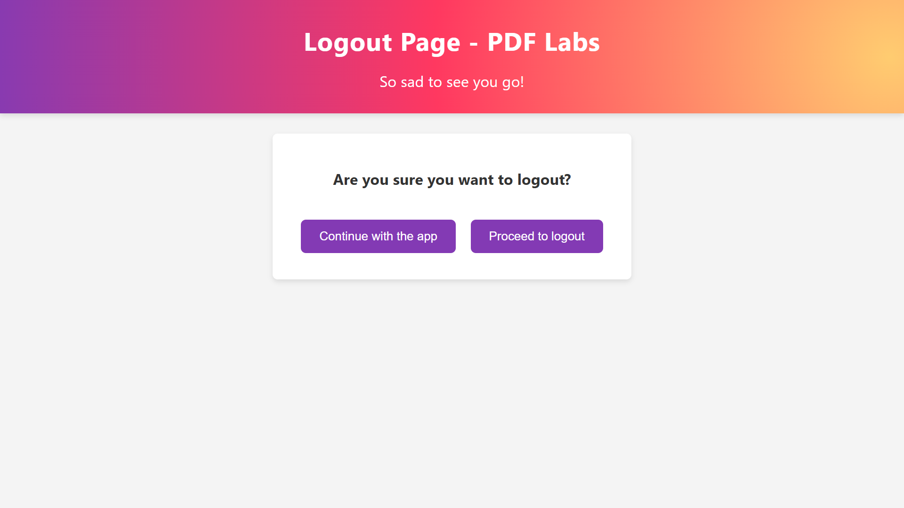
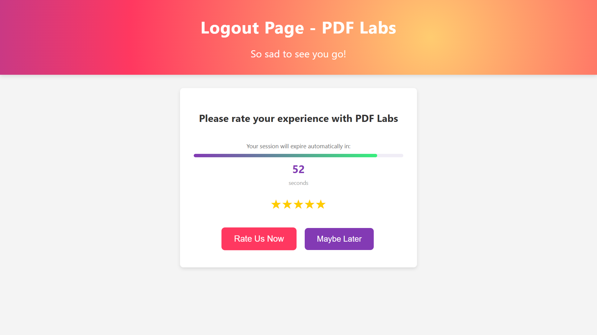
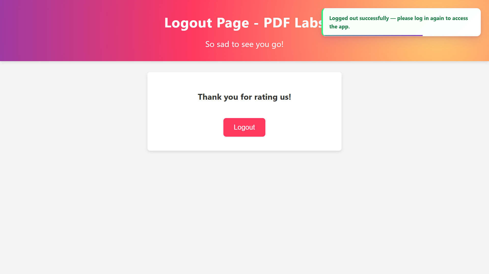
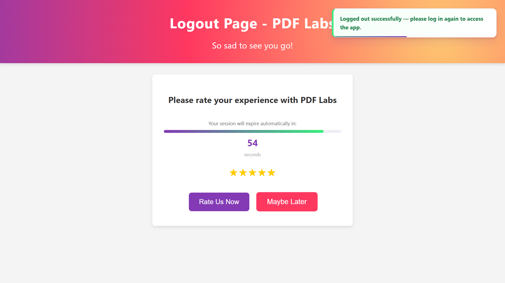
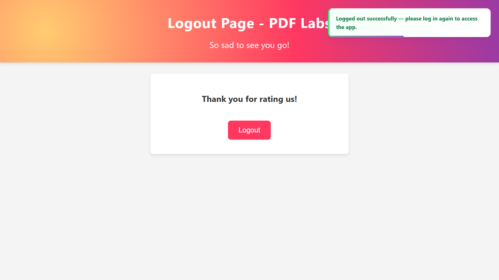
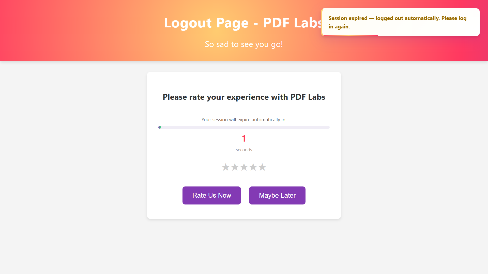

# PDF Labs — Logout Service

> The session termination microservice for the PDF Labs platform. Implements a **three-stage logout flow** — confirmation, optional star rating, final logout — using a novel short-lived token exchange pattern: when the user clicks "Proceed to logout", a 60-second replacement JWT is issued server-side and a visual countdown bar reflects exactly how long until automatic session expiry. A `sessionStorage` back-navigation guard prevents users from returning to the logout page after completing logout via the browser back button.

---

## Table of Contents

- [Overview](#overview)
- [Architecture](#architecture)
- [Screenshots](#screenshots)
- [Tech Stack](#tech-stack)
- [Project Structure](#project-structure)
- [API Endpoints](#api-endpoints)
- [Environment Variables](#environment-variables)
- [Getting Started](#getting-started)
  - [Prerequisites](#prerequisites)
  - [Run Locally (without Docker)](#run-locally-without-docker)
  - [Run with Docker](#run-with-docker)
- [Logout Flow & Token Exchange](#logout-flow--token-exchange)
- [Session & Back-Navigation Guard](#session--back-navigation-guard)
- [Security Highlights](#security-highlights)
- [Related Services](#related-services)
- [Contributing](#contributing)
- [License](#license)

---

## Overview

The **Logout Service** is a Node.js/Express microservice that handles all session termination for the [PDF Labs](https://github.com/Godfrey22152/MICROSERVICE-PDF-LABS) platform. Every other service's "Logout" button redirects to `http://localhost:4500/logout?token=<jwt>`.

This service is responsible for:

- Rendering the logout page (EJS) with three progressive sections: confirmation, star rating, and final logout
- Issuing a **60-second replacement JWT** via `POST /logout/begin-logout` when the user confirms they want to log out — replacing the original 1-hour token in `localStorage`
- Running a **visual countdown bar** that reflects the exact 60-second window of the replacement token
- Scheduling a precise automatic redirect at the moment the 60-second token expires, using the same `checkSession` / `getTokenExpiry` pattern used across the entire platform
- Protecting against **browser back-navigation** after logout using a `sessionStorage` flag
- Setting aggressive **`Cache-Control: no-store`** headers on all responses to prevent cached pages from bypassing the logout
- Redirecting users back to the home service (`:3500`) if they click "Continue with the app" instead of completing the logout

---

## Architecture

The logout service issues its own short-lived JWT at the point of logout confirmation. No external API is called. The token exchange and countdown create a deterministic, user-visible logout window.

```
                  ┌─────────────────────────────────────────────────┐
                  │               PDF Labs Platform                 │
                  │               (Docker Network)                  │
                  └──────────────────┬──────────────────────────────┘
                                     │  GET /logout?token=<jwt>
                                     │  from any service's Logout button
         ┌───────────────────────────▼──────────────────────────────────────────┐
         │              logout-service (:4500)  ◄── THIS                        │
         │                                                                      │
         │  GET  /logout/          → render 3-stage logout page                 │
         │  POST /logout/begin-logout → issue 60s replacement JWT               │
         │                                                                      │
         │  Client:                                                             │
         │    1. Swap 1-hour token → 60-second token in localStorage            │
         │    2. Re-run checkSession() → schedules redirect at T+60s            │
         │    3. Countdown bar drains visually in sync with token expiry        │
         │    4. doLogout() OR automatic expiry → location.replace(:3000)       │
         └──────┬───────────────────────────────────────────────────────────────┘
                │
   ┌────────────▼───────────────┐
   │  MongoDB (:27017)          │
   │  logout-service DB         │
   │  (connected but not used   │
   │   for data storage — only  │
   │   for future extensibility)│
   └────────────────────────────┘
```

> **Note:** The **[docker-compose.yml file](https://github.com/Godfrey22152/MICROSERVICE-PDF-LABS/blob/main/docker-compose.yml)** that wires all services together lives in the **root/main repository**, not in this repository.

---

## Screenshots

> Logout Confirmation screenshots.

### Section 1 — Logout Confirmation


### Section 2 — Star Rating with Countdown Bar



### Section 3 — Final Logout



### Section 4 — Session Expiration before exiting the logout page



---

## Tech Stack

| Layer | Technology |
|---|---|
| Runtime | Node.js ≥ 15.0.0 |
| Framework | Express 4 |
| Templating | EJS |
| Database | MongoDB (via Mongoose — connected for extensibility, not actively used for storage) |
| Auth | JWT (`jsonwebtoken`) — Bearer header, query param, or body |
| Token exchange | `jwt.sign` with `{ expiresIn: '60s' }` at logout confirmation |
| Container | Docker (multi-stage, Alpine 3.18 + Node.js 18) |

---

## Project Structure

```
logout-service/
├── app.js                        # Express entry point
├── Dockerfile                    # Multi-stage production Docker build
├── package.json
├── config/
│   └── db.js                     # MongoDB connection
├── controllers/
│   └── logoutController.js       # logoutPage — sets cache headers, clears cookie, renders page
├── middleware/
│   └── auth.js                   # JWT guard with aggressive Cache-Control headers on all requests
├── routes/
│   └── logout.js                 # GET /logout/, POST /logout/begin-logout
├── views/
│   └── logout.ejs                # 3-section logout page with countdown bar
└── public/
    ├── css/
    │   └── styles.css
    └── js/
        └── script.js             # All logout flow logic: token exchange, countdown, back-nav guard
```

---

## API Endpoints

Both routes are mounted under `/logout` via `app.use('/logout', logoutRoute)`.

| Method | Path | Auth | Description |
|---|---|---|---|
| `GET` | `/logout/` | JWT | Render the 3-stage logout page |
| `POST` | `/logout/begin-logout` | JWT | Issue a 60-second replacement JWT |

---

### `GET /logout/`

Every service navigates here with the user's current token:

```
GET http://localhost:4500/logout?token=<jwt>
```

The auth middleware validates the token, sets `Cache-Control: no-store` headers, clears any `token` cookie, and renders `logout.ejs` with all three sections (Section 2 and 3 are hidden initially).

**Responses:**
- `200` — Renders `logout.ejs`
- `302` — Redirect to `http://localhost:3000` (no/invalid/expired token, HTML client)
- `401` — Structured JSON error (AJAX client)

---

### `POST /logout/begin-logout`

Called when the user clicks "Proceed to logout". Requires the current JWT via `Authorization: Bearer <token>` header.

```
POST http://localhost:4500/logout/begin-logout
Authorization: Bearer <jwt>
Content-Type: application/json
X-Requested-With: XMLHttpRequest
```

Issues a new JWT signed with `{ expiresIn: '60s' }` using the same `JWT_SECRET`. The client replaces its current token with this short-lived one, which then drives the countdown and the scheduled automatic redirect.

**Success response:**
```json
{
  "success": true,
  "token": "<60-second-jwt>",
  "expiresIn": 60
}
```

**Error responses:**
- `401` — No/invalid/expired token (`NO_TOKEN`, `INVALID_TOKEN`, `TOKEN_EXPIRED`)
- `500` — `{ "error": true, "msg": "Could not begin logout. Please try again." }`

---

## Environment Variables

Create a `.env` file in the project root (or supply via Docker/Compose):

| Variable | Required | Description |
|---|---|---|
| `MONGO_URI` | Yes | MongoDB connection string, e.g. `mongodb://mongo:27017/account-service` |
| `JWT_SECRET` | Yes | Secret key for both verifying incoming JWTs and signing the 60-second replacement token — must match the account-service |
| `PORT` | No | Server port (defaults to `4500`) |

> **Warning:** Never commit your `.env` file or real secrets to version control.

---

## Getting Started

### Prerequisites

- [Node.js](https://nodejs.org/) ≥ 15.0.0
- [MongoDB](https://www.mongodb.com/) instance (local or Docker)
- [Docker](https://www.docker.com/) (optional)
- A valid JWT issued by the **account-service** — navigating to `/logout` without a token redirects to login immediately

### Run Locally (without Docker)

```bash
# 1. Clone the repository
git clone https://github.com/Godfrey22152/MICROSERVICE-PDF-LABS.git
cd MICROSERVICE-PDF-LABS/logout-service

# 2. Install dependencies
npm install

# 3. Create your environment file
cp .env.example .env
# Edit .env with your MONGO_URI and JWT_SECRET

# 4. Start the server
npm start
```

The service will be available at `http://localhost:4500/logout`.

### Run with Docker

#### Build and run this service standalone

```bash
docker build -t logout-service .
docker run -p 4500:4500 \
  -e MONGO_URI=mongodb://<your-mongo-host>:27017/account-service \
  -e JWT_SECRET=your_secret_here \
  logout-service
```

#### Run the full PDF Labs stack

From the **root/main repository** that contains **[docker-compose.yml file](https://github.com/Godfrey22152/MICROSERVICE-PDF-LABS/blob/main/docker-compose.yml)**:

```bash
docker compose up --build
```

---

## Logout Flow & Token Exchange

This is the most behaviourally distinct service in the platform, implementing a three-stage flow with a server-issued countdown token.

```
User clicks "Logout" on any service
        │  → window.location.href = 'http://localhost:4500/logout?token=<jwt>'
        │
        ▼
GET /logout/?token=<jwt>
  auth middleware: validates token, sets Cache-Control: no-store headers
  logoutController.logoutPage: clears token cookie, renders logout.ejs
        │
        ▼
  Client (script.js) — DOMContentLoaded:
    1. sessionStorage back-nav guard (see below)
    2. Token stored in localStorage (if not already present)
    3. checkSession() → setTimeout fires at original token's exp moment

  ─── SECTION 1: Confirmation ───────────────────────────────────────────────

  User clicks "Continue with the app":
    → sessionStorage.removeItem('logoutPageActive')
    → window.location.href = 'http://localhost:3500/?token=<jwt>'
    (Clears flag so back-nav guard knows this was an intentional stay)

  User clicks "Proceed to logout":
    │
    ▼
  POST /logout/begin-logout
    Authorization: Bearer <original-jwt>
        │
        ▼
    routes/logout.js:
      jwt.sign({ user: req.user }, JWT_SECRET, { expiresIn: '60s' })
      res.json({ success: true, token: <60s-jwt>, expiresIn: 60 })

  Client receives 60-second token:
    localStorage.setItem('token', data.token)   ← replaces 1-hour token
    checkSession()                               ← recalculates timeout vs new exp
      └─ setTimeout(handleSessionExpired, ~60000ms)
    startCountdown(60)                           ← visual bar drains in sync
    Section 1 hidden → Section 2 shown

  ─── SECTION 2: Rating ─────────────────────────────────────────────────────

  User clicks stars (1–5): star.classList.add('selected') cascade

  User clicks "Rate Us Now":
    → Section 2 hidden → Section 3 shown

  User clicks "Maybe Later":
    → doLogout() called immediately

  ─── SECTION 3: Final Logout ───────────────────────────────────────────────

  User clicks "Logout" (or countdown expires):
    doLogout() or handleSessionExpired():
      clearInterval(countdownInterval)
      clearTimeout(sessionTimeout)
      localStorage.removeItem('token')
      sessionStorage.removeItem('logoutPageActive')
      showToast("Logged out successfully…", 'success', 4000)
      setTimeout(4000) → window.location.replace('http://localhost:3000')
      (location.replace removes logout page from history → back button safe)
```

### Token Exchange Mechanics

The `JWT_SECRET` is the same across all services. The logout service uses it both to **verify** the incoming 1-hour token and to **sign** the 60-second replacement. When `checkSession()` is called after the token swap, it decodes the new token's `exp` claim and schedules `handleSessionExpired` to fire at precisely `expiresAt - Date.now()` milliseconds in the future — the same value that drives `startCountdown(60)`. Both mechanisms are derived from the same JWT `exp` field, so they are always in perfect sync.

---

## Session & Back-Navigation Guard

The logout page implements a `sessionStorage`-based guard against browser back-navigation returning a logged-out user to the logout page.

```
Navigation scenarios:

Genuine first load (e.g. from home-service):
  sessionStorage.logoutPageActive → absent
  localStorage.token              → present or URL has ?token=
  → Store token, set logoutPageActive = '1', continue normally

Back navigation after logout:
  sessionStorage.logoutPageActive → absent  (sessionStorage is NOT restored by back-nav cache)
  localStorage.token              → absent  (doLogout cleared it)
  → Both missing → window.location.replace(':3000') immediately

Back navigation while still in session (user pressed back before completing logout):
  sessionStorage.logoutPageActive → present
  localStorage.token              → present
  → Flag already set → skip token re-read, continue normally
  → checkSession() still running → redirects at token expiry

Post-logout URL revisit (manually typing the URL):
  sessionStorage.logoutPageActive → absent
  localStorage.token              → absent
  → window.location.replace(':3000') immediately
```

The key insight: `sessionStorage` is **not** restored when the browser serves a page from the back-forward cache. So the flag is absent on any back-navigation after a full-page redirect, while being present for in-tab navigation within a live session.

---

## Security Highlights

- **`Cache-Control: no-store` on every request** — both the auth middleware and the logout controller set `Cache-Control: no-store, no-cache, must-revalidate, proxy-revalidate` plus `Pragma: no-cache` and `Expires: 0` on every response. The EJS template also adds equivalent `<meta http-equiv>` tags as a belt-and-suspenders measure for browsers that cache aggressively.
- **Short-lived replacement token** — the 60-second JWT issued at logout confirmation has the minimum viable lifetime for the rating flow. Any token captured after this point expires in at most 60 seconds, limiting its utility if intercepted.
- **`location.replace` instead of `location.href`** — all post-logout redirects use `window.location.replace()`, which removes the logout page from browser history so the back button from the login page cannot return to the logout page.
- **Cookie cleared server-side** — `res.clearCookie('token')` runs in the controller as a belt-and-suspenders measure alongside the `localStorage.removeItem('token')` on the client.
- **`sessionStorage` back-nav guard** — prevents logged-out users from viewing or interacting with the logout page via back-navigation, regardless of browser caching behaviour.
- **AJAX / HTML dual response mode** — the auth middleware checks `req.xhr` / `X-Requested-With` to return either a redirect (browser) or structured JSON (AJAX) on auth failure, preventing information leakage between modes.
- **Same `JWT_SECRET` for verify and sign** — the logout service both verifies the incoming token and issues the replacement using the same secret, making it a full participant in the platform's shared token system without any additional key management.
- **Non-root Docker user** — the production container runs as `appuser` (non-root) on Alpine Linux.
- **Multi-stage Docker build** — source maps, test files, and docs are stripped from the final image.

---

## Related Services

All services below are part of the PDF Labs platform and are wired together via the root `docker-compose.yml`.

| Service | Port | Description |
|---|---|---|
| `account-service` | 3000 | Auth & landing page — issues JWTs |
| `home-service` | 3500 | Authenticated dashboard |
| `profile-service` | 4000 | User profile management |
| `logout-service` | 4500 | **This service** — session termination |
| `tools-service` | 5000 | Authenticated tools hub |
| `pdf-to-image-service` | 5100 | PDF → Image conversion |
| `image-to-pdf-service` | 5200 | Image → PDF conversion |
| `pdf-compressor-service` | 5300 | PDF compression via Ghostscript |
| `pdf-to-audio-service` | 5400 | PDF → Audio via Edge TTS |
| `pdf-to-word-service` | 5500 | PDF → Word (.docx) via ConvertAPI |
| `sheetlab-service` | 5600 | PDF ↔ Excel conversion |
| `word-to-pdf-service` | 5700 | DOCX/DOC/ODT/RTF/PPTX/PPT → PDF |
| `edit-pdf-service` | 5800 | Rotate, watermark, merge, split, protect, unlock |

---

## Contributing

1. Fork the repository
2. Create a feature branch: `git checkout -b feature/my-feature`
3. Commit your changes: `git commit -m "feat: add my feature"`
4. Push to the branch: `git push origin feature/my-feature`
5. Open a Pull Request

Please follow the existing code style and keep commits focused.

---

## License

This project is licensed under the **ISC License**. See the [LICENSE](LICENSE) file for details.

---

> Maintained by [Godfrey Ifeanyi](mailto:godfreyifeanyi50@gmail.com)
