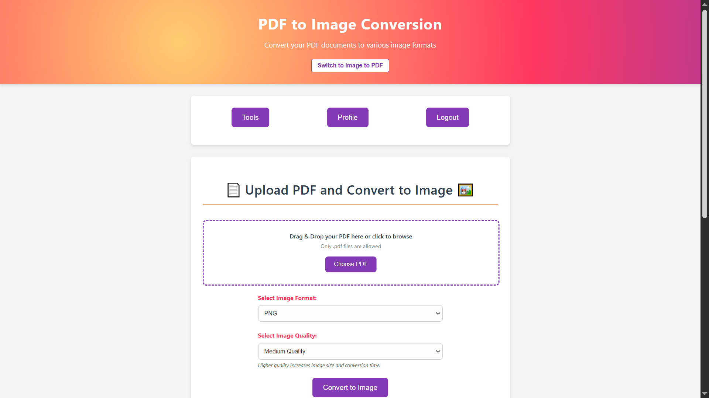
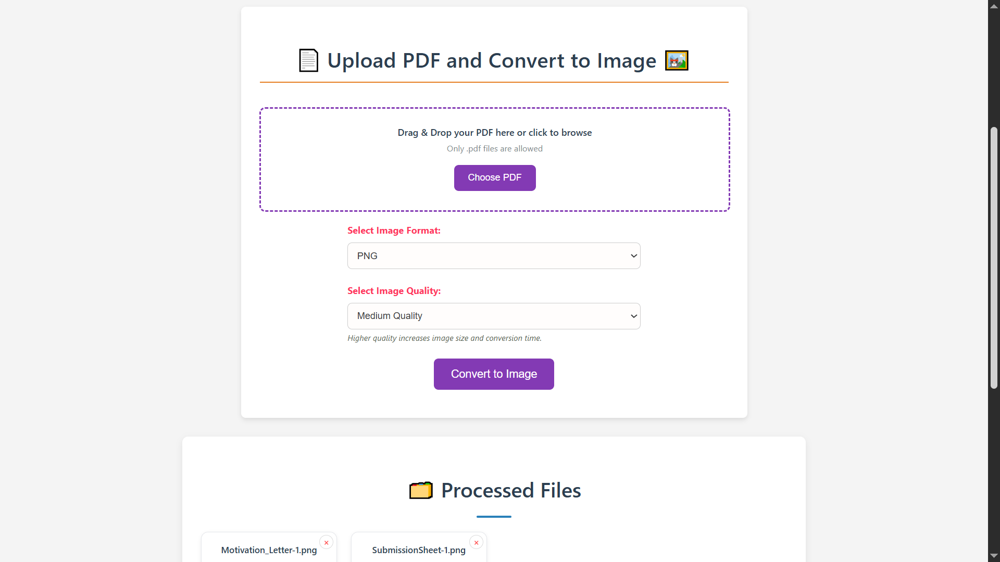
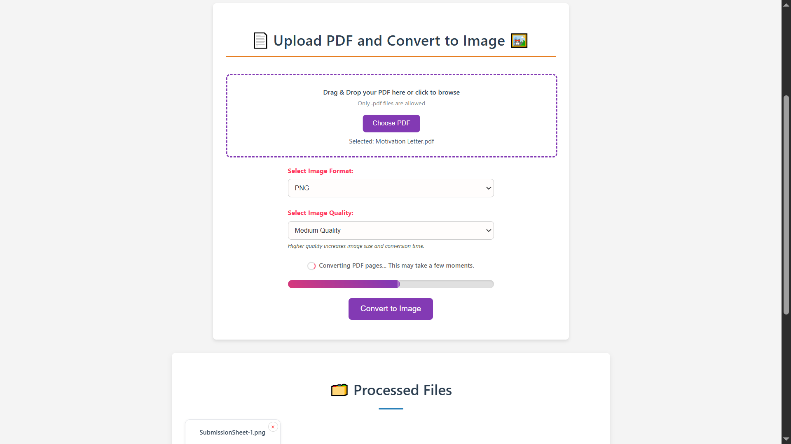
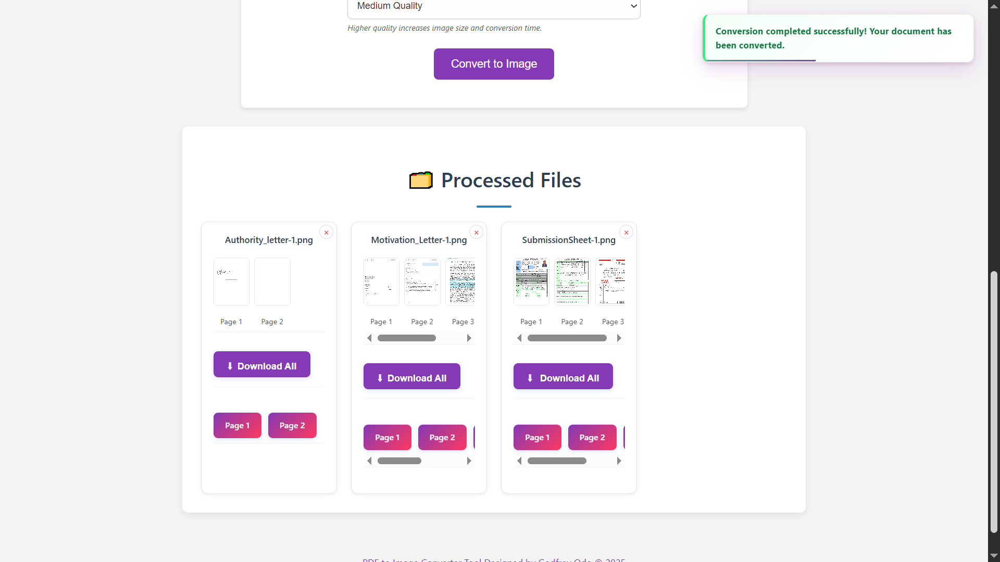

# PDF Labs — PDF to Image Service

> The PDF-to-image conversion microservice for the PDF Labs platform. Converts PDF documents into six image formats — PNG, JPEG, TIFF, SVG, EPS, and PS — using **`pdftocairo`** (Poppler) at three selectable quality levels. Multi-page PDFs produce one image per page, each with its own thumbnail preview, individual page download, and a staggered "Download All" option. Single-page-only formats (SVG, EPS, PS) are validated server-side before processing.

---

## Table of Contents

- [Overview](#overview)
- [Architecture](#architecture)
- [Screenshots](#screenshots)
- [Tech Stack](#tech-stack)
- [Project Structure](#project-structure)
- [Supported Formats](#supported-formats)
- [API Endpoints](#api-endpoints)
- [Environment Variables](#environment-variables)
- [Getting Started](#getting-started)
  - [Prerequisites](#prerequisites)
  - [Run Locally (without Docker)](#run-locally-without-docker)
  - [Run with Docker](#run-with-docker)
- [Conversion Pipeline](#conversion-pipeline)
- [Session & Authentication Flow](#session--authentication-flow)
- [Security Highlights](#security-highlights)
- [Related Services](#related-services)
- [Contributing](#contributing)
- [License](#license)

---

## Overview

The **PDF to Image Service** is a Node.js/Express microservice that converts PDF documents into image files for the [PDF Labs](https://github.com/Godfrey22152/MICROSERVICE-PDF-LABS) platform. All image generation is performed **entirely server-side** using **`pdftocairo`** (Poppler) — no external API is required.

This service is responsible for:

- Rendering the PDF to Image conversion page (EJS) with per-user conversion history showing image thumbnails
- Accepting single PDF uploads via drag-and-drop or file picker with client and server-side type validation
- First running `pdfinfo` to get the page count, then rejecting multi-page PDFs for single-page-only formats (SVG, EPS, PS) before any conversion is attempted
- Running `pdftocairo` via `child_process.exec` to convert each PDF page into the selected format at the selected DPI quality
- Building a per-page image manifest with preview and download URLs for each output file
- Persisting a `ProcessedFile` record to MongoDB with the full `images[]` array
- Serving images for inline thumbnail preview and individual page downloads
- Providing a legacy endpoint for backward-compatible file serving
- Allowing users to delete individual records and their output directories
- AJAX-first form submission with a simulated progress bar and inline result card injection including a scrollable thumbnail strip

---

## Architecture

The pdf-to-image service runs `pdftocairo` as a local subprocess. No external API is called. Output files are stored in `outputs/<uuid>/` directories, with one file per page for multi-page-capable formats.

```
                  ┌─────────────────────────────────────────────────┐
                  │               PDF Labs Platform                 │
                  │               (Docker Network)                  │
                  └──────────────────┬──────────────────────────────┘
                                     │  Token-bearing request from tools-service
         ┌───────────────────────────▼──────────────────────────────────────────┐
         │              pdf-to-image-service (:5100)  ◄── THIS                  │
         │  • pdfinfo → get page count → reject invalid format/page combos      │
         │  • pdftocairo → convert PDF pages to image files                     │
         │  • Build per-page image manifest (preview + download URLs)           │
         │  • Persist ProcessedFile record to MongoDB                           │
         │  • Serve view, download, and legacy endpoints                        │
         └──────┬───────────────────────────────────────────┬───────────────────┘
                │                                           │
   ┌────────────▼───────────────┐              ┌────────────▼──────────────────┐
   │  MongoDB (:27017)          │              │  Local filesystem             │
   │  pdf-to-image-service DB   │              │  uploads/  (multer staging)   │
   │  • ProcessedFile schema    │              │  outputs/  (<uuid>/ dirs)     │
   │  • images[] sub-documents  │              │  One file per page per format │
   └────────────────────────────┘              └───────────────────────────────┘

  pdfinfo + pdftocairo installed in Docker image via apk add poppler-utils
  ── both run as child processes inside the container, no network required ──
```

> **Note:** The **[docker-compose.yml file](https://github.com/Godfrey22152/MICROSERVICE-PDF-LABS/blob/main/docker-compose.yml)** that wires all services together lives in the **root/main repository**, not in this repository.

---

## Screenshots

> PDF to Image Conversion application screenshots.

### PDF to Image Conversion Page


### Format & Quality Selection


### Processed Files with Thumbnail Strip



---

## Tech Stack

| Layer | Technology |
|---|---|
| Runtime | Node.js ≥ 15.0.0 |
| Framework | Express 4 |
| Templating | EJS |
| Database | MongoDB (via Mongoose 8) |
| File uploads | `multer` (disk storage, `uploads/` staging dir) |
| Image generation | **`pdftocairo`** (Poppler) — subprocess via `child_process.exec` |
| Page count check | **`pdfinfo`** (Poppler) — subprocess run before conversion |
| Auth | JWT (`jsonwebtoken`) — Bearer header, query param, or body |
| File ID | `uuid` v4 |
| Container | Docker (multi-stage, Alpine 3.18 + `poppler-utils`) |

---

## Project Structure

```
pdf-to-image-service/
├── server.js                         # Express entry point
├── Dockerfile                        # Multi-stage build; installs poppler-utils in runtime stage
├── package.json
├── config/
│   └── db.js                         # MongoDB connection with disconnect/error listeners
├── controllers/
│   └── pdfController.js              # Render, pdfinfo, pdftocairo, serve, download, delete
├── middleware/
│   └── sessionCheck.js               # JWT guard — Bearer, query, body; HTML redirect fallback
├── models/
│   └── ProcessedFile.js              # Mongoose schema (ProcessedFile + imageSchema per page)
├── routes/
│   └── pdfRoutes.js                  # All /pdf-to-image routes
├── utils/
│   ├── errorHandler.js               # handleExecError, rejectMultiPageIfNeeded, globalErrorHandler
│   └── fileUtils.js                  # sanitizeFilename
├── views/
│   └── pdf-to-image.ejs              # Conversion page with thumbnail strip and per-page downloads
├── public/
│   ├── css/
│   │   └── styles.css
│   └── js/
│       ├── main.js                   # Session, drag-drop, AJAX submit, progress, thumbnails, delete
│       └── eventlisteners.js         # Navigation to other PDF Labs services
├── uploads/                          # Temporary multer staging (auto-created, gitignored)
└── outputs/                          # Per-conversion image dirs as outputs/<uuid>/ (gitignored)
```

---

## Supported Formats

| Format | Extension | Multi-page | Notes |
|---|---|---|---|
| **PNG** | `.png` | ✅ Yes | One file per page: `<name>-1.png`, `<name>-2.png`, … |
| **JPEG** | `.jpg` | ✅ Yes | One file per page: `<name>-1.jpg`, `<name>-2.jpg`, … |
| **TIFF** | `.tif` | ✅ Yes | One file per page |
| **SVG** | `.svg` | ❌ No | Single-page PDFs only — rejected server-side if page count > 1 |
| **EPS** | `.eps` | ❌ No | Single-page PDFs only |
| **PS** | `.ps` | ❌ No | Single-page PDFs only |

### Quality / DPI Settings

| Label | DPI (`-r` flag) |
|---|---|
| Average Quality | 150 |
| Medium Quality *(default)* | 300 |
| Best Quality | 600 |

Higher DPI settings increase output file size and conversion time proportionally.

---

## API Endpoints

All routes are prefixed with `/tools`. Session-protected routes require a valid JWT.

| Method | Path | Auth | Description |
|---|---|---|---|
| `GET` | `/tools/pdf-to-image` | JWT | Render the conversion page with user's file history |
| `POST` | `/tools/pdf-to-image` | JWT | Upload a PDF and convert it to images |
| `GET` | `/tools/pdf-to-image/view/:id` | None | Serve an image file inline by UUID + filename |
| `GET` | `/tools/pdf-to-image/download/:id` | None | Download an image file by UUID + filename |
| `GET` | `/tools/pdf-to-image/view-legacy/:id` | None | Legacy endpoint — serves by page number + format |
| `DELETE` | `/tools/pdf-to-image/:id` | JWT | Delete a conversion record and its output directory |

---

### `GET /tools/pdf-to-image`

```
GET http://localhost:5100/tools/pdf-to-image?token=<jwt>
```

Queries all `ProcessedFile` records for the authenticated user (sorted newest-first) and renders the page with thumbnail strips and per-page download links.

**Responses:**
- `200` — Renders `pdf-to-image.ejs`
- `302` — Redirect to `http://localhost:3000` (invalid/missing token, HTML client)
- `401` — Structured JSON auth error (API client)

---

### `POST /tools/pdf-to-image`

Accepts `multipart/form-data`. Called via XHR (`X-Requested-With: XMLHttpRequest`) from the browser; returns JSON for card injection, or redirects on non-XHR fallback.

```
POST http://localhost:5100/tools/pdf-to-image?token=<jwt>
Content-Type: multipart/form-data

pdf:     <file>     (PDF only)
format:  png | jpeg | jpg | svg | eps | ps | tiff
quality: 150 | 300 | 600
```

**Success response (XHR):**
```json
{
  "fileId": "<uuid>",
  "filename": "document.pdf",
  "sanitizedName": "document",
  "format": "png",
  "totalPages": 3,
  "images": [
    {
      "page": 1,
      "filename": "document-1.png",
      "previewUrl": "/tools/pdf-to-image/view/<uuid>?file=document-1.png&format=png",
      "downloadUrl": "/tools/pdf-to-image/download/<uuid>?file=document-1.png&format=png"
    },
    ...
  ]
}
```

**Error responses:**
- `400` — No file / unsupported format / multi-page PDF with single-page-only format (`MULTIPAGE_NOT_SUPPORTED`)
- `401` — Auth error
- `500` — `pdfinfo` or `pdftocairo` execution error / no images generated

---

### `GET /tools/pdf-to-image/view/:id`

No authentication required. Serves an image inline using `res.sendFile`.

```
GET http://localhost:5100/tools/pdf-to-image/view/<uuid>?file=document-1.png
```

---

### `GET /tools/pdf-to-image/download/:id`

No authentication required. Triggers a download using `res.download`.

```
GET http://localhost:5100/tools/pdf-to-image/download/<uuid>?file=document-1.png
```

---

### `GET /tools/pdf-to-image/view-legacy/:id`

No authentication required. Backward-compatible endpoint that finds a file by `?page=N&format=<ext>` rather than by filename — useful for cards created before the `images[]` manifest was introduced.

---

### `DELETE /tools/pdf-to-image/:id`

Verifies the record belongs to the authenticated user before deleting both the MongoDB document and the entire `outputs/<uuid>/` directory.

```
DELETE http://localhost:5100/tools/pdf-to-image/<uuid>?token=<jwt>
Authorization: Bearer <jwt>
```

**Responses:**
- `200` — `"File deleted successfully."`
- `404` — `"File not found or you don't have permission to delete it."`
- `500` — `"Server error while deleting file."`

---

## Environment Variables

Create a `.env` file in the project root (or supply via Docker/Compose):

| Variable | Required | Description |
|---|---|---|
| `MONGO_URI` | Yes | MongoDB connection string, e.g. `mongodb://mongo:27017/pdf-to-image-service` |
| `JWT_SECRET` | Yes | Secret key for verifying JWTs — must match the account-service |
| `PORT` | No | Server port (defaults to `5100`) |

> **No external API key required.** Image generation uses `pdftocairo` from Poppler, installed directly into the Docker image.

> **Warning:** Never commit your `.env` file or real secrets to version control.

---

## Getting Started

### Prerequisites

- [Node.js](https://nodejs.org/) ≥ 15.0.0
- [MongoDB](https://www.mongodb.com/) instance (local or Docker)
- **[Poppler](https://poppler.freedesktop.org/)** — must be installed and both `pdfinfo` and `pdftocairo` available on the system `PATH`
- [Docker](https://www.docker.com/) (optional — Poppler is installed automatically in the Docker image)
- A valid JWT issued by the **account-service**

#### Installing Poppler locally

```bash
# Ubuntu / Debian
sudo apt-get install poppler-utils

# macOS (Homebrew)
brew install poppler

# Alpine Linux (as used in the Docker image)
apk add --no-cache poppler-utils

# Verify installation
pdfinfo -v
pdftocairo -v
```

### Run Locally (without Docker)

```bash
# 1. Clone the repository
git clone https://github.com/Godfrey22152/MICROSERVICE-PDF-LABS.git
cd MICROSERVICE-PDF-LABS/pdf-to-image-service

# 2. Install dependencies
npm install

# 3. Create your environment file
cp .env.example .env
# Edit .env with your MONGO_URI and JWT_SECRET

# 4. Start the server
npm start
```

The service will be available at `http://localhost:5100/tools/pdf-to-image`.

> The `uploads/` and `outputs/` directories are created automatically at runtime and are excluded from version control.

### Run with Docker

Poppler (`pdfinfo` and `pdftocairo`) is installed automatically via `apk add poppler-utils` in the Alpine runtime stage — no manual installation needed.

#### Build and run this service standalone

```bash
docker build -t pdf-to-image-service .
docker run -p 5100:5100 \
  -e MONGO_URI=mongodb://<your-mongo-host>:27017/pdf-to-image-service \
  -e JWT_SECRET=your_secret_here \
  pdf-to-image-service
```

#### Run the full PDF Labs stack

From the **root/main repository** that contains `docker-compose.yml`:

```bash
docker compose up --build
```

---

## Conversion Pipeline

```
User uploads PDF via drag-drop or file picker
        │  Client validates: only application/pdf accepted
        │
        ▼
POST /tools/pdf-to-image  (multipart/form-data, XHR)
        │
        ▼
  sessionCheck validates JWT server-side
  multer: saves PDF to uploads/<temp>
        │
        ▼
  Step 1 — Page count check:
  exec(`pdfinfo "${pdfPath}"`)
    ├─ On error → handleExecError() → 500
    └─ Parse "Pages: N" from stdout → pageCount

  Step 2 — Format validation:
  rejectMultiPageIfNeeded(formatConfig, pageCount, res)
    └─ If SVG/EPS/PS and pageCount > 1 → 400 MULTIPAGE_NOT_SUPPORTED

  Step 3 — Image generation:
  if (multiPage):
    cmd = `pdftocairo -r ${quality} ${flag} "${pdfPath}" "${outBase}"`
    → Generates: <name>-1.png, <name>-2.png, ... (zero-padded by pdftocairo)
  else:
    cmd = `pdftocairo -r ${quality} ${flag} "${pdfPath}" "${outBase}.${ext}"`
    → Generates: <name>.svg (or .eps, .ps)

  exec(cmd, async callback):
    ├─ On error → handleExecError() → 500
    └─ Read outDir → filter files by regex pattern
       Sort alphabetically (ensures correct page order)
       Build images[] array: { page, filename, previewUrl, downloadUrl }

  Step 4 — Persist:
  new ProcessedFile({ ..., images }).save()
        │
        ├─ XHR:     res.json(payload) → appendProcessedCard() injects
        │             thumbnail strip + per-page download links into DOM
        └─ non-XHR: res.redirect(/tools/pdf-to-image?token=...)
```

### Multi-page Output Naming

`pdftocairo` generates output files using the pattern `<baseName>-<N>.<ext>` where N is a zero-padded page number. The controller discovers these files by scanning the output directory with a regex (`/<name>-\d+\.<ext>$/i`) and sorts them alphabetically to ensure correct page ordering before building the manifest.

### "Download All" behaviour

The Download All button reads the serialised `images[]` array from a `data-images` attribute on the button element (injected by both EJS server rendering and the AJAX card builder), then triggers staggered `<a download>` clicks at 200 ms intervals to avoid browser popup blockers.

---

## Session & Authentication Flow

```
User arrives at /tools/pdf-to-image?token=<jwt>
        │
        ▼
  sessionCheck middleware: structural check (3 parts) + jwt.verify()
        │
   ┌────┴──────────────────────────┐
   │ Invalid / expired / no token  │  → HTML: redirect to :3000
   │                               │  → XHR:  401 JSON error
   └───────────────────────────────┘
        │ Valid
        ▼
  controller.renderPdfToImagePage → ProcessedFile.find({ userId }) → render page
  EJS inline script: stores token from URL into localStorage on DOMContentLoaded
        │
        ▼
  Client (main.js):
    • URL token → localStorage.setItem('token', urlToken)
    • checkSession() decodes exp → setTimeout at exact expiry moment
    • Expired/tampered → handleAuthError() → clears token → redirect to :3000

  User submits form (XHR, X-Requested-With: XMLHttpRequest)
        │
        ├─ sessionCheck validates token again server-side
        │
        ├─ 400 MULTIPAGE_NOT_SUPPORTED → showToast with format-specific message
        │
        └─ 200 → appendProcessedCard(payload)
                   Injects scrollable thumbnail strip with inline preview images
                   + per-page individual download links
                   + "Download All" button with staggered downloads

  User clicks "Download All"
        │
        └─ Reads data-images JSON → staggered <a download> clicks (200ms apart)
           Falls back to legacy view-legacy/:id endpoint for old-format cards

  User clicks delete button
        │
        ▼
  showConfirmationModal() → promise-based confirm/cancel
        │
        └─ Confirmed → DELETE /tools/pdf-to-image/:id?token=<jwt>
                          → rmSync(outputs/<uuid>, recursive)
                          → ProcessedFile.deleteOne()
                          → card.remove() + grid cleanup if empty
```

---

## Security Highlights

- **Pre-conversion page count validation** — `pdfinfo` is run before `pdftocairo` to get the page count, and `rejectMultiPageIfNeeded` returns a `400` with a typed `MULTIPAGE_NOT_SUPPORTED` error for SVG/EPS/PS format requests against multi-page PDFs. This prevents wasted conversion work and gives the user a clear, actionable error.
- **Client-side MIME type validation** — the drag-and-drop handler and `input[type=file]` change listener both check `file.type === 'application/pdf'` immediately, with toast feedback before any upload is attempted.
- **User-scoped delete** — `deleteProcessedFile` queries MongoDB with both `fileId` AND `userId`, preventing one user from deleting another user's files.
- **UUID-scoped output directories** — view and download routes are scoped by a `uuid`-based directory, making image files non-guessable without the exact ID.
- **No external API dependency** — all image generation uses `pdftocairo` running locally inside the container; there is no API key to leak and no external service that can fail or rate-limit.
- **Dual-layer token validation** — `sessionCheck` verifies the JWT server-side on every protected route; `main.js` independently schedules a precise client-side expiry redirect.
- **HTML/API dual response mode** — all auth and error paths check `req.xhr` / `X-Requested-With` to return either a redirect or structured JSON.
- **Non-root Docker user** — the production container runs as `appuser` (non-root) on Alpine Linux.
- **Multi-stage Docker build** — dev tooling, source maps, and docs are stripped; only production artifacts and the Poppler binaries land in the final image.
- **No secrets in image** — `MONGO_URI` and `JWT_SECRET` are injected at runtime via environment variables.

---

## Related Services

All services below are part of the PDF Labs platform and are wired together via the root `docker-compose.yml`.

| Service | Port | Description |
|---|---|---|
| `account-service` | 3000 | Auth & landing page — issues JWTs |
| `home-service` | 3500 | Authenticated dashboard |
| `profile-service` | 4000 | User profile management |
| `logout-service` | 4500 | Session termination |
| `tools-service` | 5000 | Authenticated tools hub |
| `pdf-to-image-service` | 5100 | **This service** — PDF → Image conversion |
| `image-to-pdf-service` | 5200 | Image → PDF conversion |
| `pdf-compressor-service` | 5300 | PDF compression via Ghostscript |
| `pdf-to-audio-service` | 5400 | PDF → Audio via Edge TTS |
| `pdf-to-word-service` | 5500 | PDF → Word conversion |
| `sheetlab-service` | 5600 | PDF ↔ Excel conversion |
| `word-to-pdf-service` | 5700 | Word → PDF conversion |
| `edit-pdf-service` | 5800 | Rotate, watermark, merge, split, protect, unlock |

---

## Contributing

1. Fork the repository
2. Create a feature branch: `git checkout -b feature/my-feature`
3. Commit your changes: `git commit -m "feat: add my feature"`
4. Push to the branch: `git push origin feature/my-feature`
5. Open a Pull Request

Please follow the existing code style and keep commits focused.

---

## License

This project is licensed under the **ISC License**. See the [LICENSE](LICENSE) file for details.

---

> Maintained by [Godfrey Ifeanyi](mailto:godfreyifeanyi50@gmail.com)
