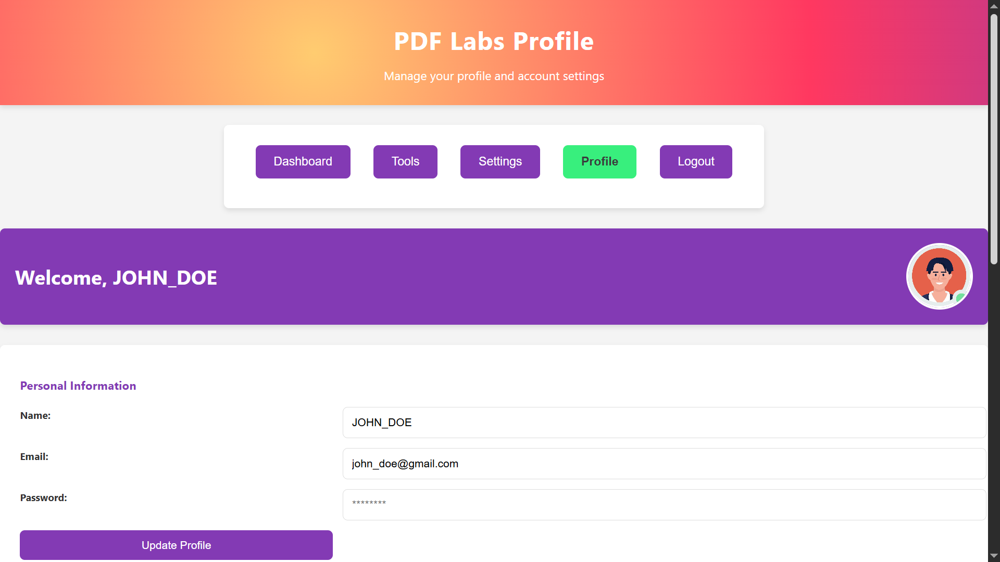
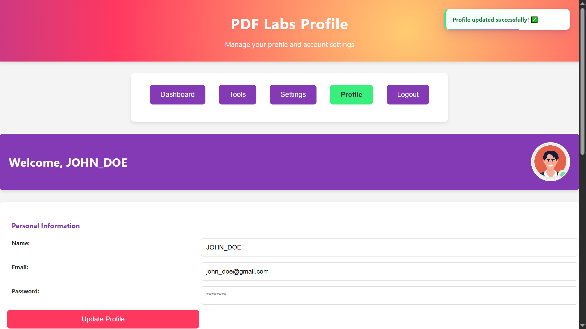
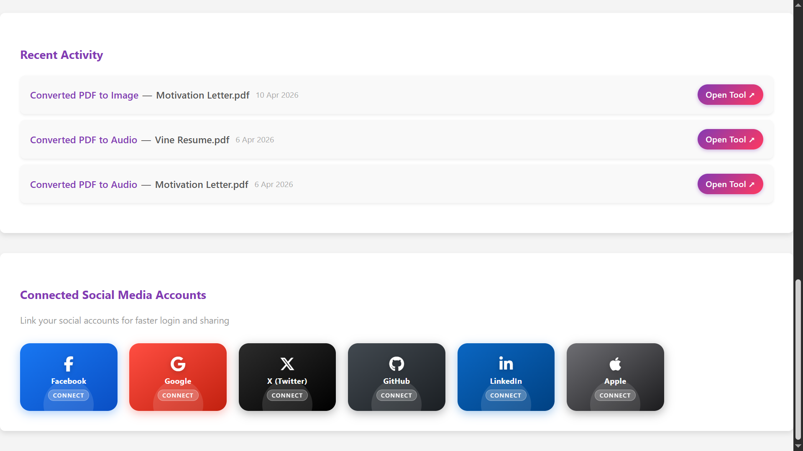
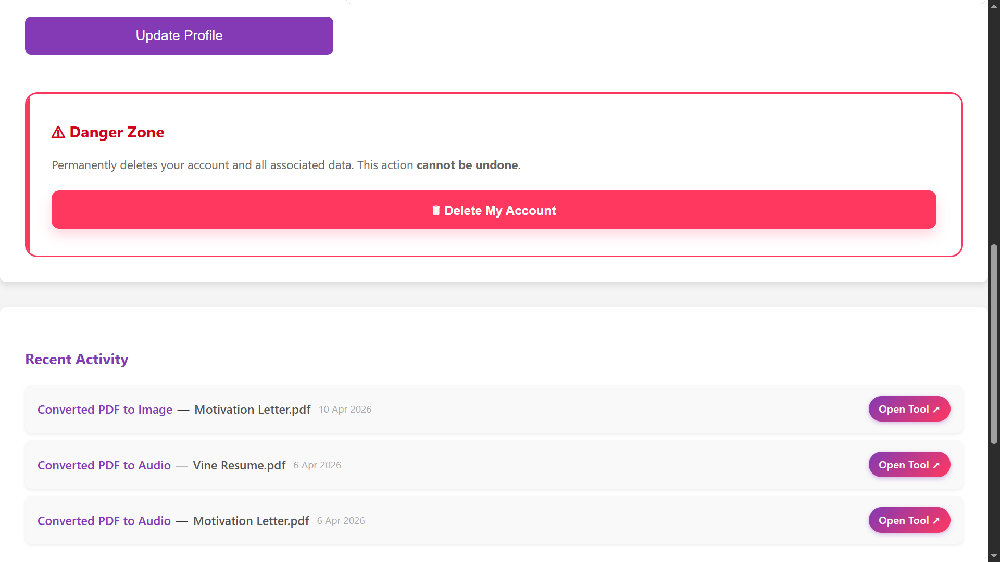
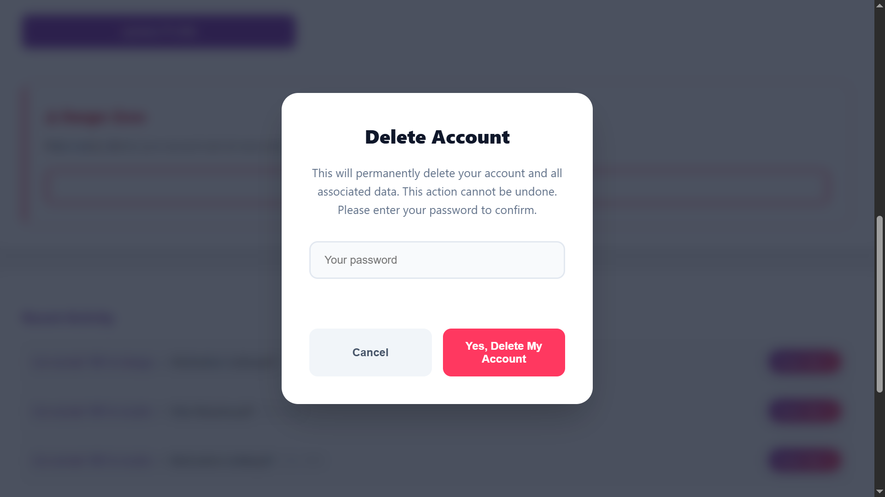

# PDF Labs — Profile Service

> The user profile and account management microservice for the PDF Labs platform. Handles profile viewing and updates, password changes, account deletion, and aggregates recent activity history pulled live from all other PDF tool service databases.

---

## Table of Contents

- [Overview](#overview)
- [Architecture](#architecture)
- [Screenshots](#screenshots)
- [Tech Stack](#tech-stack)
- [Project Structure](#project-structure)
- [API Endpoints](#api-endpoints)
- [Environment Variables](#environment-variables)
- [Getting Started](#getting-started)
  - [Prerequisites](#prerequisites)
  - [Run Locally (without Docker)](#run-locally-without-docker)
  - [Run with Docker](#run-with-docker)
- [Cross-Service Activity Aggregation](#cross-service-activity-aggregation)
- [Session & Authentication Flow](#session--authentication-flow)
- [Security Highlights](#security-highlights)
- [Related Services](#related-services)
- [Contributing](#contributing)
- [License](#license)

---

## Overview

The **Profile Service** is a Node.js/Express microservice that powers the user account page for the [PDF Labs](https://github.com/Godfrey22152/MICROSERVICE-PDF-LABS) platform. It is accessible from any page's navigation bar via the **Profile** button.

This service is responsible for:

- Rendering the authenticated profile dashboard (EJS), showing the user's personal info and activity feed
- Allowing users to update their username, email, and password
- Allowing users to permanently delete their account and all associated data across every service database
- **Aggregating recent activity** by opening short-lived connections directly to each tool service's MongoDB database and querying their processed-file collections — without any inter-service HTTP calls
- Client-side session management: proactive JWT expiry scheduling, tamper detection, and a custom confirmation modal for destructive actions

---

## Architecture

The profile service connects to the shared MongoDB instance and opens **per-request connections** to each tool service's database namespace to collect activity data. All connections are closed after each query.

```
                  ┌─────────────────────────────────────────────────┐
                  │               PDF Labs Platform                 │
                  │               (Docker Network)                  │
                  └────────────────────┬────────────────────────────┘
                                       │
              ┌────────────────────────▼────────────────────────────┐
              │            profile-service (:4000)  ◄── THIS        │
              │  • View / update profile                            │
              │  • Delete account + all cross-service activity      │
              │  • Aggregate activity from all tool DBs             │
              └────┬──────────────────────────────────────┬─────────┘
                   │                                      │
     ┌─────────────▼─────────────┐        ┌───────────────▼─────────────────────┐
     │  account-service MongoDB  │        │  Tool service MongoDB namespaces    │
     │  (account-service DB)     │        │  (opened per-request, then closed)  │
     │  • User schema            │        │  pdf-to-image-service               │
     │  • Auth credentials       │        │  image-to-pdf-service               │
     └───────────────────────────┘        │  pdf-compressor-service             │
                                          │  pdf-to-audio-service               │
                                          │  pdf-to-word-service                │
                                          │  word-to-pdf-service                │
                                          │  edit-pdf-service                   │
                                          │  sheetlab-service                   │
                                          └─────────────────────────────────────┘
```

> **Note:** The **[Docker Compose file](https://github.com/Godfrey22152/MICROSERVICE-PDF-LABS/blob/main/docker-compose.yml)** that wires all services together lives in the **root/main repository**, not in this repository.

---

## Screenshots


### Profile Page


### Update Profile Form


### Recent Activity Feed


### Delete Account Confirmation Modal



---

## Tech Stack

| Layer | Technology |
|---|---|
| Runtime | Node.js ≥ 15.0.0 |
| Framework | Express 4 |
| Templating | EJS |
| Database | MongoDB (via Mongoose 8) |
| Auth | JWT (`jsonwebtoken`) — Bearer header, query param, or body |
| Password hashing | `bcrypt` |
| Config | `config` module + `.env` |
| Icons | Font Awesome 6 (CDN) |
| Container | Docker (multi-stage, Alpine-based) |

---

## Project Structure

```
profile-service/
├── app.js                    # Express entry point, global error handler
├── Dockerfile                # Multi-stage production Docker build
├── package.json
├── config/
│   ├── db.js                 # connectDB() for own DB + connectToDb(dbName) for tool DBs
│   └── default.json          # Config template (env-var references)
├── middleware/
│   └── auth.js               # JWT guard — Bearer header, query param, body; HTML redirect fallback
├── models/
│   └── User.js               # Mongoose User schema (username, email, password, profilePicture)
├── routes/
│   └── profile.js            # All profile routes + cross-DB activity helpers
├── views/
│   └── profile.ejs           # Profile dashboard template
└── public/
    ├── css/
    │   └── styles.css
    ├── js/
    │   └── script.js         # Session management, update form, delete modal, toasts
    └── images/               # Profile pictures and UI assets
```

---

## API Endpoints

All endpoints require a valid JWT, supplied via `Authorization: Bearer <token>` header, `?token=` query parameter, or request body. Browser requests without a valid token are redirected to `http://localhost:3000`; API requests receive a structured JSON error.

| Method | Path | Description |
|---|---|---|
| `GET` | `/profile` | Render the profile page with user info and activity feed |
| `POST` | `/update-profile` | Update username, email, and optionally password |
| `DELETE` | `/delete-account` | Permanently delete the account and all cross-service activity |

---

### `GET /profile`

```
GET http://localhost:4000/profile?token=<jwt>
```

Fetches the authenticated user from MongoDB, then queries all eight tool service databases in parallel to build the activity feed, sorted newest-first.

**Responses:**
- `200` — Renders `profile.ejs`
- `302` — Redirect to `http://localhost:3000` (no/invalid token, HTML client)
- `401` — `{ "error": true, "type": "TOKEN_EXPIRED" | "INVALID_TOKEN" | "NO_TOKEN", "msg": "..." }` (API client)
- `404` — `{ "error": true, "type": "USER_DELETED", "msg": "..." }`

---

### `POST /update-profile`

```
POST http://localhost:4000/update-profile
Authorization: Bearer <jwt>
Content-Type: application/json

{
  "name": "new_username",
  "email": "newemail@example.com",
  "password": "newpassword"   // optional — omit to keep existing password
}
```

**Responses:**
- `200` — `{ "msg": "Profile updated successfully" }`
- `400` — `{ "msg": "Name and email are required" }`
- `401` — Auth error (see above)
- `404` — `{ "error": true, "type": "USER_DELETED", "msg": "..." }`
- `500` — `{ "msg": "Internal Server Error" }`

---

### `DELETE /delete-account`

Requires the user's current password as confirmation. Deletes the user document from the account-service database **and** purges all activity records from every tool service database.

```
DELETE http://localhost:4000/delete-account?token=<jwt>
Authorization: Bearer <jwt>
Content-Type: application/json
X-Requested-With: XMLHttpRequest

{
  "password": "currentpassword"
}
```

**Responses:**
- `200` — `{ "success": true, "msg": "Your account has been permanently deleted." }`
- `400` — `{ "error": true, "msg": "Password is required to delete your account." }`
- `403` — `{ "error": true, "msg": "Incorrect password. Account deletion aborted." }`
- `404` — `{ "error": true, "type": "USER_DELETED", "msg": "..." }`
- `500` — `{ "error": true, "type": "SERVER_ERROR", "msg": "..." }`

---

## Environment Variables

Create a `.env` file in the project root (or supply via Docker/Compose):

| Variable | Required | Description |
|---|---|---|
| `MONGO_URI` | Yes | MongoDB URI pointing to the account-service namespace, e.g. `mongodb://mongo:27017/account-service` |
| `JWT_SECRET` | Yes | Secret key for verifying JWTs — must match the account-service |
| `PORT` | No | Server port (defaults to `4000`) |
| `NODE_ENV` | No | `development` or `production` |

> **Important:** `MONGO_URI` must point to the account-service database. The profile service derives tool-service database URIs by replacing only the database name portion of this URI at runtime — no separate connection strings are needed.

> **Warning:** Never commit your `.env` file or real secrets to version control.

---

## Getting Started

### Prerequisites

- [Node.js](https://nodejs.org/) ≥ 15.0.0
- [MongoDB](https://www.mongodb.com/) instance accessible to this service and all tool services
- [Docker](https://www.docker.com/) (optional, for containerised runs)
- A valid JWT issued by the **account-service**

### Run Locally (without Docker)

```bash
# 1. Clone the repository
git clone https://github.com/Godfrey22152/MICROSERVICE-PDF-LABS.git
cd MICROSERVICE-PDF-LABS/profile-service

# 2. Install dependencies
npm install

# 3. Create your environment file
cp .env.example .env
# Edit .env with your MONGO_URI and JWT_SECRET

# 4. Start the server
npm start
```

The service will be available at `http://localhost:4000`.

> **Note:** The activity feed will show data only if other tool services have already written records to their respective databases under the same MongoDB instance.

### Run with Docker

#### Build and run this service standalone

```bash
docker build -t profile-service .
docker run -p 4000:4000 \
  -e MONGO_URI=mongodb://<your-mongo-host>:27017/account-service \
  -e JWT_SECRET=your_secret_here \
  profile-service
```

#### Run the full PDF Labs stack

From the **root/main repository** that contains `docker-compose.yml`:

```bash
docker compose up --build
```

---

## Cross-Service Activity Aggregation

The profile service does **not** call other services over HTTP to collect activity. Instead, it uses `mongoose.createConnection()` to open a short-lived, direct connection to each tool service's MongoDB database, queries the relevant collection, and closes the connection when done.

All eight databases are queried **in parallel** via `Promise.all`, so the activity feed renders in the time it takes for the slowest single query — not the sum of all queries.

### Database and Collection Map

| Service Database | Collection |
|---|---|
| `pdf-to-image-service` | `processedfiles` |
| `image-to-pdf-service` | `processedpdffiles` |
| `pdf-compressor-service` | `compressedfiles` |
| `pdf-to-audio-service` | `processedaudios` |
| `pdf-to-word-service` | `convertedfiles` |
| `word-to-pdf-service` | `wordtopdffiles` |
| `edit-pdf-service` | `editedfiles` |
| `sheetlab-service` | `convertedfiles` |

### Resilience

Each database query is wrapped in an independent `try/catch`. If any individual service database is unavailable or returns an error, that source is silently skipped and an empty array is returned for it — the rest of the activity feed renders normally. Errors are logged with `console.warn` for observability without crashing the page.

### userId Matching

Activity records may store `userId` as either a plain string or a MongoDB `ObjectId`. Both variants are matched in a single `$or` query to ensure no records are missed regardless of how each tool service persisted the value.

---

## Session & Authentication Flow

The profile service uses defence-in-depth: server-side JWT verification on every request, and client-side proactive expiry scheduling.

```
User navigates to /profile?token=<jwt>
        │
        ▼
  auth middleware: structural check (3 parts) + jwt.verify()
        │
   ┌────┴──────────────────────────┐
   │ Invalid / expired / no token  │  → HTML: redirect to :3000
   │                               │  → API:  401 JSON error
   └───────────────────────────────┘
        │ Valid
        ▼
  routes/profile.js: User.findById() + fetchAllActivity() in parallel
        │
        ▼
  Render profile.ejs  (token injected for nav links and activity "Open Tool" buttons)
        │
        ▼
  Client (script.js):
    • Token stored/read from localStorage
    • JWT exp decoded → setTimeout fires at exact expiry moment
    • On expiry → showToast("Session expired") → redirect to :3000
    • checkProfileExists() on load → catches USER_DELETED on tab refresh

  User clicks "Delete My Account"
        │
        ▼
  showConfirmModal() — password input required
        │
        ▼
  DELETE /delete-account  (Authorization: Bearer + body password)
        │
        ▼
  bcrypt.compare(password, user.password)
        │
        ├─ Mismatch → 403 + toast "Incorrect password"
        │
        └─ Match → User.findByIdAndDelete() + deleteAllActivity() across all DBs
                       → 200 → localStorage.removeItem('token') → redirect :3000
```

---

## Security Highlights

- **Password confirmation for deletion** — account deletion requires the user to re-enter their current password, verified with `bcrypt.compare` server-side before any data is removed.
- **Dual-layer token validation** — the auth middleware checks JWT structure (exactly 3 dot-separated parts) before calling `jwt.verify`, catching tampered tokens early. The client also decodes the `exp` claim independently to schedule a precise redirect.
- **Typed error responses** — all auth and business-logic errors return structured objects with a `type` field (`NO_TOKEN`, `TOKEN_EXPIRED`, `INVALID_TOKEN`, `USER_DELETED`, `SERVER_ERROR`) so the client can handle each case explicitly.
- **HTML/API dual response mode** — every error path checks `req.accepts('html')` and either redirects browser clients or returns JSON for API/XHR clients, with no information leakage between modes.
- **Isolated cross-DB connections** — tool-service databases are accessed via short-lived `mongoose.createConnection()` calls that are always closed in a `finally` block, preventing connection leaks.
- **Non-root Docker user** — the production container runs as `appuser` (non-root) on an Alpine Linux base image.
- **Multi-stage Docker build** — source maps, test files, docs, and dev tooling are stripped; only production artifacts land in the final image.
- **No secrets in image** — all secrets are injected at runtime via environment variables.

---

## Related Services

All services below are part of the PDF Labs platform and are wired together via the root `docker-compose.yml`.

| Service | Port | Description |
|---|---|---|
| `account-service` | 3000 | Auth & landing page — issues JWTs |
| `home-service` | 3500 | Dashboard shown after login |
| `profile-service` | 4000 | **This service** — profile & account management |
| `logout-service` | 4500 | Session termination |
| `tools-service` | 5000 | Authenticated tools hub |
| `pdf-to-image-service` | 5100 | PDF → Image conversion |
| `image-to-pdf-service` | 5200 | Image → PDF conversion |
| `pdf-compressor-service` | 5300 | PDF compression |
| `pdf-to-audio-service` | 5400 | PDF → Audio conversion |
| `pdf-to-word-service` | 5500 | PDF → Word conversion |
| `sheetlab-service` | 5600 | PDF ↔ Excel conversion |
| `word-to-pdf-service` | 5700 | Word → PDF conversion |
| `edit-pdf-service` | 5800 | In-browser PDF editing |

---

## Contributing

1. Fork the repository
2. Create a feature branch: `git checkout -b feature/my-feature`
3. Commit your changes: `git commit -m "feat: add my feature"`
4. Push to the branch: `git push origin feature/my-feature`
5. Open a Pull Request

Please follow the existing code style and keep commits focused.

---

## License

This project is licensed under the **ISC License**. See the [LICENSE](LICENSE) file for details.

---

> Maintained by [Godfrey Ifeanyi](mailto:godfreyifeanyi50@gmail.com)
