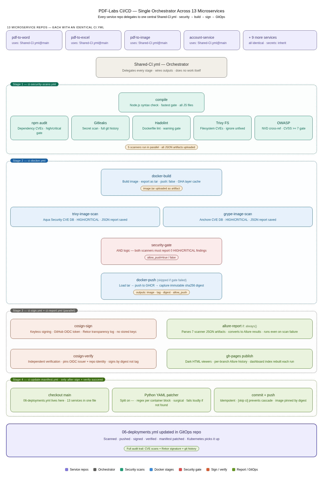

# PDF Labs — Microservice PDF Processing Platform

> A full-stack, production-grade, multi-service PDF processing platform built with Node.js and Docker. PDF Labs is composed of **13 independent microservices**, each living in its own Git branch and Docker container, orchestrated together via Docker Compose and deployable to Kubernetes with a fully automated **DevSecOps CI/CD pipeline** that runs security scanning, image hardening, keyless container signing, and GitOps manifest updates across all 13 services from a single shared GitHub Actions orchestrator.

---

## Table of Contents

- [Overview](#overview)
- [Repository Structure](#repository-structure)
- [Service Map](#service-map)
- [Application Architecture](#application-architecture)
  - [Browser-Mediated Authentication Flow](#browser-mediated-authentication-flow)
  - [Service Topology Diagram](#service-topology-diagram)
- [Technology Stack](#technology-stack)
- [CI/CD Pipeline Architecture](#cicd-pipeline-architecture)
  - [Design Philosophy](#design-philosophy)
  - [Pipeline Overview Diagram](#pipeline-overview-diagram)
  - [How It Works: The Hub-and-Spoke Model](#how-it-works-the-hub-and-spoke-model)
  - [Stage 1 — Pre-Build Security Scans](#stage-1--pre-build-security-scans)
  - [Stage 2 — Docker Build, Image Scan, Security Gate, Push](#stage-2--docker-build-image-scan-security-gate-push)
  - [Stage 3 — Keyless Signing and Security Reporting](#stage-3--keyless-signing-and-security-reporting)
  - [Stage 4 — GitOps Manifest Update](#stage-4--gitops-manifest-update)
  - [Workflow File Reference](#workflow-file-reference)
  - [Security Controls Summary](#security-controls-summary)
- [Environment Variables](#environment-variables)
- [Running the Full Stack](#running-the-full-stack)
  - [Prerequisites](#prerequisites)
  - [Clone All Service Branches](#clone-all-service-branches)
  - [Quick Start with Docker Compose](#quick-start-with-docker-compose)
  - [Stopping the Stack](#stopping-the-stack)
- [Authentication Model](#authentication-model)
- [Git Branch Structure](#git-branch-structure)
- [Contributing](#contributing)
- [License](#license)

---

## Overview

PDF Labs is a microservices application where every feature from user authentication to PDF compression is an isolated Node.js/Express service with its own MongoDB namespace, Dockerfile, and independent deployment lifecycle. Services communicate exclusively through JWT-authenticated HTTP redirects and shared browser `localStorage` token storage; there is no API gateway or inter-service HTTP mesh.

**Key application design principles:**

- Every service is independently buildable, deployable, and replaceable
- A single shared `JWT_SECRET` allows all services to verify tokens issued by the `account-service` without any additional key infrastructure
- No service calls another service's API directly, the browser holds the token and presents it on each navigation
- Services that need PDF processing use either local system tools (Ghostscript, Poppler) or the ConvertAPI v2 REST API over HTTPS

**Key DevSecOps design principles:**

- One central GitHub Actions orchestrator (`Shared-CI.yml`) serves all 13 service repos, zero pipeline duplication
- Every commit to any service branch triggers a full security pipeline before a single image byte touches the registry
- No image is ever pushed to GHCR without passing dual-scanner vulnerability gates
- No image ever reaches the deployment manifest without being cryptographically signed and independently verified
- Security reports are always published — even when the pipeline fails — so failures are always visible and auditable

---

## Repository Structure

This repository (the **main branch**) is the orchestration root. It contains the shared CI/CD workflow files, Docker Compose configuration, and Kubernetes manifests. Each microservice lives in its own dedicated Git branch.

```
main branch (this repository)
├── .github/
│   └── workflows/
│       ├── Shared-CI.yml              # ← Orchestrator: delegates all stages
│       ├── ci-security-scans.yml      # ← Stage 1: compile + 5 security scanners
│       ├── ci-docker.yml              # ← Stage 2: build → dual scan → gate → push
│       ├── ci-sign.yml                # ← Stage 3a: keyless cosign + verify
│       ├── ci-report.yml              # ← Stage 3b: Allure report → GitHub Pages
│       └── ci-update-manifest.yml     # ← Stage 4: GitOps manifest patch
├── docker-compose.yml                 # Wires all 13 services + MongoDB together
├── deployments-files/
│   └── 06-deployments.yml             # Kubernetes Deployment manifests (all 13 services)
├── README.md                          # This file
└── k8s/                               # Kubernetes supporting manifests
    ├── namespace.yaml
    ├── mongo/
    └── services/
        ├── account-service/
        ├── home-service/
        └── ...

Individual service branches (each checked out separately):
  account-service          →  branch: account-service
  home-service             →  branch: home-service
  profile-service          →  branch: profile-service
  logout-service           →  branch: logout-service
  tools-service            →  branch: tools-service
  pdf-to-image-service     →  branch: pdf-to-image-service
  image-to-pdf-service     →  branch: image-to-pdf-service
  pdf-compressor-service   →  branch: pdf-compressor-service
  pdf-to-audio-service     →  branch: pdf-to-audio-service
  pdf-to-word-service      →  branch: pdf-to-word-service
  sheetlab-service         →  branch: sheetlab-service
  word-to-pdf-service      →  branch: word-to-pdf-service
  edit-pdf-service         →  branch: edit-pdf-service
```

The **[docker-compose.yml](./docker-compose.yml)** in this branch builds each service directly from its cloned source directory on the host (`build: ~/pdf/<service-name>`), so each service branch must be checked out locally before running the full stack.

---

## Service Map

| Service | Branch | Port | Role | PDF Processing |
|---|---|---|---|---|
| `account-service` | `account-service` | 3000 | Landing page & authentication | — |
| `home-service` | `home-service` | 3500 | Post-login dashboard | — |
| `profile-service` | `profile-service` | 4000 | User profile & account management | — |
| `logout-service` | `logout-service` | 4500 | Session termination | — |
| `tools-service` | `tools-service` | 5000 | Authenticated tools hub | — |
| `pdf-to-image-service` | `pdf-to-image-service` | 5100 | PDF → PNG/JPEG/TIFF/SVG/EPS/PS | Poppler (`pdftocairo`) |
| `image-to-pdf-service` | `image-to-pdf-service` | 5200 | JPG/PNG → PDF | `pdf-lib` (in-process) |
| `pdf-compressor-service` | `pdf-compressor-service` | 5300 | PDF compression (4 quality levels) | Ghostscript |
| `pdf-to-audio-service` | `pdf-to-audio-service` | 5400 | PDF → MP3 (30+ neural voices) | Poppler + Edge TTS |
| `pdf-to-word-service` | `pdf-to-word-service` | 5500 | PDF → DOCX (standard + OCR) | ConvertAPI v2 |
| `sheetlab-service` | `sheetlab-service` | 5600 | PDF ↔ Excel (.xlsx/.xls) | ConvertAPI v2 |
| `word-to-pdf-service` | `word-to-pdf-service` | 5700 | DOCX/DOC/ODT/RTF/PPTX/PPT → PDF | ConvertAPI v2 |
| `edit-pdf-service` | `edit-pdf-service` | 5800 | Rotate, watermark, merge, split, protect, unlock | ConvertAPI v2 |

---

## Application Architecture

### Browser-Mediated Authentication Flow

PDF Labs uses a **shared-secret JWT** model with browser-mediated navigation. There is no API gateway, no service mesh, and no inter-service HTTP calls (with the single exception of the `profile-service`, which opens short-lived direct MongoDB connections to tool service databases to aggregate activity history).

```
                    ┌──────────────────────────────────────────┐
                    │              Browser (User)              │
                    │  localStorage: JWT token                 │
                    │  Appended as ?token=<jwt> on navigation  │
                    └──────────────┬───────────────────────────┘
                                   │
                    ┌──────────────▼───────────────────────────┐
                    │        account-service (:3000)           │
                    │  • Landing page & registration           │
                    │  • Login → issues JWT (1 hour)           │
                    └──────────────┬───────────────────────────┘
                                   │ redirect with ?token=
                    ┌──────────────▼───────────────────────────┐
                    │         home-service (:3500)             │
                    │  • Authenticated dashboard               │
                    │  • Navigation hub                        │
                    └──┬──────────┬──────────┬─────────────────┘
                       │          │          │
           ┌───────────▼──┐  ┌────▼─────┐ ┌─▼──────────┐
           │ tools-service│  │ profile  │ │  logout    │
           │   (:5000)    │  │ (:4000)  │ │  (:4500)   │
           └──┬──┬──┬──┬──┘  └──────────┘ └────────────┘
              │  │  │  │
    ┌─────────┘  │  │  └─────────────────────────────────────┐
    │  ┌─────────┘  └──────────┐                             │
    ▼  ▼                       ▼                             ▼
 :5100 :5200             :5300 :5400 :5500           :5600 :5700 :5800
pdf→img img→pdf       compress audio  word        sheetlab w→pdf edit-pdf
```

### Service Topology Diagram

All services run on a shared Docker bridge network (`pdf-labs-net`). MongoDB runs as a single instance with each service using its own namespace/database.

```
                    ┌──────────────────────────────────────────┐
                    │           MongoDB (:27017)               │
                    │  Each service has its own DB namespace   │
                    │  account-service  ·  home-service        │
                    │  pdf-to-image-service                    │
                    │  image-to-pdf-service                    │
                    │  pdf-compressor-service                  │
                    │  pdf-to-audio-service                    │
                    │  pdf-to-word-service                     │
                    │  word-to-pdf-service                     │
                    │  edit-pdf-service  ·  sheetlab-service   │
                    └──────────────────────────────────────────┘

                    ┌──────────────────────────────────────────┐
                    │     External APIs (outbound HTTPS)       │
                    │  ConvertAPI v2 — pdf-to-word             │
                    │                  word-to-pdf             │
                    │                  edit-pdf                │
                    │                  sheetlab                │
                    │  Microsoft Edge TTS — pdf-to-audio       │
                    └──────────────────────────────────────────┘
```

---

## Technology Stack

| Layer | Technology |
|---|---|
| Runtime | Node.js (v18 or v22 depending on service) |
| Framework | Express 4 |
| Templating | EJS |
| Database | MongoDB 7 (single instance, per-service namespaces) |
| Auth | JWT (`jsonwebtoken`) — shared secret across all services |
| Containerisation | Docker (multi-stage Alpine builds) |
| Orchestration (dev) | Docker Compose v3 |
| Orchestration (prod) | Kubernetes |
| PDF tools | Ghostscript, Poppler (`pdftocairo`, `pdftotext`, `pdfinfo`) |
| PDF generation | `pdf-lib` (image-to-pdf) |
| External APIs | ConvertAPI v2, Microsoft Edge TTS |
| CI/CD | GitHub Actions (reusable workflows) |
| Container Registry | GitHub Container Registry (GHCR) |
| Security Scanning | Trivy, Grype, Gitleaks, Hadolint, OWASP Dependency-Check, npm audit |
| Container Signing | Sigstore Cosign (keyless, GitHub OIDC) |
| Security Reporting | Allure Framework → GitHub Pages |

---

## CI/CD Pipeline Architecture

### Design Philosophy

The CI/CD system for PDF Labs is built around a single, central principle: **one pipeline, running across all 13 services without duplicating a single line of YAML.**

Each of the 13 service repositories contains exactly one CI file:

```yaml
# .github/workflows/ci.yml  — identical in every service branch
name: Branch CI

on:
  push:
  pull_request:

permissions:
  contents: write
  packages: write
  id-token: write

jobs:
  run-ci:
    uses: Godfrey22152/MICROSERVICE-PDF-LABS/.github/workflows/Shared-CI.yml@main
    secrets: inherit
```

That is the entire CI configuration for a service. The `uses:` directive delegates everything to the central `Shared-CI.yml` in the `main` branch. When the pipeline logic changes, a new scanner is added, a Trivy version is bumped, the security gate threshold is adjusted — it changes in one place and immediately applies to all 13 services on their next run.

This architecture treats CI/CD logic exactly like application code: it has a single source of truth, it is versioned, and it is free of duplication.

---

### Pipeline Overview Diagram

> The diagram below illustrates the full end-to-end pipeline — from a push in any one of the 13 service repos, through security scanning, Docker image hardening, keyless signing, and finally an automated GitOps manifest update.

<!-- ============================================================ -->
<!-- PIPELINE ARCHITECTURE DIAGRAM                                 -->
<!-- Replace the placeholder below with your generated image.      -->
<!-- Recommended: export the diagram as a PNG at 2x resolution     -->
<!-- and place it at docs/images/cicd-pipeline-architecture.png   -->
<!-- ============================================================ -->



*Figure 1 — Full pipeline DAG: 13 service repos → Shared-CI orchestrator → security scans → Docker build/scan/gate/push → keyless signing + Allure reporting (parallel) → GitOps manifest update.*

---

### How It Works: The Hub-and-Spoke Model

The orchestrator (`Shared-CI.yml`) is a pure delegation layer. It does no work itself. Its only responsibilities are:

1. **Call** each focused reusable workflow in the correct order
2. **Wire outputs** between stages (the image digest produced by `ci-docker.yml` is passed as an input to `ci-sign.yml` and `ci-update-manifest.yml`)
3. **Gate downstream stages** using the `allow_push` output from the security gate inside `ci-docker.yml`

The full execution flow on every push to any service branch:

```
Service repo push / pull_request
        │
        └── ci.yml  →  uses: Shared-CI.yml@main
                │
                ▼
    ┌───────────────────────────────────────────────────────────┐
    │  Stage 1  ·  ci-security-scans.yml                        │
    │                                                           │
    │   compile (syntax check — fastest gate)                   │
    │       │                                                   │
    │   ┌───┼───────────────────┬──────────────┐                │
    │   ▼   ▼                   ▼              ▼                │
    │  npm  gitleaks        hadolint       trivy-fs   owasp     │
    │  audit (secrets)      (dockerfile)   (fs CVEs)  (NVD)     │
    │                                                           │
    │  All run in parallel · all must pass · JSON artifacts     │
    │  uploaded before gate fires (report always available)     │
    └───────────────────────────────────────────────────────────┘
                │
                ▼ (all scans must pass)
    ┌───────────────────────────────────────────────────────────┐
    │  Stage 2  ·  ci-docker.yml                                │
    │                                                           │
    │   docker-build                                            │
    │   push: false · export as image.tar artifact              │
    │   GHA layer cache for subsequent runs                     │
    │       │                                                   │
    │   ┌───┴──────────────────┐                                │
    │   ▼                      ▼                                │
    │  trivy-image-scan     grype-image-scan                    │
    │  (Aqua CVE DB)        (Anchore CVE DB)                    │
    │       └──────────┬───────┘                                │
    │                  ▼                                        │
    │          security-gate                                    │
    │          AND logic: both scanners = 0 HIGH/CRITICAL       │
    │          → allow_push = "true" / "false"                  │
    │                  │                                        │
    │                  ▼ (only if allow_push == 'true')         │
    │          docker-push                                      │
    │          Load tar → push GHCR → capture sha256 digest     │
    └───────────────────────────────────────────────────────────┘
                │
                ▼
    ┌─────────────────────────┐    ┌──────────────────────────┐
    │  Stage 3a  ·  ci-sign   │    │  Stage 3b  ·  ci-report  │
    │                         │    │                          │
    │  cosign-sign            │    │  if: always()            │
    │  Keyless · OIDC token   │    │  Download all artifacts  │
    │  Rekor transparency log │    │  → Allure result files   │
    │       │                 │    │  → HTML scan viewers     │
    │  cosign-verify          │    │  → gh-pages publish      │
    │  Pins OIDC issuer +     │    │  → Dashboard index.html  │
    │  repo identity regexp   │    │                          │
    └──────────┬──────────────┘    └──────────────────────────┘
               │
               ▼ (only after sign + verify succeed)
    ┌───────────────────────────────────────────────────────────┐
    │  Stage 4  ·  ci-update-manifest.yml                       │
    │                                                           │
    │  Checkout main · locate 06-deployments.yml                │
    │  Python YAML patcher:                                     │
    │    split on --- · regex per container block               │
    │    surgical update of image: line for this service only   │
    │  git commit "ci: update <service> → <sha> [skip ci]"      │
    │  git push origin main                                     │
    └───────────────────────────────────────────────────────────┘
```

---

### Stage 1 — Pre-Build Security Scans

**File:** `.github/workflows/ci-security-scans.yml`

Five independent security scanners run before any Docker layer is built. A fast syntax check gates the parallel scanner fan-out:

| Job | Tool | What It Catches | Gate Level |
|---|---|---|---|
| `compile` | `node --check` | JavaScript syntax errors | Any error |
| `dependency-audit` | npm audit | Known CVEs in npm dependencies | High / Critical |
| `gitleaks-scan` | Gitleaks | Secrets, API keys, credentials in git history | Any finding |
| `dockerfile-lint` | Hadolint | Dockerfile best-practice violations | Warning and above |
| `trivy-fs-scan` | Trivy (filesystem) | OS and language CVEs in the repo filesystem | High / Critical (unfixed ignored) |
| `owasp-dependency-check` | OWASP Dependency-Check | NVD cross-reference for all dependencies | CVSS ≥ 7 |

**The two-step scan pattern** is used on every scanner: the first step runs with `exit-code: 0` and uploads the JSON report artifact; the second step runs the hard gate with `exit-code: 1`. This ensures the report artifact is always available for review even when the gate fires and the job fails.

```
  generate report (exit-code: 0)  →  upload artifact
          │
  enforce gate (exit-code: 1)  →  fail job if findings found
```

This pattern is critical: if the gate step and the upload were the same step, a failure would kill the step before the artifact upload, and you would lose the evidence you need to understand why the gate fired.

---

### Stage 2 — Docker Build, Image Scan, Security Gate, Push

**File:** `.github/workflows/ci-docker.yml`

This stage implements a four-job internal DAG with one core principle: **the image is never pushed to the registry before being scanned.**

**Build once, scan from tar:**

The image is built with `push: false` and exported as a `image.tar` artifact. Both image scanners download this same tar file and load it independently. This means:

- Identical bytes are scanned by both tools, no drift between scanners
- The registry never sees an image that hasn't been scanned
- GitHub Actions layer caching (`cache-from: type=gha`) means unchanged layers rebuild in seconds

**Dual-scanner AND gate:**

```
  trivy-image-scan    grype-image-scan
  (Aqua Security DB)  (Anchore / NVD / GitHub Advisory DB)
          │                    │
          └────────┬───────────┘
                   ▼
           security-gate
           TRIVY == 0 AND GRYPE == 0
                   │
         ┌─────────┴──────────┐
         ▼                    ▼
    allow_push=true     allow_push=false
    (proceed)           (pipeline blocked)
```

Two different CVE databases are intentionally used. A vulnerability that has been annotated in one database may not yet appear in the other. The AND logic means a single scanner passing is not sufficient, both must agree the image is clean.

**Push by digest:**

After a successful push, the `sha256` digest is captured from the registry response. All downstream stages (signing, manifest update) reference this digest — not the tag. Tags are mutable; the digest is a cryptographic hash of the image layers and cannot change.

---

### Stage 3 — Keyless Signing and Security Reporting

**Files:** `.github/workflows/ci-sign.yml` · `.github/workflows/ci-report.yml`

These two stages run in parallel after a successful push.

#### Keyless Container Signing (ci-sign.yml)

PDF Labs uses **Sigstore Cosign keyless signing** — no private key is stored anywhere in the pipeline.

How it works:

1. GitHub Actions generates a short-lived OIDC token that cryptographically proves the identity of this specific workflow run
2. Cosign exchanges the OIDC token with Sigstore's Fulcio CA for a short-lived signing certificate
3. The image is signed by digest (not tag) — the signature is tied to the exact image bytes
4. The signature and a transparency log entry are written to the **Rekor** public ledger
5. The certificate expires within minutes — it cannot be replayed or reused

```bash
cosign sign --yes \
  ghcr.io/org/repo/service-image@sha256:<digest>
```

An independent `cosign-verify` job immediately follows. It confirms the signature exists in Rekor and pins the expected identity:

```bash
cosign verify \
  --certificate-oidc-issuer=https://token.actions.githubusercontent.com \
  --certificate-identity-regexp="https://github.com/<org>/<repo>/.github/workflows/.*" \
  ghcr.io/org/repo/service-image@sha256:<digest>
```

The `--certificate-identity-regexp` flag is a supply-chain control: it rejects any signature made by a workflow in a fork or a different repository, even if the image bytes are identical.

#### Security Dashboard (ci-report.yml)

The report stage runs with `if: always()` — it runs regardless of whether any upstream stage failed or was skipped.

It produces three outputs, all published to GitHub Pages:

| Output | Location on gh-pages | Description |
|---|---|---|
| Raw scan viewers | `/scan-reports/<branch>/<run>/` | Dark-themed, syntax-highlighted HTML page for each scanner's JSON report |
| OWASP HTML report | `/owasp/<branch>/<run>/` | Full OWASP Dependency-Check HTML report |
| Allure security report | `/allure-action/<branch>/` | Per-branch Allure HTML report with run history |
| Dashboard index | `/index.html` | Branch-level dashboard linking all reports with collapsible run history |

The `continue-on-error: true` on every artifact download step means the report page is generated even if some scanners were skipped (e.g. because an earlier gate blocked Docker from building).

---

### Stage 4 — GitOps Manifest Update

**File:** `.github/workflows/ci-update-manifest.yml`

This stage only runs after `cosign-sign` **and** `cosign-verify` have both succeeded. An unsigned or unverified image can never reach the deployment manifest.

**The YAML patching challenge:**

`deployments-files/06-deployments.yml` is a single file containing all 13 Kubernetes Deployment objects separated by `---` YAML document separators. Using `sed` or `awk` to patch this file is fragile — a regex can cross document boundaries and accidentally update the wrong service's image.

Instead, a Python script handles the patch surgically:

```
1. Read the full manifest
2. Split on --- boundaries → list of 13 independent documents
3. For each document:
     search for a container block whose name: matches this service
     if found: replace only the image: line within that block
4. Re-join with --- separators
5. Write back to disk
6. Exit non-zero if the service name was not found (silent no-ops are worse than errors)
```

**The commit:**

```bash
git commit -m "ci: update <service-name> → <git-sha> [skip ci]"
```

- `[skip ci]` prevents a push to `main` from triggering CI on all 13 service repos — avoiding a cascade of 13 unnecessary pipeline runs
- An idempotency check (`git diff --cached --quiet`) ensures re-running the same pipeline for an already-current SHA creates no empty commit

---

### Workflow File Reference

| File | Stage | Triggered By | Key Outputs |
|---|---|---|---|
| `Shared-CI.yml` | Orchestrator | Every service's `ci.yml` | Wires `image`, `tag`, `digest`, `allow_push` between stages |
| `ci-security-scans.yml` | 1 | `Shared-CI.yml` | JSON artifacts for all 5 scanners |
| `ci-docker.yml` | 2 | `Shared-CI.yml` (after stage 1) | `image`, `tag`, `digest`, `allow_push` |
| `ci-sign.yml` | 3a | `Shared-CI.yml` (if `allow_push == 'true'`) | Signature in Rekor |
| `ci-report.yml` | 3b | `Shared-CI.yml` (`if: always()`) | Allure + HTML pages on gh-pages |
| `ci-update-manifest.yml` | 4 | `Shared-CI.yml` (after sign + verify) | Patched `06-deployments.yml` on `main` |

---

### Security Controls Summary

| Control | Implementation | Where |
|---|---|---|
| Dependency CVE scanning | npm audit (high/critical gate) | Stage 1 |
| Secret detection | Gitleaks (full git history) | Stage 1 |
| Dockerfile hardening | Hadolint (warning gate, DL3018 excluded) | Stage 1 |
| Filesystem CVE scanning | Trivy FS (HIGH/CRITICAL, unfixed ignored) | Stage 1 |
| Transitive dependency NVD check | OWASP Dependency-Check (CVSS ≥ 7) | Stage 1 |
| Image never pushed before scanning | Build as tar, scan before push | Stage 2 |
| Dual-database image CVE scanning | Trivy image + Grype (AND gate) | Stage 2 |
| Registry pollution prevention | Security gate blocks push if findings exist | Stage 2 |
| Immutable image reference | All downstream stages use `sha256` digest, not tag | Stage 2 |
| Keyless container signing | Sigstore Cosign via GitHub OIDC | Stage 3a |
| Supply chain identity pinning | `cosign verify` with `--certificate-identity-regexp` | Stage 3a |
| Transparency log | Rekor public ledger entry per image | Stage 3a |
| Always-available security reports | `if: always()` on report stage | Stage 3b |
| Audit trail | Git history + Rekor + Allure per-run history | All stages |
| Cascade prevention | `[skip ci]` on manifest commit | Stage 4 |
| Idempotent GitOps | No empty commits on re-runs | Stage 4 |

---

## Environment Variables

All services share `JWT_SECRET` and `MONGO_URI`. Four services additionally require `CONVERTAPI_SECRET`.

| Variable | Required By | Description |
|---|---|---|
| `MONGO_URI` | All services | MongoDB connection string for the service's own namespace |
| `JWT_SECRET` | All services | Shared JWT signing/verification secret — must be identical across all services |
| `CONVERTAPI_SECRET` | `pdf-to-word`, `word-to-pdf`, `edit-pdf`, `sheetlab` | ConvertAPI v2 secret key (free tier: 250 conversions/month) |
| `SESSION_SECRET` | `sheetlab` | express-session secret (defaults to `"sheetlab_secret"` — override in production) |
| `NODE_ENV` | All services | `development` or `production` |
| `PORT` | All services | Server port (each service has a default — see [Service Map](#service-map)) |

> **Security note:** The `JWT_SECRET` shown in **[docker-compose.yml](./docker-compose.yml)** is a development default. Always replace it with a cryptographically strong random value in any non-local environment.

---

## Running the Full Stack

### Prerequisites

- [Docker](https://www.docker.com/) and Docker Compose installed
- Each service branch checked out locally under `~/pdf/<service-name>`
- A [ConvertAPI](https://www.convertapi.com) account (free tier sufficient for development)

### Clone All Service Branches

```bash
# Create the working directory
mkdir -p ~/pdf && cd ~/pdf

# Clone each service branch
git clone -b account-service         https://github.com/Godfrey22152/MICROSERVICE-PDF-LABS.git account-service
git clone -b home-service            https://github.com/Godfrey22152/MICROSERVICE-PDF-LABS.git home-service
git clone -b profile-service         https://github.com/Godfrey22152/MICROSERVICE-PDF-LABS.git profile-service
git clone -b logout-service          https://github.com/Godfrey22152/MICROSERVICE-PDF-LABS.git logout-service
git clone -b tools-service           https://github.com/Godfrey22152/MICROSERVICE-PDF-LABS.git tools-service
git clone -b pdf-to-image-service    https://github.com/Godfrey22152/MICROSERVICE-PDF-LABS.git pdf-to-image-service
git clone -b image-to-pdf-service    https://github.com/Godfrey22152/MICROSERVICE-PDF-LABS.git image-to-pdf-service
git clone -b pdf-compressor-service  https://github.com/Godfrey22152/MICROSERVICE-PDF-LABS.git pdf-compressor-service
git clone -b pdf-to-audio-service    https://github.com/Godfrey22152/MICROSERVICE-PDF-LABS.git pdf-to-audio-service
git clone -b pdf-to-word-service     https://github.com/Godfrey22152/MICROSERVICE-PDF-LABS.git pdf-to-word-service
git clone -b sheetlab-service        https://github.com/Godfrey22152/MICROSERVICE-PDF-LABS.git sheetlab-service
git clone -b word-to-pdf-service     https://github.com/Godfrey22152/MICROSERVICE-PDF-LABS.git word-to-pdf-service
git clone -b edit-pdf-service        https://github.com/Godfrey22152/MICROSERVICE-PDF-LABS.git edit-pdf-service

# Clone the main branch for docker-compose.yml and k8s manifests
cd ~ && git clone https://github.com/Godfrey22152/MICROSERVICE-PDF-LABS.git pdf-labs-main
```

### Quick Start with Docker Compose

```bash
# Navigate to the main branch directory
cd ~/pdf-labs-main

# Set your ConvertAPI secret (replace with your actual key)
export CONVERTAPI_SECRET=your_convertapi_secret_here

# Build and start all 13 services + MongoDB
docker compose up --build

# Or run in detached mode
docker compose up --build -d
```

Once all containers are running, open your browser and navigate to:

```
http://localhost:3000
```

Create an account, log in, and you will be routed through the full platform.

### Stopping the Stack

```bash
# Stop all containers
docker compose down

# Stop and remove the MongoDB volume (all persisted data)
docker compose down -v
```

---

## Authentication Model

PDF Labs uses a **shared-secret JWT** authentication model designed to be simple and stateless across all services:

1. The `account-service` issues a JWT signed with `JWT_SECRET` on successful login (1-hour expiry by default)
2. The JWT is stored in the browser's `localStorage` and appended as `?token=<jwt>` on every navigation between services
3. Every protected route on every service verifies the token using the same `JWT_SECRET` — no token exchange, no OAuth flow, no inter-service calls
4. Each service independently validates the token's structure (3 dot-separated parts) and cryptographic signature before processing any request
5. Client-side, every service decodes the JWT `exp` claim and schedules a precise redirect back to the `account-service` at the moment of expiry
6. When a user logs out, the `logout-service` issues a 60-second replacement token and redirects to the `account-service` after a countdown

---

## Git Branch Structure

The project uses a **branch-per-service** model. The `main` branch is the integration root and contains only orchestration files — CI/CD workflows, Docker Compose, and Kubernetes manifests. No application source code lives on `main`.

```
main                       ← CI/CD workflows · docker-compose.yml · k8s manifests
├── account-service        ← Full source: Dockerfile · app.js · routes · views
├── home-service           ← Full source: Dockerfile · app.js · routes · views
├── profile-service        ← Full source: Dockerfile · app.js · routes · views
├── logout-service         ← Full source: Dockerfile · app.js · routes · views
├── tools-service          ← Full source: Dockerfile · app.js · routes · views
├── pdf-to-image-service   ← Full source: Dockerfile · app.js · routes · views
├── image-to-pdf-service   ← Full source: Dockerfile · app.js · routes · views
├── pdf-compressor-service ← Full source: Dockerfile · app.js · routes · views
├── pdf-to-audio-service   ← Full source: Dockerfile · app.js · routes · views
├── pdf-to-word-service    ← Full source: Dockerfile · app.js · routes · views
├── sheetlab-service       ← Full source: Dockerfile · app.js · routes · views
├── word-to-pdf-service    ← Full source: Dockerfile · app.js · routes · views
└── edit-pdf-service       ← Full source: Dockerfile · app.js · routes · views
```

Each service branch contains the full service source tree including its own `Dockerfile`, `README.md`, `.dockerignore`, `.gitignore`, and `package.json`. Services are developed and versioned independently, a change to one service branch never touches any other branch.

**Every branch has its own CI pipeline** that fires on every push and pull request, delegating to `Shared-CI.yml@main` on the main branch. This means every commit to any service, however small goes through the full 4-stage security, build, sign, and deploy pipeline before its image reaches the deployment manifest.

---

## Contributing

1. Fork the repository
2. For **service changes**: check out the relevant service branch and make your changes there
3. For **orchestration changes** (Docker Compose, Kubernetes manifests, CI/CD workflows): work on the `main` branch
4. Create a feature branch from the appropriate base: `git checkout -b feature/my-feature`
5. Commit your changes following conventional commits: `git commit -m "feat: describe the change"`
6. Push and open a Pull Request targeting the correct base branch

**Please keep service branches isolated** — changes to one service's branch should not affect other branches. The CI pipeline will automatically validate your changes through the full security and build pipeline on every push.

---

## License

This project is licensed under the **ISC License**.

---

> Developed and maintained by [Godfrey Ifeanyi](mailto:godfreyifeanyi50@gmail.com)
>
> Repository: [https://github.com/Godfrey22152/MICROSERVICE-PDF-LABS](https://github.com/Godfrey22152/MICROSERVICE-PDF-LABS)
