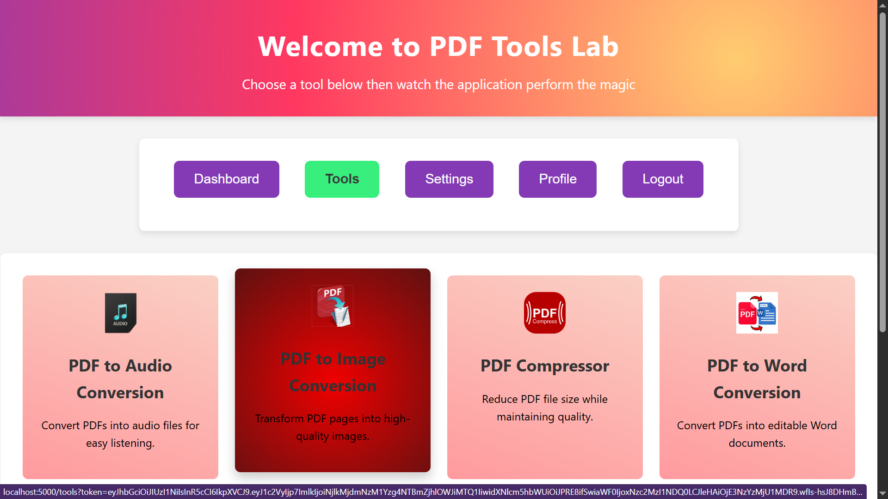

# PDF Labs — Tools Service

> The authenticated tools hub microservice for the PDF Labs platform. Renders the central tools dashboard after login, validates JWT sessions, and routes users to the appropriate PDF processing microservice.

---

## Table of Contents

- [Overview](#overview)
- [Architecture](#architecture)
- [Screenshots](#screenshots)
- [Tech Stack](#tech-stack)
- [Project Structure](#project-structure)
- [API Endpoints](#api-endpoints)
- [Environment Variables](#environment-variables)
- [Getting Started](#getting-started)
  - [Prerequisites](#prerequisites)
  - [Run Locally (without Docker)](#run-locally-without-docker)
  - [Run with Docker](#run-with-docker)
- [Session & Authentication Flow](#session--authentication-flow)
- [Security Highlights](#security-highlights)
- [Related Services](#related-services)
- [Contributing](#contributing)
- [License](#license)

---

## Overview

The **Tools Service** is a Node.js/Express microservice that serves as the authenticated tools dashboard for the [PDF Labs](https://github.com/Godfrey22152/MICROSERVICE-PDF-LABS) platform. After a user logs in via the **Account Service** (port `3000`) and is passed through the **Home Service** (port `3500`), they land here to choose from the full suite of PDF tools.

This service is responsible for:

- Rendering the tools selection page (EJS) — only accessible with a valid JWT
- Client-side session management: reading the JWT from the URL, storing it in `localStorage`, and scheduling an automatic expiry redirect
- Proxying navigation to all downstream tool microservices by forwarding the token in the URL
- Exposing a `validate-session` API endpoint for other services to verify tokens

---

## Architecture

The tools service sits downstream of the account and home services. It acts as the navigation hub that links every PDF tool microservice together.

```
                  ┌─────────────────────────────────────┐
                  │          PDF Labs Platform          │
                  │          (Docker Network)           │
                  └──────────────┬──────────────────────┘
                                 │
         ┌───────────────────────▼────────────────────────────┐
         │              account-service (:3000)               │
         │  Login → issues JWT → redirects to home-service    │
         └───────────────────────┬────────────────────────────┘
                                 │
         ┌───────────────────────▼────────────────────────────┐
         │               home-service (:3500)                 │
         │  Dashboard → "Tools" nav → tools-service           │
         └───────────────────────┬────────────────────────────┘
                                 │
         ┌───────────────────────▼──────────────────────────────────────────────────────────────────┐
         │              tools-service (:5000)  ◄── THIS                                             │
         │              Renders tool cards, validates JWT                                           │
         └──┬───────┬────────┬────────────┬────────────┬──────────────┬─────────┬──────────┬────────┘
            │       │        │            │            |              |         |          |
         :5100     :5200      :5300       :5400        :5500        :5600      :5700      :5800
       (pdf→image) (image→pdf) (compressor) (pdf→audio) (pdf→word) (pdf→Excel) (word→pdf) (edit pdf)
```

> **Note:** The **[Docker Compose file](https://github.com/Godfrey22152/MICROSERVICE-PDF-LABS/blob/main/docker-compose.yml)** that wires all services lives in the **root/main repository**, not in this repository.

---

## Screenshots

> Tools Page application screenshots.

### Tools Dashboard


### Session Expiry Toast


### Error Page


---

## Tech Stack

| Layer | Technology |
|---|---|
| Runtime | Node.js ≥ 15.0.0 |
| Framework | Express 4 |
| Templating | EJS |
| Database | MongoDB (via Mongoose 8) |
| Auth | JWT (`jsonwebtoken`) — Bearer header, query param, or body |
| Config | `config` module + `.env` |
| Container | Docker (multi-stage, Alpine-based) |

---

## Project Structure

```
tools-service/
├── app.js                    # Express entry point, error handlers
├── Dockerfile                # Multi-stage production Docker build
├── package.json
├── config/
│   ├── db.js                 # MongoDB connection
│   └── default.json          # Config template (env-var references)
├── middleware/
│   └── auth.js               # JWT guard — accepts Bearer header, query param, or body token
├── routes/
│   └── tools.js              # GET /tools, GET /tools/validate-session
├── views/
│   ├── tools.ejs             # Tools dashboard page
│   └── error.ejs             # Error page (NOT_FOUND / SERVER_ERROR)
└── public/
    ├── css/
    │   └── styles.css
    ├── js/
    │   └── script.js         # Session management, toast, nav & tool routing
    └── images/               # Tool card images
```

---

## API Endpoints

### Public (token validated inline, redirect on failure)

| Method | Path | Description |
|---|---|---|
| `GET` | `/` | Redirects to `/tools?token=<jwt>` if token present, else to login |
| `GET` | `/tools` | Renders the tools dashboard — requires valid `?token=` query param |

### Protected (JWT required via Bearer header, query param, or body)

| Method | Path | Description |
|---|---|---|
| `GET` | `/tools/validate-session` | Returns `{ valid: true, user: {...} }` for a valid token |

#### `GET /tools`

Accepts the JWT as a query parameter. The token is verified server-side before rendering; invalid or tampered tokens are immediately redirected to login.

```
GET http://localhost:5000/tools?token=<jwt>
```

**Responses:**
- `200` — Renders `tools.ejs` dashboard
- `302` — Redirects to `http://localhost:3000` (no token or invalid token)

#### `GET /tools/validate-session`

Useful for other microservices to verify a token issued by the account-service.

```
GET http://localhost:5000/tools/validate-session
Authorization: Bearer <jwt>
```

**Responses:**
- `200` — `{ "valid": true, "user": { "id": "...", "username": "..." } }`
- `401` — `{ "error": true, "type": "TOKEN_EXPIRED" | "INVALID_TOKEN" | "NO_TOKEN", "msg": "..." }`

---

## Environment Variables

Create a `.env` file in the project root (or supply these via Docker/Compose):

| Variable | Required | Description |
|---|---|---|
| `MONGO_URI` | Yes | MongoDB connection string, e.g. `mongodb://mongo:27017/tools-service` |
| `JWT_SECRET` | Yes | Secret key used for verifying JWTs (must match account-service) |
| `PORT` | No | Server port (defaults to `5000`) |
| `NODE_ENV` | No | `development` or `production` |

> **Important:** The `JWT_SECRET` must be identical across all services in the platform so that tokens issued by the account-service can be verified here.

> **Warning:** Never commit your `.env` file or real secrets to version control.

---

## Getting Started

### Prerequisites

- [Node.js](https://nodejs.org/) ≥ 15.0.0
- [MongoDB](https://www.mongodb.com/) instance (local or Docker)
- [Docker](https://www.docker.com/) (optional, for containerised runs)
- A valid JWT — this service requires a token issued by the **account-service**

### Run Locally (without Docker)

```bash
# 1. Clone the repository
git clone https://github.com/Godfrey22152/MICROSERVICE-PDF-LABS.git
cd MICROSERVICE-PDF-LABS/tools-service

# 2. Install dependencies
npm install

# 3. Create your environment file
cp .env.example .env
# Then edit .env with your MONGO_URI and JWT_SECRET

# 4. Start the server
npm start
```

The service will be available at `http://localhost:5000`.

> **Note:** Without a valid token from the account-service, navigating to `/` or `/tools` will redirect you to `http://localhost:3000`. Start the full stack for the complete flow.

### Run with Docker

#### Build and run this service standalone

```bash
docker build -t tools-service .
docker run -p 5000:5000 \
  -e MONGO_URI=mongodb://<your-mongo-host>:27017/tools-service \
  -e JWT_SECRET=your_secret_here \
  tools-service
```

#### Run the full PDF Labs stack

From the **root/main repository** that contains **[docker-compose.yml](https://github.com/Godfrey22152/MICROSERVICE-PDF-LABS/blob/main/docker-compose.yml)**:

```bash
docker compose up --build
```

This starts all services on the `pdf-labs-net` Docker bridge network.

---

## Session & Authentication Flow

The tools-service performs both server-side and client-side token validation for defence-in-depth.

```
User arrives at /tools?token=<jwt>
        │
        ▼
  Server: jwt.verify(token)          ← server-side guard in routes/tools.js
        │
   ┌────┴────────────────────┐
   │ Invalid / expired       │       → 302 redirect to account-service (:3000)
   └─────────────────────────┘
        │ Valid
        ▼
  Render tools.ejs  (token injected into page)
        │
        ▼
  Client: token stored in localStorage  ← script.js
        │
        ▼
  Client: JWT payload decoded, exp read
        │
        ├─ Already expired  → immediate toast + redirect (100ms delay)
        │
        └─ Still valid      → setTimeout fires at exact expiry moment
                                 → toast "Session expired" + redirect to :3000

  User clicks a tool card
        │
        ▼
  navigateWithToken(toolUrl)
        │
        ▼
  window.location.href = `${toolUrl}?token=${jwt}`
        │
        ▼
  Tool microservice (:5100–:5800) receives token and validates independently
```

### Token Sources (auth middleware)

The `auth.js` middleware accepts the JWT from three locations, checked in this priority order:

1. `Authorization: Bearer <token>` header
2. `?token=<jwt>` URL query parameter
3. `token` field in the request body

---

## Security Highlights

- **Dual-layer token validation** — the token is verified server-side (Node.js `jwt.verify`) before rendering, and also decoded client-side to schedule a precise expiry redirect, so sessions cannot silently outlive their `exp` claim.
- **Tamper detection** — the client checks JWT structure (exactly 3 dot-separated parts) and payload readability before trusting the token; structurally invalid tokens trigger an immediate redirect.
- **Non-root Docker user** — the production container runs as `appuser` (non-root) on an Alpine Linux base image.
- **Multi-stage Docker build** — development tooling, source maps, test files, and docs are stripped; only production artifacts land in the final image.
- **Flexible token ingestion** — the auth middleware accepts tokens from headers, query params, or body, making it easy for both browser clients and API consumers to authenticate.
- **Structured error responses** — the auth middleware returns typed error objects (`NO_TOKEN`, `TOKEN_EXPIRED`, `INVALID_TOKEN`) so clients can handle each case programmatically.
- **No secrets in image** — all secrets are injected at runtime via environment variables.

---

## Related Services

All services below are part of the PDF Labs platform and are wired together via the root `docker-compose.yml`.

| Service | Port | Description |
|---|---|---|
| `account-service` | 3000 | Auth & landing page — issues JWTs |
| `home-service` | 3500 | Dashboard shown after login |
| `profile-service` | 4000 | User profile management |
| `logout-service` | 4500 | Session termination |
| `tools-service` | 5000 | **This service** — authenticated tools hub |
| `pdf-to-image-service` | 5100 | PDF → Image conversion |
| `image-to-pdf-service` | 5200 | Image → PDF conversion |
| `pdf-compressor-service` | 5300 | PDF compression |
| `pdf-to-audio-service` | 5400 | PDF → Audio conversion |
| `pdf-to-word-service` | 5500 | PDF → Word conversion |
| `sheetlab-service` | 5600 | PDF ↔ Excel conversion |
| `word-to-pdf-service` | 5700 | Word → PDF conversion |
| `edit-pdf-service` | 5800 | In-browser PDF editing |

---

## Contributing

1. Fork the repository
2. Create a feature branch: `git checkout -b feature/my-feature`
3. Commit your changes: `git commit -m "feat: add my feature"`
4. Push to the branch: `git push origin feature/my-feature`
5. Open a Pull Request

Please follow the existing code style and keep commits focused.

---

## License

This project is licensed under the **ISC License**. See the [LICENSE](LICENSE) file for details.

---

> Maintained by [Godfrey Ifeanyi](mailto:godfreyifeanyi50@gmail.com)
