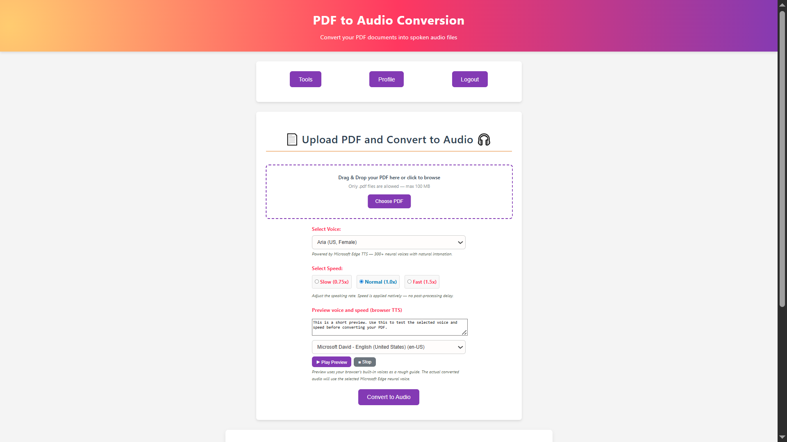
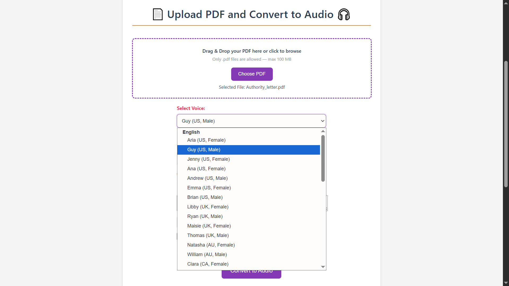
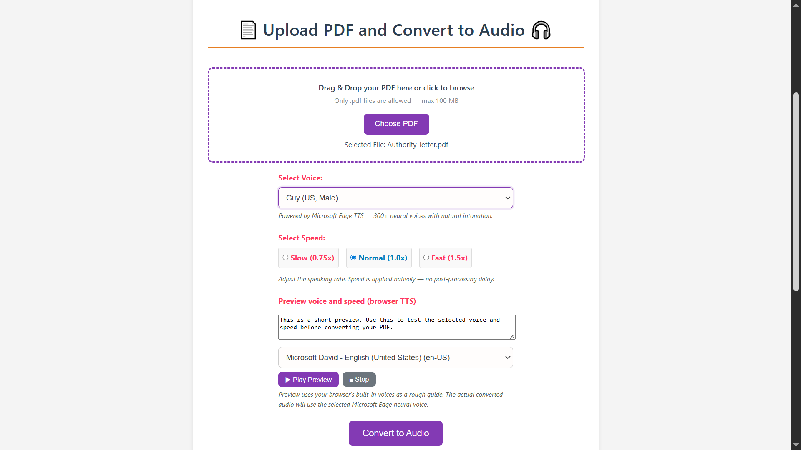
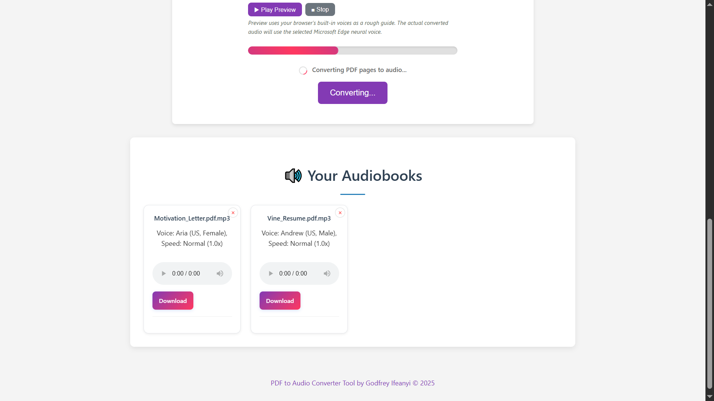
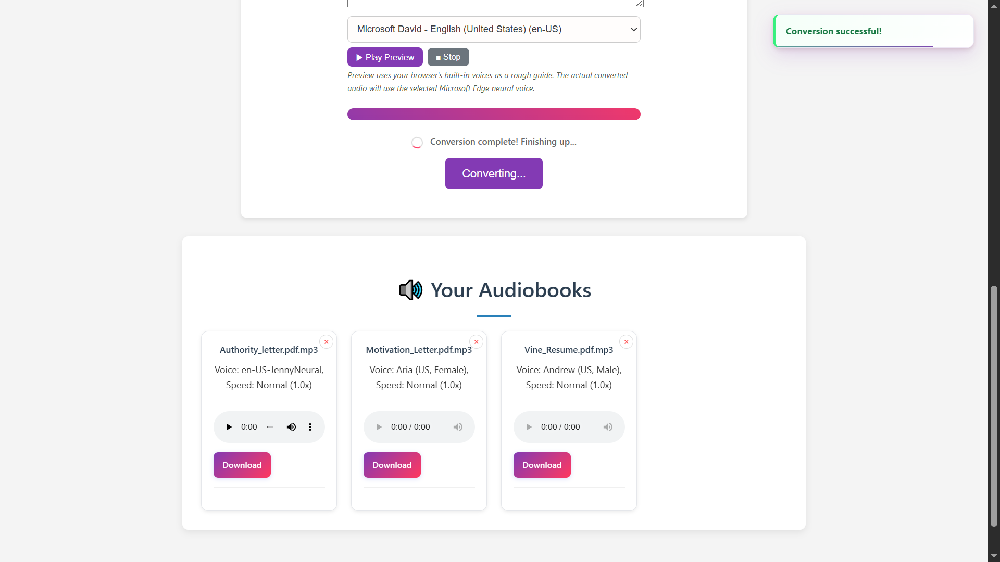

# PDF Labs — PDF to Audio Service

> The PDF-to-audio conversion microservice for the PDF Labs platform. Extracts text from PDFs using **`pdftotext`** (Poppler), normalises it for natural speech, then synthesises high-quality MP3 audio using **Microsoft Edge TTS** neural voices — supporting 30+ voices across 10 languages with three selectable speaking speeds. Audio files are served with an inline player, a download link, and a browser-TTS voice preview for quick selection.

---

## Table of Contents

- [Overview](#overview)
- [Architecture](#architecture)
- [Screenshots](#screenshots)
- [Tech Stack](#tech-stack)
- [Project Structure](#project-structure)
- [Voice Catalogue](#voice-catalogue)
- [API Endpoints](#api-endpoints)
- [Environment Variables](#environment-variables)
- [Getting Started](#getting-started)
  - [Prerequisites](#prerequisites)
  - [Run Locally (without Docker)](#run-locally-without-docker)
  - [Run with Docker](#run-with-docker)
- [Conversion Pipeline](#conversion-pipeline)
- [Session & Authentication Flow](#session--authentication-flow)
- [Security Highlights](#security-highlights)
- [Related Services](#related-services)
- [Contributing](#contributing)
- [License](#license)

---

## Overview

The **PDF to Audio Service** is a Node.js/Express microservice that converts PDF documents into spoken MP3 audio files for the [PDF Labs](https://github.com/Godfrey22152/MICROSERVICE-PDF-LABS) platform. It is the most pipeline-intensive service in the platform, chaining two system-level dependencies: **Poppler** (`pdftotext`) for text extraction and **Microsoft Edge TTS** (`msedge-tts`) for neural voice synthesis.

This service is responsible for:

- Rendering the PDF to Audio page (EJS) with a grouped voice selector (30+ neural voices, 10 languages), speed selector, and a browser Web Speech API live preview widget
- Accepting PDF uploads (up to 100 MB) via drag-and-drop with client and server-side type validation
- Extracting text from the PDF using `pdftotext` (Poppler) via `child_process.exec`
- Applying a multi-step text normalisation pipeline to remove PDF layout artefacts and escape XML/SSML special characters before synthesis
- Synthesising the normalised text in chunks using Microsoft Edge TTS neural voices at 24 kHz / 96 kbps mono MP3
- Binary-concatenating multi-chunk MP3 files using Node.js streams — no `ffmpeg` dependency
- Persisting a `ProcessedAudio` record to MongoDB with voice, speed, and size metadata
- Serving audio files for both inline playback and direct download
- Allowing users to delete individual records and their output directories

---

## Architecture

The audio service chains two processing steps: local text extraction via `pdftotext` subprocess, followed by cloud-based TTS synthesis via the Edge TTS WebSocket API (`msedge-tts` Node.js library).

```
                  ┌─────────────────────────────────────────────────┐
                  │               PDF Labs Platform                 │
                  │               (Docker Network)                  │
                  └──────────────────┬──────────────────────────────┘
                                     │  Token-bearing request from tools-service
         ┌───────────────────────────▼─────────────────────────────────────────┐
         │              pdf-to-audio-service (:5400)  ◄── THIS                 │
         │  Step 1: pdftotext (Poppler subprocess) → raw text                  │
         │  Step 2: Text normalisation pipeline (8 stages)                     │
         │  Step 3: Edge TTS synthesis → chunk MP3s → binary concat            │
         │  Step 4: Persist ProcessedAudio record to MongoDB                   │
         │  Step 5: Serve view/download routes                                 │
         └──────┬────────────────────────────┬────────────────────────┬────────┘
                │                            │                        │
   ┌────────────▼──────────────┐  ┌──────────▼──────────────┐  ┌──────▼────────────────┐
   │  MongoDB (:27017)         │  │  Local filesystem       │  │  Microsoft Edge TTS   │
   │  pdf-to-audio-service DB  │  │  uploads/  (PDF staging)│  │  (WebSocket API via   │
   │  • ProcessedAudio schema  │  │  outputs/  (MP3 dirs)   │  │   msedge-tts library) │
   └───────────────────────────┘  └─────────────────────────┘  └───────────────────────┘

  pdftotext installed in Docker image via apk add poppler-utils
  ── runs as a child process inside the container ──
```

> **Note:** The **[Docker Compose file](https://github.com/Godfrey22152/MICROSERVICE-PDF-LABS/blob/main/docker-compose.yml)** that wires all services together lives in the **root/main repository**, not in this repository.

> **Edge TTS:** Microsoft's Edge TTS endpoint is a free, publicly accessible WebSocket service used by the `msedge-tts` library. No API key is required, but it requires outbound internet access from the container.

---

## Screenshots

>  PDF to Audio Conversion application screenshots.

### PDF to Audio Conversion Page


### Voice & Speed Selection



### Audiobook Cards with Inline Player



---

## Tech Stack

| Layer | Technology |
|---|---|
| Runtime | Node.js 18 (with `globalThis.crypto` polyfill for `msedge-tts`) |
| Framework | Express 4 |
| Templating | EJS |
| Database | MongoDB (via Mongoose) |
| File uploads | `multer` (disk storage, PDF-only filter, 100 MB limit) |
| Text extraction | **`pdftotext`** (Poppler) — runs as a `child_process.exec` subprocess |
| TTS synthesis | **`msedge-tts`** — Microsoft Edge neural voices via WebSocket |
| MP3 concatenation | Node.js `fs.createReadStream` pipe — no `ffmpeg` required |
| Audio format | MP3 — 24 kHz, 96 kbps, mono (`AUDIO_24KHZ_96KBITRATE_MONO_MP3`) |
| Voice preview | Web Speech API (browser built-in, client-side only) |
| Auth | JWT (`jsonwebtoken`) — Bearer header, query param, or body |
| File ID | `uuid` v4 |
| Container | Docker (multi-stage, Node.js 18 Alpine + `poppler-utils`) |

---

## Project Structure

```
pdf-to-audio-service/
├── server.js                         # Express entry point + globalThis.crypto polyfill
├── Dockerfile                        # Multi-stage build; installs poppler-utils in runtime stage
├── package.json
├── config/
│   └── db.js                         # MongoDB connection with disconnect/error listeners
├── controllers/
│   └── audioController.js            # Full pipeline: extract → normalise → synthesise → save
├── middleware/
│   └── sessionCheck.js               # JWT guard — Bearer, query, body; HTML redirect fallback
├── models/
│   └── ProcessedAudio.js             # Mongoose schema (voice, speed, voiceLabel, speedLabel)
├── routes/
│   └── audioRoutes.js                # All /pdf-to-audio routes + Multer error handler
├── utils/
│   ├── errorHandler.js               # handleExecError (pdftotext) + globalErrorHandler
│   └── fileUtils.js                  # sanitizeFilename (URI-decode + path traversal safe)
├── views/
│   └── pdf-to-audio.ejs              # Page template with grouped voice selector and speed options
├── public/
│   ├── css/
│   │   └── styles.css
│   └── js/
│       ├── main.js                   # Session, drag-drop, XHR submit, progress, delete modal
│       ├── client-side-preview-logic.js  # Web Speech API voice preview widget
│       └── eventlisteners.js         # Navigation to other PDF Labs services
├── uploads/                          # Temporary multer PDF staging (auto-created, gitignored)
└── outputs/                          # Per-conversion output dirs as outputs/<uuid>/ (gitignored)
```

---

## Voice Catalogue

Voices are grouped by language in the `<select>` dropdown and rendered server-side from the `voiceConfig` object in the controller.

| Language | Voices Available |
|---|---|
| English (US) | Aria, Guy, Jenny, Ana, Andrew, Emma, Brian (including multilingual variants) |
| English (UK) | Libby, Ryan, Maisie, Thomas |
| English (AU) | Natasha, William |
| English (CA) | Clara, Liam |
| English (IN) | Neerja, Prabhat |
| English (NG) | Abeo (Male), Ezinne (Female) |
| Spanish | Elvira (ES), Dalia (MX) |
| French | Denise, Henri |
| German | Katja, Conrad |
| Portuguese | Francisca (BR), Fernanda (PT) |
| Arabic | Zariyah |
| Chinese | Xiaoxiao, Yunxi |
| Japanese | Nanami |
| Korean | Sun-Hi |
| Hindi | Swara |

**Default voice:** `en-US-AriaNeural` (Aria, US Female)

### Speaking Speeds

| Label | Value | Edge TTS Rate |
|---|---|---|
| Slow | 0.75 | `-25%` |
| Normal *(default)* | 1.0 | `-10%` |
| Fast | 1.5 | `+50%` |

---

## API Endpoints

All routes are prefixed with `/tools`. Session-protected routes require a valid JWT.

| Method | Path | Auth | Description |
|---|---|---|---|
| `GET` | `/tools/pdf-to-audio` | JWT | Render the conversion page with user's audiobook history |
| `POST` | `/tools/pdf-to-audio` | JWT | Upload a PDF and convert it to audio |
| `GET` | `/tools/pdf-to-audio/view/:id` | None | Serve the MP3 for inline browser playback |
| `GET` | `/tools/pdf-to-audio/download/:id` | None | Download the MP3 file |
| `DELETE` | `/tools/pdf-to-audio/:id` | JWT | Delete an audio record and its output directory |

---

### `GET /tools/pdf-to-audio`

```
GET http://localhost:5400/tools/pdf-to-audio?token=<jwt>
```

Queries all `ProcessedAudio` records for the authenticated user (sorted newest-first) and renders the page with the voice catalogue injected into the grouped `<select>`.

**Responses:**
- `200` — Renders `pdf-to-audio.ejs`
- `302` — Redirect to `http://localhost:3000` (invalid/missing token, HTML client)
- `401` — Structured JSON auth error (API client)

---

### `POST /tools/pdf-to-audio`

Accepts `multipart/form-data`. Called via XHR (`X-Requested-With: XMLHttpRequest`) from the browser; returns JSON for card injection, or redirects on non-XHR fallback.

```
POST http://localhost:5400/tools/pdf-to-audio?token=<jwt>
Content-Type: multipart/form-data

pdf:   <file>        (PDF only, max 100 MB)
voice: <voice-key>   (e.g. "en-US-AriaNeural" — defaults to Aria if unrecognised)
speed: 0.75 | 1.0 | 1.5  (defaults to 1.0 if unrecognised)
```

**Success response (XHR):**
```json
{
  "fileId": "<uuid>",
  "filename": "document.pdf",
  "sanitizedName": "document",
  "audioFile": "document.mp3",
  "previewUrl": "/tools/pdf-to-audio/view/<uuid>?file=document.mp3",
  "downloadUrl": "/tools/pdf-to-audio/download/<uuid>?file=document.mp3",
  "voice": "en-US-AriaNeural",
  "voiceLabel": "Aria (US, Female)",
  "speed": "1.0",
  "speedLabel": "Normal (1.0x)",
  "audioFileSize": "4.2 MB"
}
```

**Error responses:**
- `400` — No file uploaded / non-PDF file
- `401` — Auth error (`NO_TOKEN`, `TOKEN_EXPIRED`, `INVALID_TOKEN`)
- `413` — File exceeds 100 MB
- `422` — PDF contains no extractable text (image-only / scanned PDF)
- `500` — `pdftotext` failure or Edge TTS synthesis failure

---

### `GET /tools/pdf-to-audio/view/:id`

No authentication required. Serves the MP3 file inline using `res.sendFile`, enabling the `<audio>` element on the page to stream the file.

```
GET http://localhost:5400/tools/pdf-to-audio/view/<uuid>
```

---

### `GET /tools/pdf-to-audio/download/:id`

No authentication required. Triggers a download via `res.download`.

```
GET http://localhost:5400/tools/pdf-to-audio/download/<uuid>
```

---

### `DELETE /tools/pdf-to-audio/:id`

Verifies the record belongs to the authenticated user, deletes the `outputs/<uuid>/` directory with `fs.rm`, then removes the MongoDB document.

```
DELETE http://localhost:5400/tools/pdf-to-audio/<uuid>
Authorization: Bearer <jwt>
```

**Responses:**
- `200` — `"File deleted successfully."`
- `404` — `"File not found or you don't have permission."`
- `500` — `"Error deleting file."` or `"File deleted but database cleanup failed."`

---

## Environment Variables

Create a `.env` file in the project root (or supply via Docker/Compose):

| Variable | Required | Description |
|---|---|---|
| `MONGO_URI` | Yes | MongoDB connection string, e.g. `mongodb://mongo:27017/pdf-to-audio-service` |
| `JWT_SECRET` | Yes | Secret key for verifying JWTs — must match the account-service |
| `PORT` | No | Server port (defaults to `5400`) |
| `NODE_ENV` | No | `development` or `production` (stack traces included in dev errors) |

> **No API key required.** Microsoft Edge TTS is accessed via the free public WebSocket endpoint used by the `msedge-tts` library. Outbound internet access from the container is required.

> **Warning:** Never commit your `.env` file or real secrets to version control.

---

## Getting Started

### Prerequisites

- [Node.js](https://nodejs.org/) 18 (the `globalThis.crypto` polyfill in `server.js` is required for Node 18; it is auto-globalised in Node 19+)
- [MongoDB](https://www.mongodb.com/) instance (local or Docker)
- **[Poppler](https://poppler.freedesktop.org/)** — must be installed and `pdftotext` available on the system `PATH`
- Outbound internet access — required for Microsoft Edge TTS WebSocket connections
- [Docker](https://www.docker.com/) (optional — Poppler is installed automatically in the Docker image)
- A valid JWT issued by the **account-service**

#### Installing Poppler locally

```bash
# Ubuntu / Debian
sudo apt-get install poppler-utils

# macOS (Homebrew)
brew install poppler

# Alpine Linux (as used in the Docker image)
apk add --no-cache poppler-utils

# Verify installation
pdftotext -v
```

### Run Locally (without Docker)

```bash
# 1. Clone the repository
git clone https://github.com/Godfrey22152/MICROSERVICE-PDF-LABS.git
cd MICROSERVICE-PDF-LABS/pdf-to-audio-service

# 2. Install dependencies
npm install

# 3. Create your environment file
cp .env.example .env
# Edit .env with your MONGO_URI and JWT_SECRET

# 4. Start the server
npm start
```

The service will be available at `http://localhost:5400/tools/pdf-to-audio`.

> The `uploads/` and `outputs/` directories are created automatically at runtime and are excluded from version control.

### Run with Docker

Poppler (`pdftotext`) is installed automatically via `apk add poppler-utils` in the runtime stage — no manual installation needed. The Node.js 18 Alpine base image is used (not `alpine:3.18`) so that Node is pre-installed.

#### Build and run this service standalone

```bash
docker build -t pdf-to-audio-service .
docker run -p 5400:5400 \
  -e MONGO_URI=mongodb://<your-mongo-host>:27017/pdf-to-audio-service \
  -e JWT_SECRET=your_secret_here \
  pdf-to-audio-service
```

#### Run the full PDF Labs stack

From the **root/main repository** that contains **[docker-compose.yml file](https://github.com/Godfrey22152/MICROSERVICE-PDF-LABS/blob/main/docker-compose.yml)**:

```bash
docker compose up --build
```

---

## Conversion Pipeline

This is the most complex processing pipeline in the platform, involving two system-level dependencies and eight text normalisation stages.

```
User uploads PDF via drag-drop or file picker
        │  Client validates: only application/pdf accepted
        │
        ▼
POST /tools/pdf-to-audio  (multipart/form-data, XHR)
        │
        ▼
  sessionCheck validates JWT server-side
  multer: saves PDF to uploads/<temp>
  multer fileFilter: rejects non-PDF by extension AND MIME type
        │
        ▼
  Step 1 — Text Extraction:
  exec(`pdftotext "${pdfPath}" "${textPath}"`)
    ├─ On error → handleExecError() → 500
    ├─ fs.unlink(pdfPath)  ← PDF always deleted after extraction
    └─ rawText = fs.readFileSync(textPath)
       fs.unlink(textPath)
       if (!rawText) → 422 "No extractable text" (scanned image PDFs)

  Step 2 — Text Normalisation (8 stages):
    A. Normalize line endings (\r\n, \r → \n)
    B. Remove form-feed (\f) page-break chars from pdftotext output
    C. Collapse 3+ consecutive newlines to 2
    D. Rejoin soft-wrapped lines (letter/comma \n\n lowercase → join with space)
    E. Collapse all remaining newlines to spaces (TTS needs prose, not layout)
    F. Add period after ALL-CAPS headings for natural TTS pausing
    G. Escape XML/SSML special characters: & → "and", < / > stripped,
       smart quotes normalised, em-dash/en-dash → "-", ellipsis → "..."
    H. Collapse multiple spaces (justified-layout PDF artefacts)

  Step 3 — Edge TTS Synthesis:
    tts = new MsEdgeTTS()
    tts.setMetadata(selectedVoice, AUDIO_24KHZ_96KBITRATE_MONO_MP3)

    chunks = chunkText(rawText, maxLen=2000)
      ├─ Splits on sentence boundaries (. ! ?)
      └─ Hard-splits any sentence > 2000 chars

    if (chunks.length === 1):
      tts.toFile(outDir, chunk, { rate }) with 120s timeout guard
    else:
      for each chunk:
        synthesiseChunkWithTimeout() → chunk_N.mp3
      concatMp3Pure(chunkPaths, finalMp3)
        └─ Binary stream pipe — no ffmpeg, safe for CBR MP3 with same encoding

    tts.close()

  On TTS error:
    ├─ Normalise: ttsErr instanceof Error ? ttsErr.message : String(ttsErr)
    │   (msedge-tts may reject with plain strings, not Error objects)
    └─ cleanupOutputDir(outDir) → 500

  Step 4 — Save record:
    audioFileSizeBytes = fs.statSync(finalMp3).size
    new ProcessedAudio(payload).save()

    ├─ XHR:     res.json(dbEntry) → createAudioCard() injects card into DOM
    └─ non-XHR: res.redirect(/tools/pdf-to-audio?token=...)
```

### Key Design Decisions

**No `ffmpeg`** — MP3 chunks are concatenated using a pure Node.js stream pipe. This works correctly for CBR (Constant Bit Rate) MP3 files with identical encoding parameters, which Edge TTS guarantees. This eliminates a heavy system dependency and reduces the Docker image size.

**120-second TTS timeout per chunk** — each `tts.toFile()` call races against a `setTimeout` rejection. This prevents the server from hanging indefinitely if the Edge TTS WebSocket stalls mid-chunk.

**String-normalised TTS errors** — `msedge-tts` can reject chunk promises with plain strings (`"Connect Error: ..."`, `"No audio data received"`, `"No metadata received"`) rather than `Error` objects. The controller explicitly checks `ttsErr instanceof Error` before calling `.message` to avoid the `undefined` error message that `String(ttsErr)` prevents.

**Text normalisation before synthesis** — the 8-stage pipeline converts PDF visual layout into clean prose. Without stage G (XML/SSML escaping), ampersands and angle brackets in the source PDF cause Edge TTS to return 0 audio bytes.

---

## Session & Authentication Flow

```
User arrives at /tools/pdf-to-audio?token=<jwt>
        │
        ▼
  sessionCheck middleware: structural check (3 parts) + jwt.verify()
        │
   ┌────┴──────────────────────────┐
   │ Invalid / expired / no token  │  → HTML: redirect to :3000
   │                               │  → XHR:  401 JSON error
   └───────────────────────────────┘
        │ Valid
        ▼
  controller.renderPdfToAudioPage → ProcessedAudio.find({ userId }) → render page
  voiceConfig injected server-side → grouped <optgroup> rendered by EJS
        │
        ▼
  Client (main.js):
    • URL token → localStorage.setItem('token', urlToken)
    • checkSession() decodes exp → setTimeout at exact expiry moment
    • Expired/tampered → handleAuthError() → clears token → redirect to :3000

  Client (client-side-preview-logic.js):
    • Web Speech API populates browser voice list
    • Form voice selection syncs to browser preview voice on change
    • Play/Stop controls use SpeechSynthesisUtterance at selected speed

  User submits form (XHR, X-Requested-With: XMLHttpRequest)
        │
        ├─ sessionCheck validates token again server-side
        │
        ├─ 401 → handle401() → typed message → handleAuthError()
        ├─ 413 → "File too large" (multer LIMIT_FILE_SIZE)
        ├─ 422 → "No extractable text" (scanned image PDF)
        │
        └─ 200 → createAudioCard(result) injects card with inline <audio> player into DOM

  User clicks delete button
        │
        ▼
  showModal() — title/message/onConfirm pattern (not promise-based)
        │
        └─ Confirmed → DELETE /tools/pdf-to-audio/:id
                          → fs.rm(outDir, recursive) → ProcessedAudio.deleteOne()
                          → card.remove() → replaceWith no-files message if grid empty
```

---

## Security Highlights

- **Dual MIME + extension validation** — the multer `fileFilter` checks both `file.mimetype === "application/pdf"` AND `path.extname(file.originalname) === ".pdf"`, catching files that have been renamed to bypass extension-only checks.
- **Multer error middleware** — a dedicated `handleMulterError` middleware in `audioRoutes.js` catches `MulterError` instances (file size, unexpected field) and non-Multer upload errors, returning clean status codes (`413` for size, `400` for type) before they reach the global error handler.
- **Path traversal-safe filename sanitisation** — `fileUtils.sanitizeFilename` URI-decodes the filename, normalises path separators, extracts only `path.basename`, then strips all non-alphanumeric characters. This is the most defensive sanitisation implementation across all services.
- **TTS error normalisation** — `msedge-tts` can reject with plain strings. The controller wraps every string/Error check with `String(ttsErr)` to prevent `undefined` propagating to the HTTP response.
- **120-second per-chunk timeout** — prevents the server from hanging indefinitely on Edge TTS WebSocket stalls.
- **`cleanupOutputDir` on all failure paths** — on any TTS failure, the output directory is removed to prevent orphaned disk usage.
- **`globalThis.crypto` polyfill** — documented with a comment explaining why it is needed for `msedge-tts` on Node.js 18. This prevents a silent `ReferenceError` crash on startup.
- **User-scoped delete** — `deleteProcessedFile` queries MongoDB with both `fileId` AND `userId`.
- **No API key stored** — Edge TTS uses a free public WebSocket endpoint; no credentials are required or stored.
- **Dual-layer token validation** — `sessionCheck` enforces JWT validity server-side; `main.js` schedules a precise client-side expiry redirect.
- **Non-root Docker user** — the production container runs as `appuser` (non-root) on the Node.js 18 Alpine image.

---

## Related Services

All services below are part of the PDF Labs platform and are wired together via the root `docker-compose.yml`.

| Service | Port | Description |
|---|---|---|
| `account-service` | 3000 | Auth & landing page — issues JWTs |
| `home-service` | 3500 | Authenticated dashboard |
| `profile-service` | 4000 | User profile management |
| `logout-service` | 4500 | Session termination |
| `tools-service` | 5000 | Authenticated tools hub |
| `pdf-to-image-service` | 5100 | PDF → Image conversion |
| `image-to-pdf-service` | 5200 | Image → PDF conversion |
| `pdf-compressor-service` | 5300 | PDF compression via Ghostscript |
| `pdf-to-audio-service` | 5400 | **This service** — PDF → Audio via Edge TTS |
| `pdf-to-word-service` | 5500 | PDF → Word conversion |
| `sheetlab-service` | 5600 | PDF ↔ Excel conversion |
| `word-to-pdf-service` | 5700 | Word → PDF conversion |
| `edit-pdf-service` | 5800 | Rotate, watermark, merge, split, protect, unlock |

---

## Contributing

1. Fork the repository
2. Create a feature branch: `git checkout -b feature/my-feature`
3. Commit your changes: `git commit -m "feat: add my feature"`
4. Push to the branch: `git push origin feature/my-feature`
5. Open a Pull Request

Please follow the existing code style and keep commits focused.

---

## License

This project is licensed under the **ISC License**. See the [LICENSE](LICENSE) file for details.

---

> Maintained by [Godfrey Ifeanyi](mailto:godfreyifeanyi50@gmail.com)
