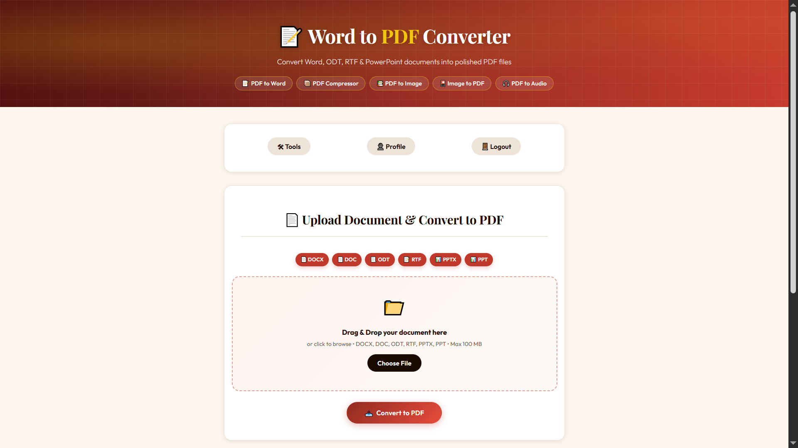
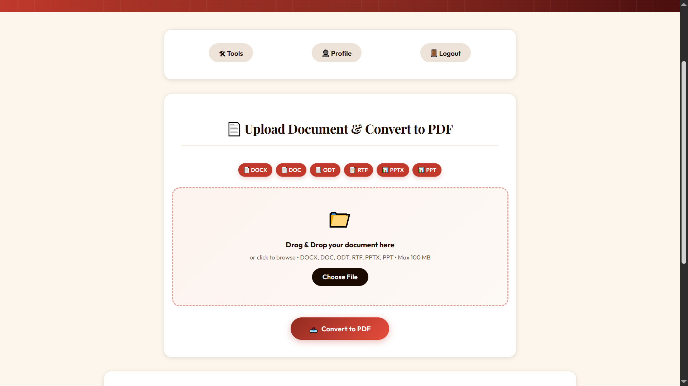

# PDF Labs — Word to PDF Service

> The document-to-PDF conversion microservice for the PDF Labs platform. Converts **six document formats** — DOCX, DOC, ODT, RTF, PPTX, and PPT — into polished PDF files using **ConvertAPI v2** via a raw HTTPS REST call. The ConvertAPI endpoint is selected dynamically based on the uploaded file's extension, and the source format is validated by both MIME type and file extension before reaching the controller.

---

## Table of Contents

- [Overview](#overview)
- [Architecture](#architecture)
- [Screenshots](#screenshots)
- [Tech Stack](#tech-stack)
- [Project Structure](#project-structure)
- [Supported Input Formats](#supported-input-formats)
- [API Endpoints](#api-endpoints)
- [Environment Variables](#environment-variables)
- [Getting Started](#getting-started)
  - [Prerequisites](#prerequisites)
  - [Run Locally (without Docker)](#run-locally-without-docker)
  - [Run with Docker](#run-with-docker)
- [Conversion Pipeline](#conversion-pipeline)
- [Session & Authentication Flow](#session--authentication-flow)
- [Security Highlights](#security-highlights)
- [Related Services](#related-services)
- [Contributing](#contributing)
- [License](#license)

---

## Overview

The **Word to PDF Service** is a Node.js/Express microservice that converts Word, ODT, RTF, and PowerPoint documents into PDF files for the [PDF Labs](https://github.com/Godfrey22152/MICROSERVICE-PDF-LABS) platform. Conversion is delegated entirely to **ConvertAPI v2** via raw `https.request` — no local document processing tools are installed in the Docker image.

This service is responsible for:

- Rendering the Word to PDF conversion page (EJS) with per-user file history showing original size, PDF size, and input format
- Displaying a visual format chip strip (DOCX, DOC, ODT, RTF, PPTX, PPT) to communicate supported formats at a glance
- Accepting uploads for six document formats (up to 100 MB), validated by both file extension and MIME type via multer `fileFilter`
- Dynamically selecting the correct ConvertAPI v2 endpoint based on the uploaded file's extension (`/<format>/to/pdf`)
- Posting the document to ConvertAPI with a 3-minute timeout, then downloading the resulting PDF from ConvertAPI's temporary storage URL
- Persisting a `ConvertedFile` record to MongoDB with the `inputFormat` field tracking which source format was used
- Serving converted PDFs as direct downloads scoped by UUID
- Allowing users to delete individual records and their output directories via a pre-built inline confirmation modal (defined in EJS, unlike other services that build the modal dynamically in JS)
- AJAX-first form submission using `fetch` (not XHR) with a randomised progress bar increment

---

## Architecture

The word-to-pdf service uses the same ConvertAPI raw-HTTPS pattern as the pdf-to-word service, but selects the API endpoint dynamically based on file extension. No system document tools are required in the Docker image.

```
                  ┌─────────────────────────────────────────────────┐
                  │               PDF Labs Platform                 │
                  │               (Docker Network)                  │
                  └──────────────────┬──────────────────────────────┘
                                     │  Token-bearing request from tools-service
         ┌───────────────────────────▼──────────────────────────────────────────┐
         │              word-to-pdf-service (:5700)  ◄── THIS                   │
         │  • multer validates extension + saves to uploads/                    │
         │  • getSourceFormat(filename) → selects API endpoint by extension     │
         │  • Raw HTTPS POST to ConvertAPI v2 (/<format>/to/pdf)                │
         │  • Download PDF from ConvertAPI temporary URL                        │
         │  • Persist ConvertedFile record to MongoDB                           │
         │  • Serve download route scoped by UUID                               │
         └──────┬─────────────────────────────────────────────────┬─────────────┘
                │                                                 │
   ┌────────────▼───────────────┐              ┌──────────────────▼───────────────┐
   │  MongoDB (:27017)          │              │  ConvertAPI v2 (external HTTPS)  │
   │  word-to-pdf-service DB    │              │  POST /<format>/to/pdf           │
   │  • ConvertedFile schema    │              │   /docx/to/pdf                   │
   │  • inputFormat field       │              │   /doc/to/pdf                    │
   └────────────────────────────┘              │   /odt/to/pdf                    │
                                               │   /rtf/to/pdf                    │
                                               │   /pptx/to/pdf                   │
                                               │   /ppt/to/pdf                    │
                                               └──────────────────────────────────┘

  Local filesystem:  uploads/ (multer staging)  outputs/<uuid>/ (PDF files)
  ConvertAPI free tier: 250 conversions/month
```

> **Note:** The **[docker-compose.yml file](https://github.com/Godfrey22152/MICROSERVICE-PDF-LABS/blob/main/docker-compose.yml)** that wires all services together lives in the **root/main repository**, not in this repository.

---

## Screenshots

> Word to PDF Conversion application screenshots.

### Word to PDF Conversion Page with Format Strip


### Drop Zone and File Selection


### Converted Files History Grid


---

## Tech Stack

| Layer | Technology |
|---|---|
| Runtime | Node.js |
| Framework | Express 4 |
| Templating | EJS |
| Database | MongoDB (via Mongoose 8) |
| File uploads | `multer` (disk storage, extension + MIME filter, 100 MB limit) |
| PDF conversion | **ConvertAPI v2** — raw HTTPS REST (`form-data` multipart POST, no SDK) |
| Endpoint selection | Dynamic — based on source file extension via `FORMAT_MAP` |
| Auth | JWT (`jsonwebtoken`) — Bearer header, query param, or body |
| File ID | `uuid` v4 |
| Container | Docker (multi-stage, Alpine 3.21 + Node.js, no document tools) |

---

## Project Structure

```
word-to-pdf-service/
├── server.js                         # Express entry point
├── Dockerfile                        # Multi-stage build (Node.js only, no system doc tools)
├── package.json
├── config/
│   └── db.js                         # MongoDB connection with disconnect/error listeners
├── controllers/
│   └── pdfController.js              # Render, FORMAT_MAP, callConvertApi, downloadFile, delete
├── middleware/
│   └── sessionCheck.js               # JWT guard — Bearer, query, body; HTML redirect fallback
├── models/
│   └── ConvertedFile.js              # Mongoose schema with inputFormat field
├── routes/
│   └── pdfRoutes.js                  # All /word-to-pdf routes + MIME + extension filter
├── utils/
│   ├── errorHandler.js               # handleExecError + globalErrorHandler
│   └── fileUtils.js                  # sanitizeFilename, formatBytes
├── views/
│   └── word-to-pdf.ejs               # Conversion page with format chips + inline confirm modal
├── public/
│   ├── css/
│   │   └── styles.css
│   └── js/
│       ├── main.js                   # Session, drag-drop, fetch-based submit, progress, delete
│       └── eventlisteners.js         # Navigation to other PDF Labs services
├── uploads/                          # Temporary multer staging (auto-created, gitignored)
└── outputs/                          # Converted PDFs as outputs/<uuid>/ (gitignored)
```

---

## Supported Input Formats

| Extension | MIME Type | ConvertAPI Endpoint |
|---|---|---|
| `.docx` | `application/vnd.openxmlformats-officedocument.wordprocessingml.document` | `/docx/to/pdf` |
| `.doc` | `application/msword` | `/doc/to/pdf` |
| `.odt` | `application/vnd.oasis.opendocument.text` | `/odt/to/pdf` |
| `.rtf` | `application/rtf` or `text/rtf` | `/rtf/to/pdf` |
| `.pptx` | `application/vnd.openxmlformats-officedocument.presentationml.presentation` | `/pptx/to/pdf` |
| `.ppt` | `application/vnd.ms-powerpoint` | `/ppt/to/pdf` |

The ConvertAPI endpoint is selected at runtime by `getSourceFormat(filename)` which reads the file extension and looks it up in the `FORMAT_MAP` object. The endpoint is constructed as `https://v2.convertapi.com/convert/<format>/to/pdf`.

---

## API Endpoints

All routes are prefixed with `/tools`. Session-protected routes require a valid JWT.

| Method | Path | Auth | Description |
|---|---|---|---|
| `GET` | `/tools/word-to-pdf` | JWT | Render the conversion page with user's file history |
| `POST` | `/tools/word-to-pdf` | JWT | Upload a document and convert it to PDF |
| `GET` | `/tools/word-to-pdf/download/:id` | None | Download the converted PDF by UUID |
| `DELETE` | `/tools/word-to-pdf/:id` | JWT | Delete a conversion record and its output directory |

---

### `GET /tools/word-to-pdf`

```
GET http://localhost:5700/tools/word-to-pdf?token=<jwt>
```

Queries all `ConvertedFile` records for the authenticated user (sorted newest-first) and renders the page with format chips and the file history grid.

**Responses:**
- `200` — Renders `word-to-pdf.ejs`
- `302` — Redirect to `http://localhost:3000` (invalid/missing token, HTML client)
- `401` — Structured JSON auth error (API client)

---

### `POST /tools/word-to-pdf`

Accepts `multipart/form-data`. Called via `fetch` with `X-Requested-With: XMLHttpRequest` from the browser; returns JSON for card injection, or redirects on non-XHR fallback.

```
POST http://localhost:5700/tools/word-to-pdf?token=<jwt>
Content-Type: multipart/form-data

wordFile: <file>    (.docx, .doc, .odt, .rtf, .pptx, or .ppt — max 100 MB)
```

**Success response:**
```json
{
  "fileId": "<uuid>",
  "originalName": "report.docx",
  "sanitizedName": "report",
  "originalSize": 524288,
  "convertedSize": 892416,
  "inputFormat": "docx",
  "downloadUrl": "/tools/word-to-pdf/download/<uuid>?file=report.pdf",
  "filename": "report.pdf"
}
```

**Error responses:**
- `400` — No file uploaded / unsupported format (rejected by multer `fileFilter`)
- `401` — Auth error
- `429` — ConvertAPI monthly conversion limit reached
- `500` — Invalid API key / network timeout / output file not found after download

---

### `GET /tools/word-to-pdf/download/:id`

No authentication required. Scoped by UUID.

```
GET http://localhost:5700/tools/word-to-pdf/download/<uuid>?file=report.pdf
```

**Responses:**
- `200` — File download (`res.download`)
- `400` — Missing `file` query parameter
- `404` — File not found on disk

---

### `DELETE /tools/word-to-pdf/:id`

Verifies the record belongs to the authenticated user before deleting both the MongoDB document and the `outputs/<uuid>/` directory.

```
DELETE http://localhost:5700/tools/word-to-pdf/<uuid>?token=<jwt>
X-Requested-With: XMLHttpRequest
```

**Responses:**
- `200` — `"File deleted successfully."`
- `404` — `"File not found or permission denied."`
- `500` — `"Server error while deleting file."`

---

## Environment Variables

Create a `.env` file in the project root (or supply via Docker/Compose):

| Variable | Required | Description |
|---|---|---|
| `MONGO_URI` | Yes | MongoDB connection string, e.g. `mongodb://mongo:27017/word-to-pdf-service` |
| `JWT_SECRET` | Yes | Secret key for verifying JWTs — must match the account-service |
| `CONVERTAPI_SECRET` | Yes | Your ConvertAPI secret key — obtain at [convertapi.com](https://www.convertapi.com) |
| `PORT` | No | Server port (defaults to `5700`) |

> **ConvertAPI free tier:** 250 conversions/month. Each document-to-PDF conversion counts as one conversion.

> **Warning:** Never commit your `.env` file or real secrets to version control.

---

## Getting Started

### Prerequisites

- [Node.js](https://nodejs.org/)
- [MongoDB](https://www.mongodb.com/) instance (local or Docker)
- A valid [ConvertAPI](https://www.convertapi.com) account and secret key
- [Docker](https://www.docker.com/) (optional)
- A valid JWT issued by the **account-service**

> **No system document tools required.** No LibreOffice, Ghostscript, or Poppler is needed. The Docker image installs only Node.js, making it one of the lightest images in the platform.

### Run Locally (without Docker)

```bash
# 1. Clone the repository
git clone https://github.com/Godfrey22152/MICROSERVICE-PDF-LABS.git
cd MICROSERVICE-PDF-LABS/word-to-pdf-service

# 2. Install dependencies
npm install

# 3. Create your environment file
cp .env.example .env
# Edit .env with your MONGO_URI, JWT_SECRET, and CONVERTAPI_SECRET

# 4. Start the server
npm start
```

The service will be available at `http://localhost:5700/tools/word-to-pdf`.

> The `uploads/` and `outputs/` directories are created automatically at runtime.

### Run with Docker

No system tools are installed — only Node.js. This is one of the smallest runtime images in the platform.

#### Build and run this service standalone

```bash
docker build -t word-to-pdf-service .
docker run -p 5700:5700 \
  -e MONGO_URI=mongodb://<your-mongo-host>:27017/word-to-pdf-service \
  -e JWT_SECRET=your_secret_here \
  -e CONVERTAPI_SECRET=your_convertapi_secret \
  word-to-pdf-service
```

#### Run the full PDF Labs stack

From the **root/main repository** that contains **[docker-compose.yml file](https://github.com/Godfrey22152/MICROSERVICE-PDF-LABS/blob/main/docker-compose.yml)**:

```bash
docker compose up --build
```

---

## Conversion Pipeline

```
User drops or selects a document (DOCX, DOC, ODT, RTF, PPTX, PPT)
        │  Client validates extension against ACCEPTED_EXT list
        │  Client shows "✔ filename" feedback
        │
        ▼
POST /tools/word-to-pdf  (multipart/form-data, fetch + X-Requested-With: XMLHttpRequest)
        │
        ▼
  sessionCheck validates JWT server-side
        │
  multer fileFilter:
    ├─ Checks file extension against /\.(docx|doc|odt|rtf|pptx|ppt)$/i
    ├─ Extension mismatch → 400 "Only Word, ODT, RTF and PowerPoint files are allowed"
    └─ Accepted → save to uploads/<temp>

  Note: MIME types are listed in ALLOWED_MIME but NOT used in fileFilter
  (extension-only check in multer; full MIME list declared for client <input accept>)
        │
        ▼
  controller.convertToPdf:
    • inputFormat = path.extname(req.file.originalname).replace(".", "").toLowerCase()
    • getSourceFormat(originalName) → looks up FORMAT_MAP → returns "docx", "odt", etc.
    • apiUrl = "https://v2.convertapi.com/convert/" + sourceFormat + "/to/pdf?Secret=..."
    • Generates uuid → creates outputs/<uuid>/ directory
    • originalSize = fs.statSync(inputPath).size

  callConvertApi(inputPath, originalName, secret):
    ├─ Validates filename ends with .<sourceFormat>; appends if not
    ├─ Builds FormData:
    │   File: fs.createReadStream(inputPath)  (contentType: application/octet-stream)
    │   StoreFile: "true"
    │
    ├─ Raw https.request to dynamically selected endpoint
    │   Timeout: 180,000ms (3 minutes)
    │
    └─ Resolves with { status, body: { Files: [{ Url }] } }

  Temp file deleted in both success and catch blocks (fs.unlinkSync)
        │
        ▼
  downloadFile(files[0].Url, outputPath):
    └─ Streams PDF from ConvertAPI's temporary storage → outputs/<uuid>/<n>.pdf
       ConvertAPI storage URLs are valid for 3 hours

  convertedSize = fs.statSync(outputPath).size
        │
        ▼
  Save ConvertedFile to MongoDB (inputFormat stored for UI badge display)
        │
        ├─ fetch resolved: res.json(payload) → appendFileCard() injects card into DOM
        │   Card shows: "DOCX → PDF" badge, original size, PDF size, format
        └─ non-XHR: res.redirect(/tools/word-to-pdf?token=...)

ConvertAPI Error Mapping:
  401/403 in message → "Invalid ConvertAPI secret key" (500)
  429 in message     → "Monthly conversion limit reached" (429)
  415 in message     → "Unsupported file format" (400)
  timeout            → "ConvertAPI request timed out" (500)
```

### Key Differences from `pdf-to-word-service`

**Dynamic endpoint selection** — unlike the pdf-to-word service which always calls `/pdf/to/docx`, this service builds the endpoint at runtime using `FORMAT_MAP[ext]`, enabling six distinct ConvertAPI source formats from a single controller.

**Extension-only multer filter** — the `fileFilter` checks only the file extension (not the MIME type), though the full list of MIME types is declared in `ALLOWED_MIME` for use in the client's `<input accept>` attribute.

**`fetch` instead of `XMLHttpRequest`** — the form submission uses the `fetch` API with `.then()` chaining, while most other services use raw `XMLHttpRequest`. The `X-Requested-With: XMLHttpRequest` header is still set so the server's `req.xhr` check works correctly.

**Randomised progress increment** — `startProgress` uses `Math.random() * 8` for each step, giving a more natural-feeling bar than the fixed-step approach used by other services.

**Inline confirmation modal** — the delete confirmation modal is defined as static HTML inside `word-to-pdf.ejs` (referenced by `id="confirm-modal"`) and toggled via `.classList.add("visible")`, rather than being built dynamically in JavaScript as in other services.

---

## Session & Authentication Flow

```
User arrives at /tools/word-to-pdf?token=<jwt>
        │
        ▼
  sessionCheck middleware: structural check (3 parts) + jwt.verify()
        │
   ┌────┴──────────────────────────┐
   │ Invalid / expired / no token  │  → HTML: redirect to :3000
   │                               │  → fetch:  401 JSON error
   └───────────────────────────────┘
        │ Valid
        ▼
  controller.renderPage → ConvertedFile.find({ userId }) → render page
        │
        ▼
  Client (main.js):
    • URL token → localStorage.setItem("token", urlToken)
    • checkSession() decodes exp → setTimeout at exact expiry moment
    • Expired/tampered → handleAuthError() → clears token → redirect to :3000

  User submits form (fetch, X-Requested-With: XMLHttpRequest)
        │
        ├─ sessionCheck validates token again server-side
        │
        ├─ multer rejects non-document extensions before controller runs
        │
        ├─ 401 → handle401() → typed message → handleAuthError()
        ├─ 429 → "Monthly conversion limit reached" toast
        │
        └─ 200 → appendFileCard(data)
                   Injects card with inputFormat badge: "DOCX → PDF", "PPTX → PDF", etc.
                   Shows original size and PDF size

  User clicks delete button (server-rendered cards)
        │
        ▼
  openDeleteModal(fileId, cardEl) → modal.classList.add("visible")
  (modal is defined as static HTML in EJS, not built dynamically)
        │
        ├─ Cancel → modal.classList.remove("visible")
        └─ Confirm → DELETE /tools/word-to-pdf/:id?token=<jwt>
                        → rmSync(outputs/<uuid>, recursive)
                        → ConvertedFile.deleteOne()
                        → cardEl.remove() + grid cleanup if empty
```

---

## Security Highlights

- **Dual extension + MIME validation** — the multer `fileFilter` enforces a strict extension regex (`/\.(docx|doc|odt|rtf|pptx|ppt)$/i`). Client-side, the `<input accept>` attribute lists both extensions and full MIME types for all six formats, providing defence at both layers.
- **Dynamic endpoint with no injection risk** — `getSourceFormat` looks up the format in a hardcoded `FORMAT_MAP` object; arbitrary strings cannot reach the ConvertAPI URL path.
- **Temp file cleanup on both paths** — `fs.unlinkSync(inputPath)` runs inside both the success flow and the `catch` block, ensuring the uploaded document is always removed from disk.
- **ConvertAPI secret never logged** — the secret is redacted in the console log (`url.search.replace(secret, "***")`).
- **User-scoped delete** — `deleteFile` queries MongoDB with both `fileId` AND `userId`.
- **UUID-scoped download routes** — output files are not guessable without the exact UUID.
- **No system document tools in image** — the Docker image installs only Node.js. No LibreOffice, Ghostscript, or Poppler means no native binary attack surface.
- **Dual-layer token validation** — `sessionCheck` verifies the JWT server-side; `main.js` schedules a precise client-side expiry redirect.
- **HTML/fetch dual response mode** — all auth and error paths check `req.xhr` / `X-Requested-With` to return either a redirect or structured JSON.
- **Non-root Docker user** — the production container runs as `appuser` (non-root) on Alpine Linux.

---

## Related Services

All services below are part of the PDF Labs platform and are wired together via the root `docker-compose.yml`.

| Service | Port | Description |
|---|---|---|
| `account-service` | 3000 | Auth & landing page — issues JWTs |
| `home-service` | 3500 | Authenticated dashboard |
| `profile-service` | 4000 | User profile management |
| `logout-service` | 4500 | Session termination |
| `tools-service` | 5000 | Authenticated tools hub |
| `pdf-to-image-service` | 5100 | PDF → Image conversion |
| `image-to-pdf-service` | 5200 | Image → PDF conversion |
| `pdf-compressor-service` | 5300 | PDF compression via Ghostscript |
| `pdf-to-audio-service` | 5400 | PDF → Audio via Edge TTS |
| `pdf-to-word-service` | 5500 | PDF → Word (.docx) via ConvertAPI |
| `sheetlab-service` | 5600 | PDF ↔ Excel conversion |
| `word-to-pdf-service` | 5700 | **This service** — DOCX/DOC/ODT/RTF/PPTX/PPT → PDF |
| `edit-pdf-service` | 5800 | Rotate, watermark, merge, split, protect, unlock |

---

## Contributing

1. Fork the repository
2. Create a feature branch: `git checkout -b feature/my-feature`
3. Commit your changes: `git commit -m "feat: add my feature"`
4. Push to the branch: `git push origin feature/my-feature`
5. Open a Pull Request

Please follow the existing code style and keep commits focused.

---

## License

This project is licensed under the **ISC License**. See the [LICENSE](LICENSE) file for details.

---

> Maintained by [Godfrey Ifeanyi](mailto:godfreyifeanyi50@gmail.com) — Powered by [ConvertAPI](https://www.convertapi.com)
