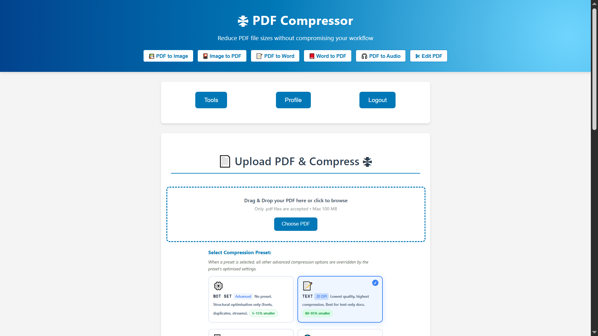
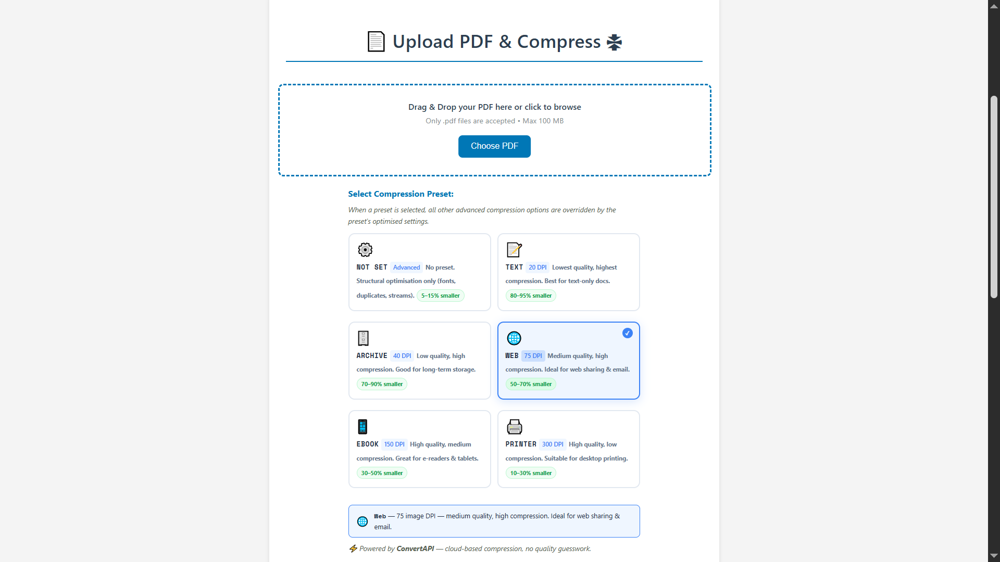
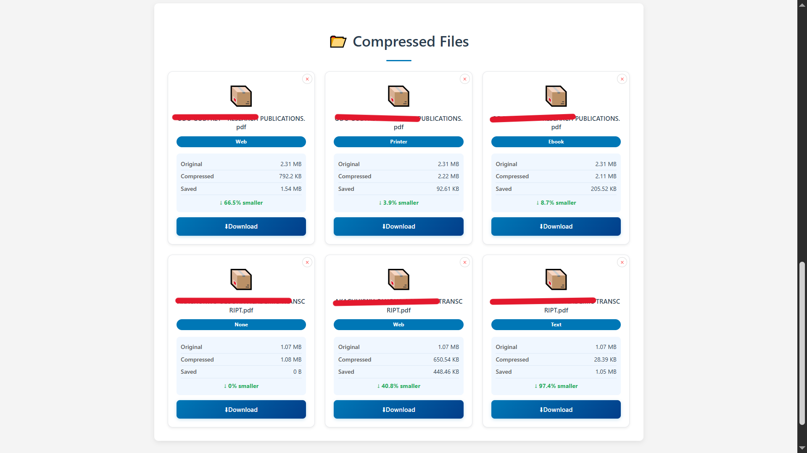

# PDF Labs — PDF Compressor Service

> The PDF compression microservice for the PDF Labs platform. Reduces PDF file sizes across four selectable quality presets using **Ghostscript** running as a local system process — no external API calls, no conversion limits, and no per-operation cost. Displays original size, compressed size, bytes saved, and percentage reduction for every file.

---

## Table of Contents

- [Overview](#overview)
- [Architecture](#architecture)
- [Screenshots](#screenshots)
- [Tech Stack](#tech-stack)
- [Project Structure](#project-structure)
- [Compression Levels](#compression-levels)
- [API Endpoints](#api-endpoints)
- [Environment Variables](#environment-variables)
- [Getting Started](#getting-started)
  - [Prerequisites](#prerequisites)
  - [Run Locally (without Docker)](#run-locally-without-docker)
  - [Run with Docker](#run-with-docker)
- [Compression Pipeline](#compression-pipeline)
- [Session & Authentication Flow](#session--authentication-flow)
- [Security Highlights](#security-highlights)
- [Related Services](#related-services)
- [Contributing](#contributing)
- [License](#license)

---

## Overview

The **PDF Compressor Service** is a Node.js/Express microservice that compresses PDF files for the [PDF Labs](https://github.com/Godfrey22152/MICROSERVICE-PDF-LABS) platform. Compression is performed **entirely server-side** using **Ghostscript** (`gs`), which is installed directly into the Docker image — no external API is required.

This service is responsible for:

- Rendering the PDF Compressor page (EJS) with the user's compression history and size stats
- Accepting single PDF uploads (up to 100 MB) via drag-and-drop or file picker, with client and server-side type validation
- Executing Ghostscript via Node.js `child_process.exec` with one of four `dPDFSETTINGS` presets
- Reporting exact original size, compressed size, bytes saved, and percentage reduction per file
- Persisting a `CompressedFile` record to MongoDB linked to the authenticated user
- Serving compressed PDFs as direct downloads scoped by a `uuid`-based output directory
- Allowing users to delete individual records and their associated output directories
- AJAX-first form submission with a simulated progress bar and inline result card injection

---

## Architecture

The compressor service runs Ghostscript as a local subprocess. No outbound API calls are made. Output files are stored in `outputs/<uuid>/` directories on the container filesystem.

```
                  ┌─────────────────────────────────────────────────┐
                  │               PDF Labs Platform                 │
                  │               (Docker Network)                  │
                  └──────────────────┬──────────────────────────────┘
                                     │  Token-bearing request from tools-service
         ┌───────────────────────────▼───────────────────────────────────────┐
         │              pdf-compressor-service (:5300)  ◄── THIS             │
         │  • Upload PDF via multer (single file, 100 MB limit)              │
         │  • Execute: gs -dPDFSETTINGS=<preset> -sOutputFile=<out> <in>     │
         │  • Write output to outputs/<uuid>/<name>_compressed.pdf           │
         │  • Persist CompressedFile record to MongoDB                       │
         │  • Serve per-file download routes                                 │
         └──────┬─────────────────────────────────────────────┬──────────────┘
                │                                             │
   ┌────────────▼───────────────┐             ┌───────────────▼──────────────┐
   │  MongoDB (:27017)          │             │  Local filesystem            │
   │  pdf-compressor-service DB │             │  uploads/  (multer staging)  │
   │  • CompressedFile schema   │             │  outputs/  (uuid dirs)       │
   └────────────────────────────┘             └──────────────────────────────┘

  Ghostscript (installed in Docker image via apk add ghostscript)
  ── runs as a child process inside the container, no network required ──
```

> **Note:** The **[docker-compose.yml file](https://github.com/Godfrey22152/MICROSERVICE-PDF-LABS/blob/main/docker-compose.yml)** that wires all services together lives in the **root/main repository**, not in this repository.

---

## Screenshots

> PDF Compressor application screenshots.

### PDF Compressor Page


### Compression Level Selection Cards


### Compressed Files History Grid


---

## Tech Stack

| Layer | Technology |
|---|---|
| Runtime | Node.js ≥ 15.0.0 |
| Framework | Express 4 |
| Templating | EJS |
| Database | MongoDB (via Mongoose 8) |
| File uploads | `multer` (disk storage, PDF-only filter, 100 MB limit) |
| PDF compression | **Ghostscript** (`gs`) — runs as a local subprocess via `child_process.exec` |
| Auth | JWT (`jsonwebtoken`) — Bearer header, query param, or body |
| File ID | `uuid` v11 |
| Container | Docker (multi-stage, Alpine 3.18 + `ghostscript` package) |

---

## Project Structure

```
pdf-compressor-service/
├── server.js                         # Express entry point
├── Dockerfile                        # Multi-stage build; installs Ghostscript in runtime stage
├── package.json
├── config/
│   └── db.js                         # MongoDB connection with disconnect/error listeners
├── controllers/
│   └── pdfController.js              # Render, compress (Ghostscript), download, delete
├── middleware/
│   └── sessionCheck.js               # JWT guard — Bearer, query, body; HTML redirect fallback
├── models/
│   └── CompressedFile.js             # Mongoose schema with size stats and compression metadata
├── routes/
│   └── pdfRoutes.js                  # GET/POST /pdf-compressor, GET /download/:id, DELETE /:id
├── utils/
│   ├── errorHandler.js               # handleExecError (Ghostscript errors) + globalErrorHandler
│   └── fileUtils.js                  # sanitizeFilename, formatBytes
├── views/
│   └── pdf-compressor.ejs            # Compressor page with level cards and file history
├── public/
│   ├── css/
│   │   └── styles.css
│   └── js/
│       ├── main.js                   # Session, drag-drop, AJAX submit, progress, delete modal
│       └── eventlisteners.js         # Navigation to other PDF Labs services
├── uploads/                          # Temporary multer staging (auto-created, gitignored)
└── outputs/                          # Compressed PDFs as outputs/<uuid>/ (auto-created, gitignored)
```

---

## Compression Levels

Four presets map directly to Ghostscript's `dPDFSETTINGS` parameter, each targeting a different balance of file size and image quality.

| Level | dPDFSETTINGS | DPI | Expected Reduction | Best For |
|---|---|---|---|---|
| **Maximum** | `/screen` | ~40 dpi | 70–90% | Email, messaging, screen display |
| **High** *(default)* | `/ebook` | ~150 dpi | 40–60% | Digital use, e-readers |
| **Medium** | `/printer` | ~300 dpi | 20–40% | Desktop printing |
| **Low** | `/prepress` | ~300 dpi + colour | 5–20% | Professional / pre-press print |

The **Maximum** level adds extra Ghostscript flags (`-dColorImageResolution=40 -dGrayImageResolution=40 -dMonoImageResolution=70`) beyond the standard preset for maximum size reduction. All other levels use only the standard `dPDFSETTINGS` preset.

> **Note:** Reduction percentages are estimates. Actual results depend on the content of the source PDF (image-heavy PDFs compress far more than text-only PDFs).

---

## API Endpoints

All routes are prefixed with `/tools`. Session-protected routes require a valid JWT.

| Method | Path | Auth | Description |
|---|---|---|---|
| `GET` | `/tools/pdf-compressor` | JWT | Render the compressor page with user's file history |
| `POST` | `/tools/pdf-compressor` | JWT | Upload a PDF and compress it at the selected level |
| `GET` | `/tools/pdf-compressor/download/:id` | None | Download the compressed PDF by UUID |
| `DELETE` | `/tools/pdf-compressor/:id` | JWT | Delete a compression record and its output directory |

---

### `GET /tools/pdf-compressor`

```
GET http://localhost:5300/tools/pdf-compressor?token=<jwt>
```

Queries all `CompressedFile` records for the authenticated user (sorted newest-first) and renders the page with the compression level cards and file history grid.

**Responses:**
- `200` — Renders `pdf-compressor.ejs`
- `302` — Redirect to `http://localhost:3000` (invalid/missing token, HTML client)
- `401` — Structured JSON auth error (API client)

---

### `POST /tools/pdf-compressor`

Accepts `multipart/form-data`. Called via AJAX (`X-Requested-With: XMLHttpRequest`) from the browser; returns JSON for card injection, or redirects on non-XHR fallback.

```
POST http://localhost:5300/tools/pdf-compressor?token=<jwt>
Content-Type: multipart/form-data

pdf:              <file>   (PDF only, max 100 MB)
compressionLevel: maximum | high | medium | low
```

**Success response (XHR):**
```json
{
  "fileId": "<uuid>",
  "originalName": "report.pdf",
  "sanitizedName": "report",
  "compressionLevel": "high",
  "compressionLabel": "High Compression",
  "originalSize": 5242880,
  "compressedSize": 2097152,
  "savedBytes": 3145728,
  "savedPercent": 60.0,
  "downloadUrl": "/tools/pdf-compressor/download/<uuid>?file=report_compressed.pdf",
  "filename": "report_compressed.pdf"
}
```

**Error responses:**
- `400` — No file uploaded / invalid compression level / non-PDF file
- `401` — Auth error (`NO_TOKEN`, `TOKEN_EXPIRED`, `INVALID_TOKEN`)
- `500` — Ghostscript execution error or output file not created

---

### `GET /tools/pdf-compressor/download/:id`

No authentication required. Scoped by UUID so files are not guessable.

```
GET http://localhost:5300/tools/pdf-compressor/download/<uuid>?file=report_compressed.pdf
```

**Responses:**
- `200` — File download (`res.download`)
- `400` — Missing `file` query parameter
- `404` — File not found on disk

---

### `DELETE /tools/pdf-compressor/:id`

Verifies the record belongs to the authenticated user before deleting both the MongoDB document and the entire `outputs/<uuid>/` directory.

```
DELETE http://localhost:5300/tools/pdf-compressor/<uuid>?token=<jwt>
Authorization: Bearer <jwt>
```

**Responses:**
- `200` — `"File deleted successfully."`
- `404` — `"File not found or you do not have permission to delete it."`
- `500` — `"Server error while deleting file."`

---

## Environment Variables

Create a `.env` file in the project root (or supply via Docker/Compose):

| Variable | Required | Description |
|---|---|---|
| `MONGO_URI` | Yes | MongoDB connection string, e.g. `mongodb://mongo:27017/pdf-compressor-service` |
| `JWT_SECRET` | Yes | Secret key for verifying JWTs — must match the account-service |
| `PORT` | No | Server port (defaults to `5300`) |

> **No external API key required.** Compression is handled entirely by Ghostscript, which is installed into the Docker image.

> **Warning:** Never commit your `.env` file or real secrets to version control.

---

## Getting Started

### Prerequisites

- [Node.js](https://nodejs.org/) ≥ 15.0.0
- [MongoDB](https://www.mongodb.com/) instance (local or Docker)
- **[Ghostscript](https://www.ghostscript.com/)** — must be installed and available as `gs` on the system `PATH`
- [Docker](https://www.docker.com/) (optional — Ghostscript is installed automatically in the Docker image)
- A valid JWT issued by the **account-service**

#### Installing Ghostscript locally

```bash
# Ubuntu / Debian
sudo apt-get install ghostscript

# macOS (Homebrew)
brew install ghostscript

# Alpine Linux (as used in the Docker image)
apk add --no-cache ghostscript

# Verify installation
gs --version
```

### Run Locally (without Docker)

```bash
# 1. Clone the repository
git clone https://github.com/Godfrey22152/MICROSERVICE-PDF-LABS.git
cd MICROSERVICE-PDF-LABS/pdf-compressor-service

# 2. Install dependencies
npm install

# 3. Create your environment file
cp .env.example .env
# Edit .env with your MONGO_URI and JWT_SECRET

# 4. Start the server
npm start
```

The service will be available at `http://localhost:5300/tools/pdf-compressor`.

> The `uploads/` and `outputs/` directories are created automatically at runtime and are excluded from version control.

### Run with Docker

Ghostscript is installed automatically via `apk add ghostscript` in the runtime stage — no manual installation needed.

#### Build and run this service standalone

```bash
docker build -t pdf-compressor-service .
docker run -p 5300:5300 \
  -e MONGO_URI=mongodb://<your-mongo-host>:27017/pdf-compressor-service \
  -e JWT_SECRET=your_secret_here \
  pdf-compressor-service
```

#### Run the full PDF Labs stack

From the **root/main repository** that contains `docker-compose.yml`:

```bash
docker compose up --build
```

---

## Compression Pipeline

```
User uploads PDF via drag-drop or file picker
        │  Client validates: only application/pdf accepted
        │
        ▼
POST /tools/pdf-compressor  (multipart/form-data, XHR)
        │
        ▼
  sessionCheck validates JWT server-side
        │
        ▼
  multer: saves PDF to uploads/<originalname>
  multer fileFilter: rejects non-PDF MIME types before controller runs
        │
        ▼
  pdfController.compressPdf:
    • Reads compressionLevel from body → looks up COMPRESSION_LEVELS[level]
    • Generates uuid → creates outputs/<uuid>/ directory
    • Records originalSize = fs.statSync(inputPath).size
    │
    ▼
  Builds Ghostscript command:
    gs -dNOPAUSE -dBATCH -dSAFER \
       -sDEVICE=pdfwrite \
       -dCompatibilityLevel=1.4 \
       -dPDFSETTINGS=<preset> \
       [-dColorImageResolution=N -dGrayImageResolution=N ...]  ← maximum only
       -dEmbedAllFonts=true -dSubsetFonts=true \
       -dAutoRotatePages=/None -dDetectDuplicateImages=true \
       -dCompressFonts=true \
       -sOutputFile="outputs/<uuid>/<name>_compressed.pdf" \
       "uploads/<temp>"
        │
        ▼
  child_process.exec(cmd, callback):
    • On error  → handleExecError(err, stderr, res) → 500 JSON
    • On success → verify output file exists → compute stats
        │
        ▼
  Cleanup: fs.unlinkSync(inputPath)   ← temp upload always deleted
        │
        ▼
  Compute:
    compressedSize = fs.statSync(outputPath).size
    savedBytes     = max(0, originalSize - compressedSize)
    savedPercent   = (savedBytes / originalSize) × 100
        │
        ▼
  Save CompressedFile to MongoDB
        │
        ├─ XHR:     res.json(payload) → appendCompressedCard() injects card into DOM
        └─ non-XHR: res.redirect(/tools/pdf-compressor?token=...)
```

### Ghostscript Command Flags

| Flag | Purpose |
|---|---|
| `-dNOPAUSE -dBATCH` | Non-interactive, exit immediately after processing |
| `-dSAFER` | Restricts file system access for security |
| `-sDEVICE=pdfwrite` | Output device: PDF writer |
| `-dCompatibilityLevel=1.4` | Broad PDF reader compatibility |
| `-dPDFSETTINGS=<preset>` | Quality/size preset (`/screen`, `/ebook`, `/printer`, `/prepress`) |
| `-dEmbedAllFonts=true` | Ensures fonts render correctly on all viewers |
| `-dSubsetFonts=true` | Only embeds used glyph subsets to reduce size |
| `-dAutoRotatePages=/None` | Preserves original page orientation |
| `-dDetectDuplicateImages=true` | Deduplicates repeated images across pages |
| `-dCompressFonts=true` | Applies font stream compression |

---

## Session & Authentication Flow

```
User arrives at /tools/pdf-compressor?token=<jwt>
        │
        ▼
  sessionCheck middleware: structural check (3 parts) + jwt.verify()
        │
   ┌────┴──────────────────────────┐
   │ Invalid / expired / no token  │  → HTML: redirect to :3000
   │                               │  → XHR:  401 JSON error
   └───────────────────────────────┘
        │ Valid
        ▼
  controller.renderCompressorPage → CompressedFile.find({ userId }) → render page
        │
        ▼
  Client (main.js):
    • URL token → localStorage.setItem('token', urlToken)
    • checkSession() decodes exp → setTimeout at exact expiry moment
    • Expired/tampered → handleAuthError() → clears token → redirect to :3000

  User clicks compression level card  →  radio input toggled + .selected class applied
  User submits form (XHR, X-Requested-With: XMLHttpRequest)
        │
        ├─ sessionCheck validates token again server-side
        │
        ├─ 401 → handle401() → typed message → handleAuthError()
        │
        └─ 200 → appendCompressedCard(payload)
                   Injects card with original size, compressed size,
                   saved bytes, and % reduction into the DOM

  User clicks delete button
        │
        ▼
  showConfirmationModal() — dynamically built promise-based modal
        │
        ├─ Cancelled → no action
        └─ Confirmed → DELETE /tools/pdf-compressor/:id?token=<jwt>
                          → card.remove() → grid cleanup if empty
```

---

## Security Highlights

- **Ghostscript `-dSAFER` flag** — restricts Ghostscript's filesystem access during execution, preventing it from reading or writing arbitrary files outside the operation scope.
- **Multer MIME type enforcement** — the `fileFilter` rejects any upload whose `mimetype` is not `application/pdf` before the file reaches the controller, even if the client-side check was bypassed.
- **Client-side type validation** — the drag-and-drop handler and `input[type=file]` change listener both validate `application/pdf` MIME type immediately, with toast feedback before any upload is attempted.
- **Temp file cleanup on all paths** — `fs.unlinkSync(inputPath)` runs inside the Ghostscript callback regardless of whether the compression succeeded or failed.
- **User-scoped delete** — `deleteCompressedFile` queries MongoDB with both `fileId` AND `userId`, preventing one user from deleting another user's files.
- **UUID-scoped output directories** — download routes are scoped by a `uuid`-based directory name, making output files non-guessable without the exact ID.
- **No external API dependency** — compression uses Ghostscript running locally inside the container; there is no API key to leak and no external service that can fail or rate-limit.
- **Dual-layer token validation** — `sessionCheck` verifies the JWT server-side on every protected route; `main.js` independently schedules a precise client-side expiry redirect.
- **HTML/API dual response mode** — all auth and error paths check `req.xhr` / `X-Requested-With` to return either a redirect or structured JSON without leaking information across modes.
- **Non-root Docker user** — the production container runs as `appuser` (non-root) on Alpine Linux.
- **Multi-stage Docker build** — dev tooling, source maps, and docs are stripped; only production artifacts and the Ghostscript binary land in the final image.
- **No secrets in image** — `MONGO_URI` and `JWT_SECRET` are injected at runtime via environment variables.

---

## Related Services

All services below are part of the PDF Labs platform and are wired together via the root `docker-compose.yml`.

| Service | Port | Description |
|---|---|---|
| `account-service` | 3000 | Auth & landing page — issues JWTs |
| `home-service` | 3500 | Authenticated dashboard |
| `profile-service` | 4000 | User profile management |
| `logout-service` | 4500 | Session termination |
| `tools-service` | 5000 | Authenticated tools hub |
| `pdf-to-image-service` | 5100 | PDF → Image conversion |
| `image-to-pdf-service` | 5200 | Image → PDF conversion |
| `pdf-compressor-service` | 5300 | **This service** — PDF compression via Ghostscript |
| `pdf-to-audio-service` | 5400 | PDF → Audio conversion |
| `pdf-to-word-service` | 5500 | PDF → Word conversion |
| `sheetlab-service` | 5600 | PDF ↔ Excel conversion |
| `word-to-pdf-service` | 5700 | Word → PDF conversion |
| `edit-pdf-service` | 5800 | Rotate, watermark, merge, split, protect, unlock |

---

## Contributing

1. Fork the repository
2. Create a feature branch: `git checkout -b feature/my-feature`
3. Commit your changes: `git commit -m "feat: add my feature"`
4. Push to the branch: `git push origin feature/my-feature`
5. Open a Pull Request

Please follow the existing code style and keep commits focused.

---

## License

This project is licensed under the **ISC License**. See the [LICENSE](LICENSE) file for details.

---

> Maintained by [Godfrey Ifeanyi](mailto:godfreyifeanyi50@gmail.com)
