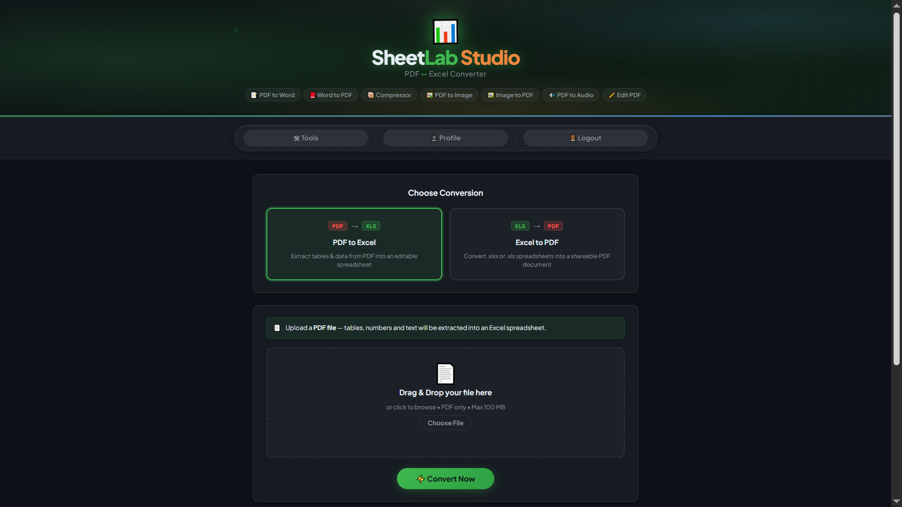
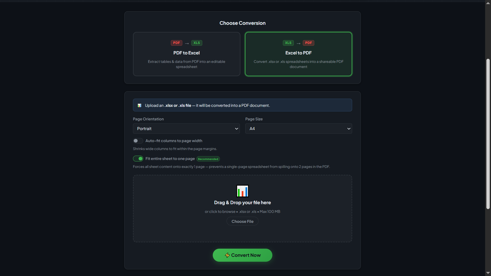
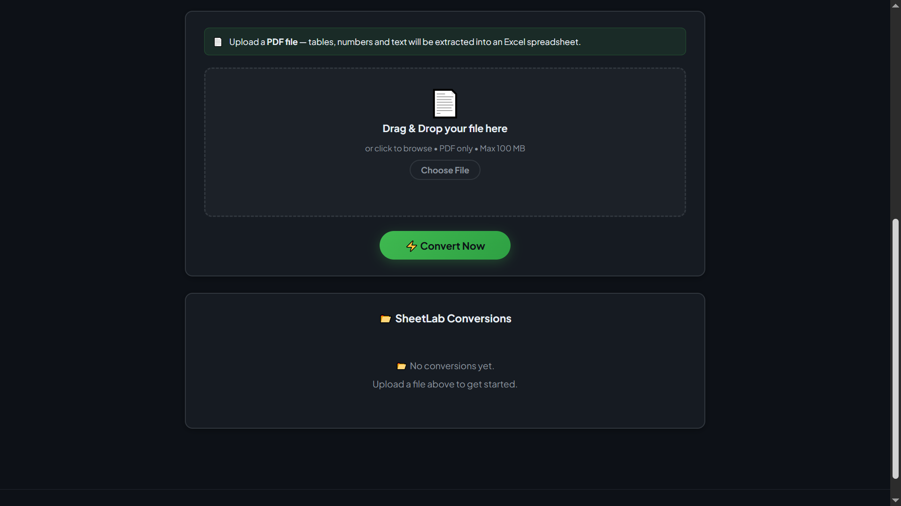
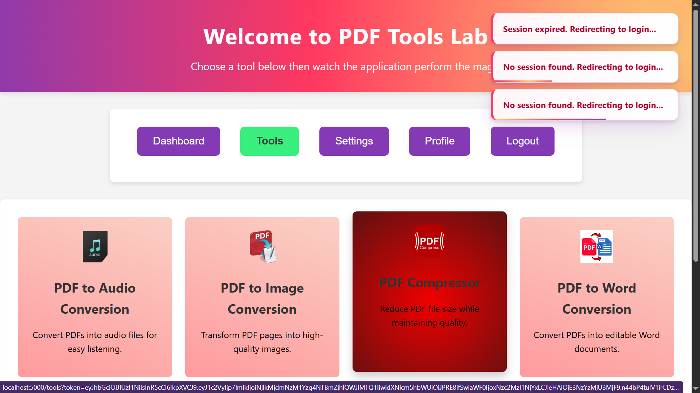

# PDF Labs — SheetLab Service

> The PDF ↔ Excel conversion microservice for the PDF Labs platform. Converts PDF documents into editable Excel spreadsheets and Excel files (.xlsx, .xls) into PDF documents — both via **ConvertAPI v2** raw HTTPS. SheetLab is the most distinctively styled service in the platform, with its own bespoke CSS design system, a dedicated `error.ejs` page with token-aware back navigation, and the most comprehensive Express server setup of any service (session, flash, morgan, method-override, cookie-parser, and a dual notFound/errorHandler middleware pair.)

---

## Table of Contents

- [Overview](#overview)
- [Architecture](#architecture)
- [Screenshots](#screenshots)
- [Tech Stack](#tech-stack)
- [Project Structure](#project-structure)
- [Supported Operations](#supported-operations)
- [API Endpoints](#api-endpoints)
- [Environment Variables](#environment-variables)
- [Getting Started](#getting-started)
  - [Prerequisites](#prerequisites)
  - [Run Locally (without Docker)](#run-locally-without-docker)
  - [Run with Docker](#run-with-docker)
- [Conversion Pipeline](#conversion-pipeline)
- [Session & Authentication Flow](#session--authentication-flow)
- [Security Highlights](#security-highlights)
- [Related Services](#related-services)
- [Contributing](#contributing)
- [License](#license)

---

## Overview

The **SheetLab Service** is a Node.js/Express microservice that converts between PDF and Excel formats for the [PDF Labs](https://github.com/Godfrey22152/MICROSERVICE-PDF-LABS) platform. It supports two bidirectional operations: **PDF → Excel** and **Excel → PDF**, each using a distinct ConvertAPI v2 endpoint selected at runtime.

This service is responsible for:

- Rendering the SheetLab Studio page (EJS) with its own bespoke design system (`sheetlab.css`), dual operation cards, Excel-to-PDF page layout options, and per-user conversion history.
- Accepting uploads for PDF and Excel files (PDF, XLSX, XLS — up to 100 MB) validated by both MIME type and extension via a custom multer `diskStorage` config (with timestamped filenames to prevent collisions.)
- Routing between two ConvertAPI v2 endpoints: `pdf/to/xlsx` for PDF → Excel, and `xlsx/to/pdf` or `xls/to/pdf` for Excel → PDF — each selected based on the uploaded file's extension
- Applying Excel → PDF layout options: page orientation (portrait/landscape), page size (A4/Letter/A3/Legal), auto-fit columns, and fit-to-page (which sets `FitToPage=true`, `FitToWidth=1`, `FitToHeight=1` to prevent a single-page sheet from spilling onto two PDF pages)
- Persisting `ConvertedFile` records to MongoDB with `operation` and `operationLabel` fields
- Serving download routes that also accept a `?token=` fallback for browsers that send no Authorization header on plain `<a href>` clicks
- Rendering a dedicated `error.ejs` page with brand-consistent styling and token-aware back navigation for 404 and 500 errors
- Allowing users to delete individual records and their output directories

---

## Architecture

SheetLab uses the same ConvertAPI raw-HTTPS pattern as the pdf-to-word and word-to-pdf services, but selects between two direction-specific endpoints based on the `operation` form field.

```
                  ┌─────────────────────────────────────────────────┐
                  │               PDF Labs Platform                 │
                  │               (Docker Network)                  │
                  └──────────────────┬──────────────────────────────┘
                                     │  Token-bearing request from tools-service
         ┌───────────────────────────▼──────────────────────────────────────────┐
         │              sheetlab-service (:5600)  ◄── THIS                      │
         │  • multer diskStorage saves file with timestamp-prefixed name        │
         │  • Operation card → selects ConvertAPI endpoint                      │
         │  • Raw HTTPS POST to ConvertAPI v2                                   │
         │  • Download output from ConvertAPI temporary URL                     │
         │  • Persist ConvertedFile record to MongoDB                           │
         │  • Serve download + delete routes                                    │
         └──────┬─────────────────────────────────────────────┬─────────────────┘
                │                                             │
   ┌────────────▼──────────────┐              ┌───────────────▼──────────────────┐
   │  MongoDB (:27017)         │              │  ConvertAPI v2 (external HTTPS)  │
   │  sheetlab-service DB      │              │  PDF → Excel: /pdf/to/xlsx       │
   │  • ConvertedFile schema   │              │  Excel → PDF: /xlsx/to/pdf       │
   │  • operation enum field   │              │               /xls/to/pdf        │
   └───────────────────────────┘              └──────────────────────────────────┘

  Local filesystem: uploads/ (timestamped multer staging) outputs/<uuid>/ (.xlsx or .pdf)
  ConvertAPI free tier: 250 conversions/month
```

> **Note:** The **[docker-compose.yml file](https://github.com/Godfrey22152/MICROSERVICE-PDF-LABS/blob/main/docker-compose.yml)** that wires all services together lives in the **root/main repository**, not in this repository.

> **Dockerfile note:** The runtime stage explicitly runs `RUN mkdir -p uploads outputs` so these directories exist before the non-root user starts the process, avoiding a permission error on first run.

---

## Screenshots

> SheetLab Studio application screenshots.

### SheetLab Studio — Operation Selection


### Excel → PDF Layout Options


### Conversion History Grid


### Error Page


---

## Tech Stack

| Layer | Technology |
|---|---|
| Runtime | Node.js |
| Framework | Express 4 |
| Templating | EJS |
| Database | MongoDB (via Mongoose) |
| File uploads | `multer` (`diskStorage`, timestamped filenames, MIME + extension filter, 100 MB limit) |
| PDF ↔ Excel conversion | **ConvertAPI v2** — raw HTTPS REST (`form-data` multipart POST, no SDK) |
| Endpoint selection | Dynamic — `pdf/to/xlsx` or `xlsx|xls/to/pdf` based on operation + file extension |
| Logging | `morgan` (dev mode HTTP request logger) |
| Session | `express-session` (server-side session for flash message support) |
| Flash messages | `connect-flash` |
| Cookie parsing | `cookie-parser` |
| Method override | `method-override` (HTML form DELETE support) |
| Auth | JWT (`jsonwebtoken`) — Bearer header, query param, or body |
| File ID | `uuid` v4 |
| Container | Docker (multi-stage, Alpine 3.21 + Node.js, no document tools) |

---

## Project Structure

```
sheetlab-service/
├── server.js                          # Express entry point — richest setup of all services
├── Dockerfile                         # Multi-stage build; RUN mkdir -p uploads outputs
├── package.json
├── config/
│   └── db.js                          # MongoDB connection with disconnect/error listeners
├── controllers/
│   └── sheetlabController.js          # OPERATIONS map, postForm, convertFile, fetchRemote, render, convert, download, delete
├── middleware/
│   ├── auth.js                        # JWT guard — Bearer, query, body; HTML redirect fallback
│   └── errorHandler.js                # notFound (renders error.ejs), errorHandler, handleExecError
├── models/
│   └── ConvertedFile.js               # Mongoose schema with operation enum + operationLabel
├── routes/
│   └── sheetlabRoutes.js              # All /tools/sheetlab routes + diskStorage multer + route-level error handler
├── utils/
│   └── fileUtils.js                   # sanitizeFilename (strips extension + trims to 100 chars), formatBytes
├── views/
│   ├── sheetlab.ejs                   # Studio page with dual operation cards, layout options, history grid
│   └── error.ejs                      # Branded 404/500 page with token-aware back link
├── public/
│   ├── css/
│   │   └── sheetlab.css               # Bespoke SheetLab design system (not shared with other services)
│   └── js/
│       ├── sheetlab.js                # Session, drag-drop, AJAX submit, progress, delete — all prefixed `sl`
│       └── eventlisteners.js          # Navigation to other PDF Labs services
├── uploads/                           # Multer staging (auto-created, gitignored)
└── outputs/                           # Per-conversion output dirs (auto-created, gitignored)
```

---

## Supported Operations.

| Operation | Input | ConvertAPI Endpoint | Output | Notes |
|---|---|---|---|---|
| **PDF → Excel** | PDF | `POST /pdf/to/xlsx` | `.xlsx` | Extracts tables, numbers, and text from PDF pages |
| **Excel → PDF** (XLSX) | `.xlsx` | `POST /xlsx/to/pdf` | `.pdf` | Supports orientation, page size, auto-fit, fit-to-page |
| **Excel → PDF** (XLS) | `.xls` | `POST /xls/to/pdf` | `.pdf` | Same options as XLSX; endpoint selected by file extension |

### Excel → PDF Layout Options

| Option | Field | Values | Default |
|---|---|---|---|
| Page Orientation | `pageOrientation` | `portrait` / `landscape` | `portrait` |
| Page Size | `pageSize` | `a4` / `letter` / `a3` / `legal` | `a4` |
| Auto-fit columns | `autoFit` | `true` / `false` | `false` |
| Fit entire sheet to one page | `fitToPage` | `true` / `false` | `true` (checked by default) |

**Fit to Page** sets `FitToPage=true`, `FitToWidth=1`, and `FitToHeight=1` in the ConvertAPI request. This is the most reliable way to prevent a single-page spreadsheet from spilling onto two PDF pages.

---

## API Endpoints

All routes are mounted under `/tools/sheetlab`. Session-protected routes require a valid JWT.

| Method | Path | Auth | Description |
|---|---|---|---|
| `GET` | `/tools/sheetlab` | JWT | Render the SheetLab Studio page with conversion history |
| `POST` | `/tools/sheetlab` | JWT | Upload a file and convert (PDF→Excel or Excel→PDF) |
| `GET` | `/tools/sheetlab/download/:id` | None | Download the converted file by UUID + filename |
| `DELETE` | `/tools/sheetlab/:id` | JWT | Delete a conversion record and its output directory |

---

### `GET /tools/sheetlab`

```
GET http://localhost:5600/tools/sheetlab?token=<jwt>
```

Queries all `ConvertedFile` records for the authenticated user (sorted newest-first) and renders the studio page.

**Responses:**
- `200` — Renders `sheetlab.ejs`
- `302` — Redirect to `http://localhost:3000` (invalid/missing token, HTML client)
- `401` — Structured JSON auth error (API client)

---

### `POST /tools/sheetlab`

Accepts `multipart/form-data`. Called via `fetch` with `X-Requested-With: XMLHttpRequest`; returns JSON for card injection, or redirects on non-XHR fallback.

```
POST http://localhost:5600/tools/sheetlab?token=<jwt>
Content-Type: multipart/form-data

sheetFile:       <file>              (PDF, XLSX, or XLS — max 100 MB)
operation:       pdfToExcel | excelToPdf
pageOrientation: portrait | landscape    (excelToPdf only)
pageSize:        a4 | letter | a3 | legal (excelToPdf only)
autoFit:         true | false             (excelToPdf only)
fitToPage:       true | false             (excelToPdf only)
```

**Success response (XHR):**
```json
{
  "fileId": "<uuid>",
  "originalName": "report.pdf",
  "sanitizedName": "report",
  "originalSize": 2097152,
  "convertedSize": 45056,
  "operation": "pdfToExcel",
  "operationLabel": "PDF → Excel",
  "downloadUrl": "/tools/sheetlab/download/<uuid>?file=report.xlsx&token=<jwt>",
  "filename": "report.xlsx"
}
```

**Error responses:**
- `400` — No file / unsupported format / unknown operation
- `401` — Auth error
- `429` — ConvertAPI API limit reached
- `504` — ConvertAPI request timed out (try a smaller file)
- `500` — Invalid API key / output file not found after download

---

### `GET /tools/sheetlab/download/:id`

No authentication required. The download URL also includes `?token=<jwt>` as a query parameter — this is a fallback for browsers that send no `Authorization` header on plain `<a href>` clicks, since the route itself does not enforce auth.

```
GET http://localhost:5600/tools/sheetlab/download/<uuid>?file=report.xlsx
```

**Responses:**
- `200` — File download (`res.download`)
- `400` — Missing `file` query parameter
- `404` — `"File not found or expired."`

---

### `DELETE /tools/sheetlab/:id`

Verifies the record belongs to the authenticated user before deleting both the MongoDB document and the `outputs/<uuid>/` directory.

```
DELETE http://localhost:5600/tools/sheetlab/<uuid>?token=<jwt>
X-Requested-With: XMLHttpRequest
```

**Responses:**
- `200` — `"Deleted."`
- `404` — `"Not found or permission denied."`
- `500` — `"Server error."`

---

## Environment Variables

Create a `.env` file in the project root (or supply via Docker/Compose):

| Variable | Required | Description |
|---|---|---|
| `MONGO_URI` | Yes | MongoDB connection string, e.g. `mongodb://mongo:27017/sheetlab-service` |
| `JWT_SECRET` | Yes | Secret key for verifying JWTs — must match the account-service |
| `CONVERTAPI_SECRET` | Yes | Your ConvertAPI secret key — obtain at [convertapi.com](https://www.convertapi.com) |
| `SESSION_SECRET` | No | Secret for express-session (defaults to `"sheetlab_secret"` — set a strong value in production) |
| `PORT` | No | Server port (defaults to `5600`) |

> **ConvertAPI free tier:** 250 conversions/month. Each conversion counts as one.

> **Warning:** Never commit your `.env` file or real secrets to version control. Always set `SESSION_SECRET` to a strong random string in production.

---

## Getting Started

### Prerequisites

- [Node.js](https://nodejs.org/)
- [MongoDB](https://www.mongodb.com/) instance (local or Docker)
- A valid [ConvertAPI](https://www.convertapi.com) account and secret key
- [Docker](https://www.docker.com/) (optional)
- A valid JWT issued by the **account-service**

> **No system document tools required.** No LibreOffice, Ghostscript, or Poppler is needed. The Docker image installs only Node.js.

### Run Locally (without Docker)

```bash
# 1. Clone the repository
git clone https://github.com/Godfrey22152/MICROSERVICE-PDF-LABS.git
cd MICROSERVICE-PDF-LABS/sheetlab-service

# 2. Install dependencies
npm install

# 3. Create your environment file
cp .env.example .env
# Edit .env with your MONGO_URI, JWT_SECRET, CONVERTAPI_SECRET, and SESSION_SECRET

# 4. Start the server
npm start
```

The service will be available at `http://localhost:5600/tools/sheetlab`.

> The `uploads/` and `outputs/` directories are created at runtime (or pre-created by the Dockerfile `RUN mkdir -p uploads outputs` instruction).

### Run with Docker

The Dockerfile explicitly creates `uploads/` and `outputs/` directories before switching to the non-root user, ensuring write access is available on first run.

#### Build and run this service standalone

```bash
docker build -t sheetlab-service .
docker run -p 5600:5600 \
  -e MONGO_URI=mongodb://<your-mongo-host>:27017/sheetlab-service \
  -e JWT_SECRET=your_secret_here \
  -e CONVERTAPI_SECRET=your_convertapi_secret \
  -e SESSION_SECRET=your_strong_session_secret \
  sheetlab-service
```

#### Run the full PDF Labs stack

From the **root/main repository** that contains **[docker-compose.yml file](https://github.com/Godfrey22152/MICROSERVICE-PDF-LABS/blob/main/docker-compose.yml)**:

```bash
docker compose up --build
```

---

## Conversion Pipeline

```
User selects operation card (PDF → Excel or Excel → PDF)
        │  Drop zone accept + icon + subtitle update dynamically
        │  Client validates extension against validExts for current operation
        │
        ▼
POST /tools/sheetlab  (multipart/form-data, fetch + X-Requested-With: XMLHttpRequest)
        │
        ▼
  auth middleware validates JWT server-side
        │
  multer diskStorage:
    ├─ Saves to uploads/<timestamp>-<originalname>   ← timestamped to prevent collisions
    ├─ Validates by MIME type OR extension (MIME || ext — either accepted)
    └─ fileSize limit: 100 MB; LIMIT_FILE_SIZE caught by errorHandler → 413

  controller.convertDoc:
    • operation = req.body.operation || "pdfToExcel"
    • Validates against OPERATIONS map
    • Generates uuid → creates outputs/<uuid>/

  ─── PDF → XLSX ───────────────────────────────────────────────────────
  convertFile(BASE + "pdf/to/xlsx" + SEC, path, name, "application/pdf", null)
    └─ postForm() → https.request (timeout: 180,000ms)
    cleanup() → fs.unlinkSync(uploadedFile.path)
    fetchRemote(body.Files[0].Url, outPath)   ← download .xlsx

  ─── Excel → PDF ──────────────────────────────────────────────────────
  ext = path.extname(originalName)  →  ".xlsx" or ".xls"
  fromFmt = isXls ? "xls" : "xlsx"
  convertFile(BASE + fromFmt + "/to/pdf" + SEC, path, name, mimeType, {
    PageOrientation, PageSize, AutoFit,
    FitToPage, FitToWidth, FitToHeight    ← all three set when fitToPage=true
  })
    cleanup() → fs.unlinkSync(uploadedFile.path)
    fetchRemote(body.Files[0].Url, outPath)   ← download .pdf

  convertedSize = fs.statSync(outPath).size
  downloadUrl includes ?token=<jwt>  ← passthrough for plain <a href> clicks
        │
        ▼
  Save ConvertedFile to MongoDB (operation enum, operationLabel stored)
        │
        ├─ fetch resolved: res.json(payload) → appendFileCard() injects card into DOM
        │   Card shows: green badge (PDF→Excel) or blue badge (Excel→PDF)
        └─ non-XHR: res.redirect(/tools/sheetlab?token=...)

ConvertAPI Error Mapping:
  401/403 → "Invalid API key" (500)
  429     → "API limit reached" (429)
  timed out → "Request timed out. Try a smaller file." (504)
  other   → "Conversion failed: <message>" (500)

Progress bar: randomised Math.random() × 8 increments (same as word-to-pdf),
  capped at 85% until the fetch resolves; dynamic progress text reflects
  current operation ("Extracting data from PDF…" vs "Converting spreadsheet to PDF…")
```

---

## Session & Authentication Flow

```
User arrives at /tools/sheetlab?token=<jwt>
        │
        ▼
  auth middleware: structural check (3 parts) + jwt.verify()
        │
   ┌────┴──────────────────────────┐
   │ Invalid / expired / no token  │  → HTML: redirect to :3000
   │                               │  → fetch:  401 JSON error
   └───────────────────────────────┘
        │ Valid
        ▼
  controller.renderPage → ConvertedFile.find({ userId }) → render sheetlab.ejs
        │
        ▼
  Client (sheetlab.js — all functions prefixed "sl"):
    • URL token → localStorage.setItem("token", urlToken)
    • slCheckSession() decodes exp → setTimeout at exact expiry moment
    • Expired/tampered → slHandleAuthError() → clears token → redirect to :3000

  User switches operation card:
    → radio input toggled
    → .sl-op-card.selected class toggled
    → .sl-params.active toggled
    → fileInput.accept updated dynamically
    → dropzone subtitle and icon updated

  User submits form (fetch, X-Requested-With: XMLHttpRequest)
        │
        ├─ auth validates token again server-side
        │
        ├─ Progress text: "Extracting data from PDF…" or "Converting spreadsheet to PDF…"
        │
        ├─ 401 → slHandle401() → typed message → slHandleAuthError()
        ├─ 429 → "API limit reached" toast
        ├─ 504 → "Request timed out. Try a smaller file." toast
        │
        └─ 200 → appendFileCard(data)
                   Green badge + 📊 icon for PDF→Excel
                   Blue badge + 📄 icon for Excel→PDF

  Error pages (404/500):
    Rendered via error.ejs with token-aware back link:
    href="/tools/sheetlab?token=<%= encodeURIComponent(locals.token) %>"
```

---

## Security Highlights

- **Dual MIME + extension validation** — the multer `fileFilter` accepts files where MIME type OR extension matches the allowed list, covering both well-configured and misconfigured browsers.
- **Timestamped upload filenames** — multer `diskStorage` prefixes each saved file with `Date.now()`, preventing filename collisions and making staging files non-guessable.
- **Temp file cleanup on all paths** — `cleanup()` calls `fs.unlinkSync(uploadedFile.path)` in both the success flow (after ConvertAPI responds) and the `catch` block.
- **Token passthrough in download URL** — download links include `?token=<jwt>` in addition to UUID scoping. This ensures users can still trigger downloads from `<a href>` links after a page refresh, since browsers don't send `Authorization` headers on navigation requests.
- **Fit-to-page parameter triplet** — the `fitToPage`, `FitToWidth=1`, and `FitToHeight=1` combination is documented in the controller with a comment explaining why all three are needed together. Setting only `FitToPage` is insufficient.
- **ConvertAPI secret masked in logs** — `postForm` logs the URL with `Secret=***` replacing the actual secret value.
- **User-scoped delete** — `deleteFile` queries MongoDB with both `fileId` AND `userId`.
- **Dedicated error page** — a `notFound` + `errorHandler` middleware pair renders `error.ejs` with the appropriate status code and a back link that preserves the user's session token — unique among all services in the platform.
- **Session secret should be set in production** — the `server.js` defaults `SESSION_SECRET` to `"sheetlab_secret"`. This should be overridden via environment variable in any non-development deployment.
- **Route-level multer error handler** — a dedicated `router.use((err, req, res, next) => {...})` catches multer errors at the route level before they reach the global handler.
- **No system document tools in image** — only Node.js is installed in the Docker runtime stage.
- **Non-root Docker user** — the production container runs as `appuser` on Alpine Linux.

---

## Related Services

All services below are part of the PDF Labs platform and are wired together via the root `docker-compose.yml`.

| Service | Port | Description |
|---|---|---|
| `account-service` | 3000 | Auth & landing page — issues JWTs |
| `home-service` | 3500 | Authenticated dashboard |
| `profile-service` | 4000 | User profile management |
| `logout-service` | 4500 | Session termination |
| `tools-service` | 5000 | Authenticated tools hub |
| `pdf-to-image-service` | 5100 | PDF → Image conversion |
| `image-to-pdf-service` | 5200 | Image → PDF conversion |
| `pdf-compressor-service` | 5300 | PDF compression via Ghostscript |
| `pdf-to-audio-service` | 5400 | PDF → Audio via Edge TTS |
| `pdf-to-word-service` | 5500 | PDF → Word (.docx) via ConvertAPI |
| `sheetlab-service` | 5600 | **This service** — PDF ↔ Excel via ConvertAPI |
| `word-to-pdf-service` | 5700 | DOCX/DOC/ODT/RTF/PPTX/PPT → PDF |
| `edit-pdf-service` | 5800 | Rotate, watermark, merge, split, protect, unlock |

---

## Contributing

1. Fork the repository
2. Create a feature branch: `git checkout -b feature/my-feature`
3. Commit your changes: `git commit -m "feat: add my feature"`
4. Push to the branch: `git push origin feature/my-feature`
5. Open a Pull Request

Please follow the existing code style and keep commits focused.

---

## License

This project is licensed under the **ISC License**. See the [LICENSE](LICENSE) file for details.

---

> Maintained by [Godfrey Ifeanyi](mailto:godfreyifeanyi50@gmail.com) — Powered by [ConvertAPI](https://www.convertapi.com)
