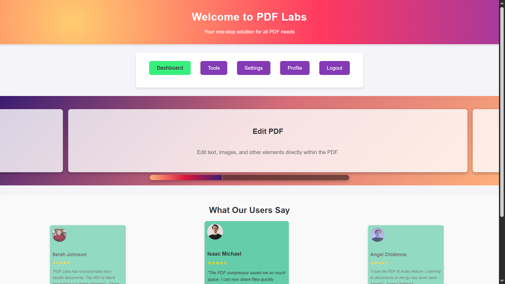
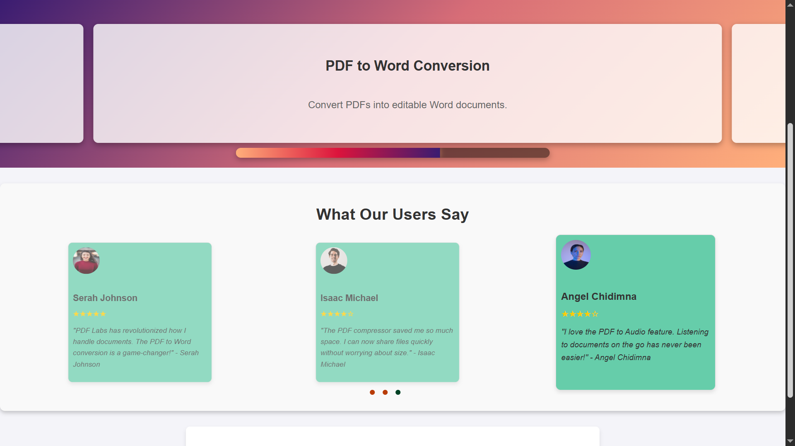
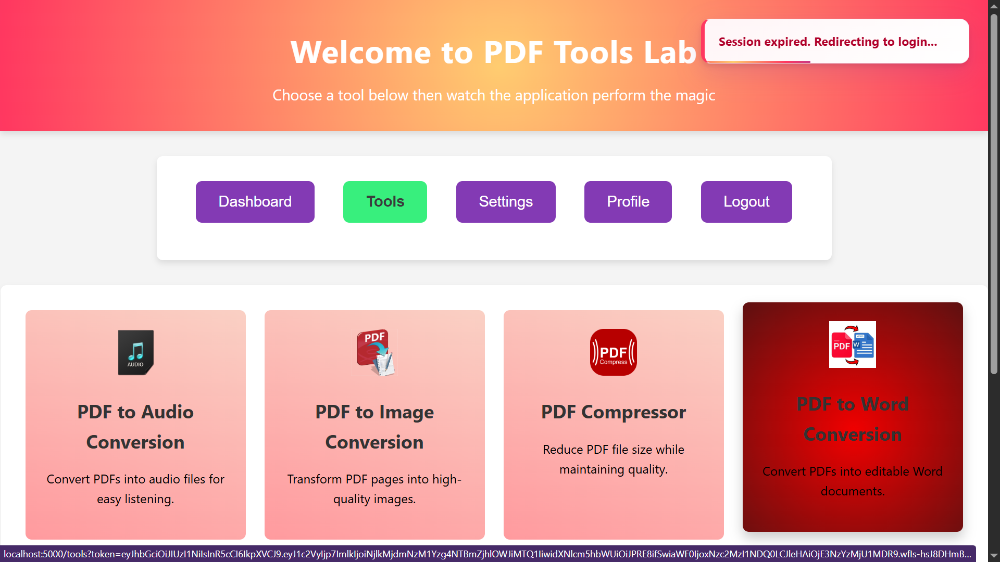

# PDF Labs — Home Service

> The authenticated dashboard microservice for the PDF Labs platform. Serves as the post-login landing page, displaying educational feature animations, user testimonials, and the primary navigation hub that connects users to all other services.

---

## Table of Contents

- [Overview](#overview)
- [Architecture](#architecture)
- [Screenshots](#screenshots)
- [Tech Stack](#tech-stack)
- [Project Structure](#project-structure)
- [API Endpoints](#api-endpoints)
- [Environment Variables](#environment-variables)
- [Getting Started](#getting-started)
  - [Prerequisites](#prerequisites)
  - [Run Locally (without Docker)](#run-locally-without-docker)
  - [Run with Docker](#run-with-docker)
- [Session & Authentication Flow](#session--authentication-flow)
- [UI Features](#ui-features)
- [Security Highlights](#security-highlights)
- [Related Services](#related-services)
- [Contributing](#contributing)
- [License](#license)

---

## Overview

The **Home Service** is a Node.js/Express microservice that renders the main authenticated dashboard for the [PDF Labs](https://github.com/Godfrey22152/MICROSERVICE-PDF-LABS) platform. After a user logs in via the **Account Service** (port `3000`) and a JWT is issued, they are redirected here with the token in the URL query string.

This service is responsible for:

- Rendering the post-login dashboard (EJS) — only accessible with a valid JWT
- Displaying an auto-advancing educational animation carousel highlighting all PDF tools
- Displaying a user testimonials carousel
- Serving as the primary navigation hub linking to Tools, Profile, Settings, and Logout services
- Client-side JWT session management: reading the token from the URL, persisting it to `localStorage`, and scheduling a precise expiry redirect.

---

## Architecture

The home service is the first authenticated page a user sees after login. It sits between the account service and the wider tool ecosystem, acting as the dashboard and navigation anchor for the entire platform.

```
                  ┌─────────────────────────────────────┐
                  │          PDF Labs Platform          │
                  │          (Docker Network)           │
                  └──────────────┬──────────────────────┘
                                 │
         ┌───────────────────────▼────────────────────────────┐
         │            account-service (:3000)                 │
         │  Login → issues JWT → redirects to home-service    │
         └───────────────────────┬────────────────────────────┘
                                 │  GET /?token=<jwt>
         ┌───────────────────────▼────────────────────────────┐
         │             home-service (:3500)  ◄── THIS         │
         │  • Authenticated dashboard                         │
         │  • Educational animation carousel                  │
         │  • Testimonials carousel                           │
         │  • Navigation hub to all services                  │
         └──────┬───────────────┬──────────────────┬──────────┘
                │               │                  │
     ┌──────────▼───┐  ┌────────▼──────┐  ┌────────▼───────────┐
     │tools-service │  │profile-service│  │  logout-service    │
     │  (:5000)     │  │   (:4000)     │  │    (:4500)         │
     └──────────────┘  └───────────────┘  └────────────────────┘
```

> **Note:** The `docker-compose.yml` that wires all services together lives in the **root/main repository**, not in this repository.

---

## Screenshots.

> Dashboard application screenshots.

### Home Dashboard


### Educational Animation Carousel


### Testimonials Section


### Session Expiry Toast


---

## Tech Stack

| Layer | Technology |
|---|---|
| Runtime | Node.js ≥ 15.0.0 |
| Framework | Express 4 |
| Templating | EJS |
| Database | MongoDB (via Mongoose) |
| Auth | JWT (`jsonwebtoken`) — Bearer header, query param, or body |
| Config | `config` module + `.env` |
| Container | Docker (multi-stage, Alpine-based) |

---

## Project Structure

```
home-service/
├── app.js                        # Express entry point, global error handler
├── Dockerfile                    # Multi-stage production Docker build
├── package.json
├── config/
│   └── db.js                     # MongoDB connection
├── controllers/
│   └── homeController.js         # getHomePage handler (used by /api/home)
├── middleware/
│   └── auth.js                   # JWT guard — Bearer header, query param, body; HTML redirect fallback
├── routes/
│   └── home.js                   # GET /, GET /api/home
├── views/
│   └── home.ejs                  # Dashboard template with animations and testimonials
└── public/
    ├── css/
    │   ├── styles.css
    │   └── educational-animation.css
    ├── js/
    │   ├── script.js             # Session management, nav routing, slide state
    │   ├── educational-animation.js  # Slide-container transform animation
    │   └── testimonial_Carousel.js   # Testimonial carousel logic
    └── images/                   # Testimonial avatars, social icons, UI assets
```

---

## API Endpoints

Both routes require a valid JWT. Browser clients without a valid token are redirected to `http://localhost:3000`; API clients receive a structured JSON error.

| Method | Path | Auth | Description |
|---|---|---|---|
| `GET` | `/` | JWT (query param) | Renders the home dashboard — primary post-login entry point |
| `GET` | `/api/home` | JWT (Bearer header) | Returns the home page for API/programmatic clients |

---

### `GET /`

The primary route used after login. The account-service redirects here with the token appended as a query parameter.

```
GET http://localhost:3500/?token=<jwt>
```

**Responses:**
- `200` — Renders `home.ejs` with the token passed to the template for nav link construction
- `302` — Redirects to `http://localhost:3000` (no token, malformed token, or expired token, HTML client)
- `401` — `{ "error": true, "type": "TOKEN_EXPIRED" | "INVALID_TOKEN" | "NO_TOKEN", "msg": "..." }` (API client)

---

### `GET /api/home`

An alternative programmatic entry point that accepts the token via `Authorization` header, query param, or request body.

```
GET http://localhost:3500/api/home
Authorization: Bearer <jwt>
```

**Responses:**
- `200` — Renders `home.ejs`
- `401` — Structured JSON auth error (see above)

---

## Environment Variables

Create a `.env` file in the project root (or supply via Docker/Compose):

| Variable | Required | Description |
|---|---|---|
| `MONGO_URI` | Yes | MongoDB connection string, e.g. `mongodb://mongo:27017/account-service` |
| `JWT_SECRET` | Yes | Secret key for verifying JWTs — must match the account-service |
| `PORT` | No | Server port (defaults to `3500`) |
| `NODE_ENV` | No | `development` or `production` |

> **Important:** The `JWT_SECRET` must be identical across all services in the platform so that tokens issued by the account-service can be verified here.

> **Warning:** Never commit your `.env` file or real secrets to version control.

---

## Getting Started

### Prerequisites

- [Node.js](https://nodejs.org/) ≥ 15.0.0
- [MongoDB](https://www.mongodb.com/) instance (local or Docker)
- [Docker](https://www.docker.com/) (optional, for containerised runs)
- A valid JWT issued by the **account-service** — navigating directly to `/` without a token redirects to login

### Run Locally (without Docker)

```bash
# 1. Clone the repository
git clone https://github.com/Godfrey22152/MICROSERVICE-PDF-LABS.git
cd MICROSERVICE-PDF-LABS/home-service

# 2. Install dependencies
npm install

# 3. Create your environment file
cp .env.example .env
# Edit .env with your MONGO_URI and JWT_SECRET

# 4. Start the server
npm start
```

The service will be available at `http://localhost:3500`.

> **Note:** Navigating to `http://localhost:3500` without a `?token=` query parameter will immediately redirect to `http://localhost:3000`. Start the full stack to test the complete post-login flow.

### Run with Docker

#### Build and run this service standalone

```bash
docker build -t home-service .
docker run -p 3500:3500 \
  -e MONGO_URI=mongodb://<your-mongo-host>:27017/account-service \
  -e JWT_SECRET=your_secret_here \
  home-service
```

#### Run the full PDF Labs stack

From the **root/main repository** that contains **[docker-compose.yml](https://github.com/Godfrey22152/MICROSERVICE-PDF-LABS/blob/main/docker-compose.yml)**:

```bash
docker compose up --build
```

---

## Session & Authentication Flow

```
User completes login on account-service (:3000)
        │
        ▼
JWT issued → browser redirects to http://localhost:3500/?token=<jwt>
        │
        ▼
  auth middleware: structural check (3 parts) + jwt.verify()
        │
   ┌────┴──────────────────────────┐
   │ Invalid / expired / no token  │  → HTML: redirect to :3000
   │                               │  → API:  401 JSON error
   └───────────────────────────────┘
        │ Valid
        ▼
  routes/home.js: res.render('home', { token })
  Token injected into template for nav link construction
        │
        ▼
  Client (script.js):
    • URL token read → localStorage.setItem('token', urlToken)
    • checkSession() runs immediately:
        ├─ No token        → handleAuthError() after 100ms
        ├─ Malformed JWT   → handleAuthError() after 100ms
        ├─ Corrupt payload → handleAuthError() after 100ms
        ├─ Already expired → handleAuthError() after 100ms
        └─ Valid           → setTimeout fires at exact exp moment
                               → showToast("Session expired") → redirect :3000

  User clicks nav button (Tools / Profile / Logout)
        │
        ▼
  Token read from localStorage → appended to destination URL as ?token=<jwt>
        │
        ▼
  Destination service receives token and validates independently
```

---

## UI Features

### Educational Animation Carousel

A full-width slide carousel (`#educational-animations`) auto-advances every 10 seconds using a CSS `translateX` transform driven by `educational-animation.js`. Each slide highlights one of the platform's PDF tools. A countdown bar visually tracks time until the next slide. The EJS template defines six slides covering: PDF to Audio, PDF to Word, PDF to Image, Edit PDF, Image Scanner, and Excel SheetLab.

### Testimonials Carousel

A separate testimonial section (`#testimonial-carousel`) cycles through three user reviews, each with an avatar, name, star rating, and quote. Navigation indicators are rendered dynamically by `testimonial_Carousel.js`.

### Toast Notification System

All session events (expiry, invalid token, no token) surface as non-blocking toast notifications via `showToast()`. Toasts are defined with inline CSS directly in `home.ejs` to ensure they render correctly even before external stylesheets load. Four variants are supported: `error`, `success`, `warning`, and `info`, each with a colour-coded left border and an animated progress bar.

---

## Security Highlights

- **Server-side token validation on every request** — the `auth` middleware verifies the JWT structurally (3 dot-separated parts) and cryptographically (`jwt.verify`) before the route handler runs. No unauthenticated request ever reaches the view renderer.
- **Dual-layer session enforcement** — the client independently decodes the JWT `exp` claim and schedules a precise redirect at the exact moment the token expires, preventing sessions from silently outliving their validity window.
- **Typed error responses** — auth failures return structured objects with a `type` field (`NO_TOKEN`, `TOKEN_EXPIRED`, `INVALID_TOKEN`) for programmatic handling by API clients.
- **HTML/API dual response mode** — all error paths check `req.accepts('html')` and either redirect browser clients or return JSON for XHR/API clients.
- **Token cleared before redirect** — `localStorage.removeItem('token')` runs synchronously inside `handleAuthError` before the toast and redirect, eliminating any race window where a stale token could be reused.
- **Non-root Docker user** — the production container runs as `appuser` (non-root) on an Alpine Linux base image.
- **Multi-stage Docker build** — source maps, test files, docs, and dev tooling are stripped from the final image; only production artifacts are included.
- **No secrets in image** — all secrets are injected at runtime via environment variables.

---

## Related Services

All services below are part of the PDF Labs platform and are wired together via the root `docker-compose.yml`.

| Service | Port | Description |
|---|---|---|
| `account-service` | 3000 | Auth & landing page — issues JWTs |
| `home-service` | 3500 | **This service** — authenticated dashboard |
| `profile-service` | 4000 | User profile management |
| `logout-service` | 4500 | Session termination |
| `tools-service` | 5000 | Authenticated tools hub |
| `pdf-to-image-service` | 5100 | PDF → Image conversion |
| `image-to-pdf-service` | 5200 | Image → PDF conversion |
| `pdf-compressor-service` | 5300 | PDF compression |
| `pdf-to-audio-service` | 5400 | PDF → Audio conversion |
| `pdf-to-word-service` | 5500 | PDF → Word conversion |
| `sheetlab-service` | 5600 | PDF ↔ Excel conversion |
| `word-to-pdf-service` | 5700 | Word → PDF conversion |
| `edit-pdf-service` | 5800 | In-browser PDF editing |

---

## Contributing

1. Fork the repository
2. Create a feature branch: `git checkout -b feature/my-feature`
3. Commit your changes: `git commit -m "feat: add my feature"`
4. Push to the branch: `git push origin feature/my-feature`
5. Open a Pull Request

Please follow the existing code style and keep commits focused.

---

## License

This project is licensed under the **ISC License**. See the [LICENSE](LICENSE) file for details.

---

> Maintained by [Godfrey Ifeanyi](mailto:godfreyifeanyi50@gmail.com)
