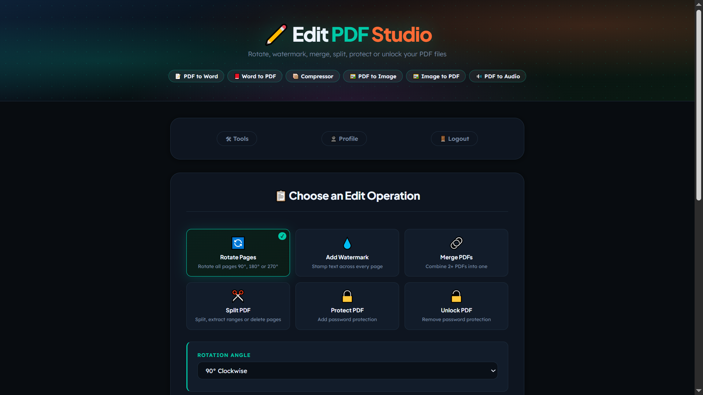
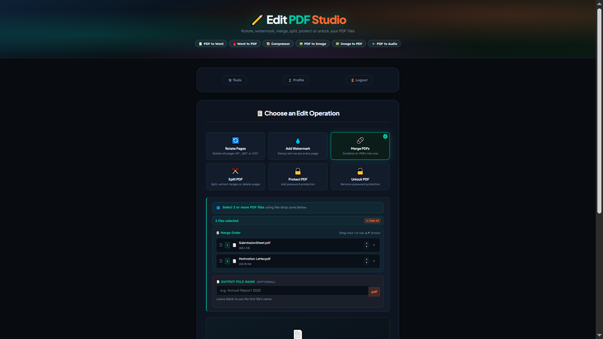
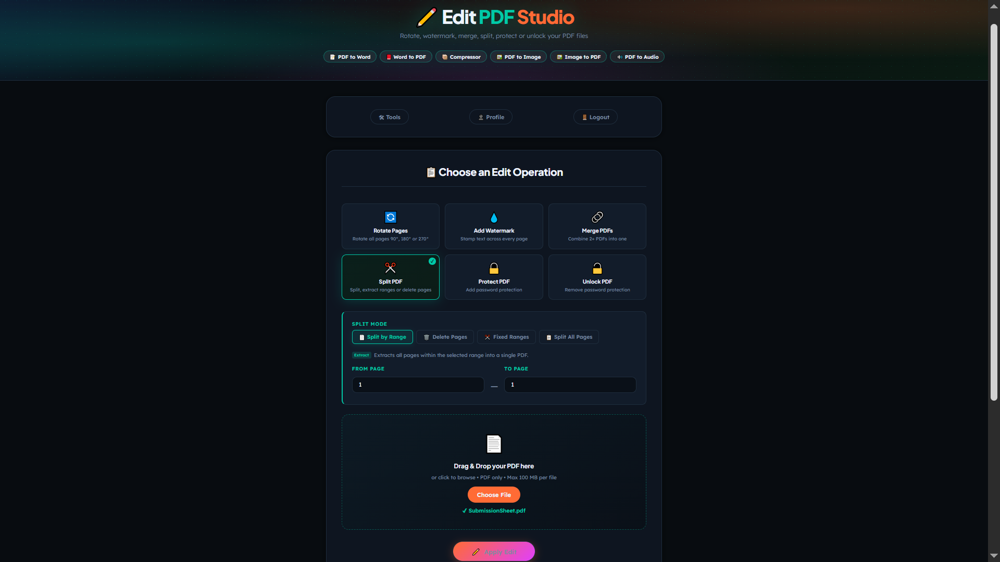
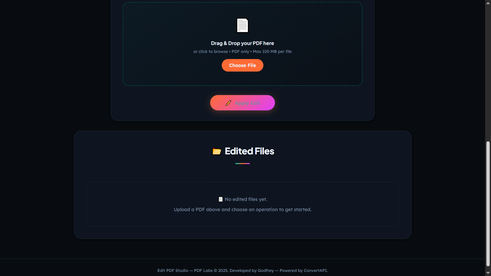

# PDF Labs — Edit PDF Service

> The PDF editing microservice for the PDF Labs platform. Provides six in-browser PDF operations — rotate, watermark, merge, split, protect, and unlock — all powered by the ConvertAPI v2 external API. Supports multi-file uploads, drag-and-drop reordering for merges, four split sub-modes, and per-user file history with individual part downloads.

---

## Table of Contents

- [Overview](#overview)
- [Architecture](#architecture)
- [Screenshots](#screenshots)
- [Tech Stack](#tech-stack)
- [Project Structure](#project-structure)
- [Supported Operations](#supported-operations)
- [API Endpoints](#api-endpoints)
- [Environment Variables](#environment-variables)
- [Getting Started](#getting-started)
  - [Prerequisites](#prerequisites)
  - [Run Locally (without Docker)](#run-locally-without-docker)
  - [Run with Docker](#run-with-docker)
- [ConvertAPI Integration](#convertapi-integration)
- [Session & Authentication Flow](#session--authentication-flow)
- [Security Highlights](#security-highlights)
- [Related Services](#related-services)
- [Contributing](#contributing)
- [License](#license)

---

## Overview

The **Edit PDF Service** is a Node.js/Express microservice that handles all PDF editing operations for the [PDF Labs](https://github.com/Godfrey22152/MICROSERVICE-PDF-LABS) platform. It accepts PDF file uploads via a drag-and-drop interface, delegates the actual conversion work to the **ConvertAPI v2** REST API over HTTPS, downloads the resulting files back to the server, and serves them as direct downloads to the user.

This service is responsible for:

- Rendering the Edit PDF Studio dashboard (EJS) with per-user file history
- Accepting multi-file uploads (up to 10 PDFs, 100 MB each) via `multer`
- Executing six PDF editing operations against the ConvertAPI v2 endpoints
- Handling the four split sub-modes (by range, delete pages, fixed chunks, all pages) which may return one or many output files
- Persisting every edit record to MongoDB with full split-page metadata
- Serving output files via download routes scoped by a `uuid`-based file ID
- Allowing users to delete individual edit records and their associated output files
- AJAX-first form submission with a simulated progress bar and inline result card injection

---

## Architecture

The edit-pdf service calls ConvertAPI v2 over HTTPS and stores outputs locally in a per-operation `outputs/<uuid>/` directory. It shares the MongoDB instance with other services and is reachable from the tools-service navigation bar.

```
                  ┌─────────────────────────────────────────────────┐
                  │               PDF Labs Platform                 │
                  │               (Docker Network)                  │
                  └──────────────────┬──────────────────────────────┘
                                     │  Token-bearing request from tools-service
         ┌───────────────────────────▼──────────────────────────────────┐
         │                edit-pdf-service (:5800)  ◄── THIS            │
         │  • Upload PDF(s) via multer (up to 10 × 100 MB)              │
         │  • Post to ConvertAPI v2 endpoint over HTTPS                 │
         │  • Download result(s) back to outputs/<uuid>/                │
         │  • Persist EditedFile record to MongoDB                      │
         │  • Serve per-file download routes                            │
         └──────┬──────────────────────────────────────────┬────────────┘
                │                                          │
   ┌────────────▼──────────────┐            ┌──────────────▼─────────────────┐
   │  MongoDB (:27017)         │            │  ConvertAPI v2 (external)      │
   │  edit-pdf-service DB      │            │  https://v2.convertapi.com     │
   │  • EditedFile schema      │            │  • /convert/pdf/to/rotate      │
   │  • splitPages sub-docs    │            │  • /convert/pdf/to/watermark   │
   └───────────────────────────┘            │  • /convert/pdf/to/merge       │
                                            │  • /convert/pdf/to/split       │
                                            │  • /convert/pdf/to/delete-pages│
                                            │  • /convert/pdf/to/protect     │
                                            │  • /convert/pdf/to/unprotect   │
                                            └────────────────────────────────┘
```

> **Note:** The **[docker-compose.yml file](https://github.com/Godfrey22152/MICROSERVICE-PDF-LABS/blob/main/docker-compose.yml)** that wires all services together lives in the **root/main repository**, not in this repository.

> **ConvertAPI free tier:** 250 conversions/month. Each operation (including each split part) counts as one conversion.

---

## Screenshots

> Edit PDF Studio application screenshots.

### Edit PDF Studio — Operation Selection


### Merge — Drag-and-Drop Reorder UI


### Split — Sub-mode Tabs


### Edited Files — Result Cards with Download


### Split Result — Per-Part Download Cards


---

## Tech Stack

| Layer | Technology |
|---|---|
| Runtime | Node.js |
| Framework | Express 4 |
| Templating | EJS |
| Database | MongoDB (via Mongoose 8) |
| File uploads | `multer` (disk storage, PDF-only filter, 100 MB limit) |
| PDF processing | ConvertAPI v2 (external REST API, called over raw HTTPS) |
| Auth | JWT (`jsonwebtoken`) — Bearer header, query param, or body |
| File ID | `uuid` v4 |
| Container | Docker (multi-stage, Alpine-based) |

---

## Project Structure

```
edit-pdf-service/
├── server.js                     # Express entry point
├── Dockerfile                    # Multi-stage production Docker build
├── package.json
├── config/
│   └── db.js                     # MongoDB connection with disconnect/error listeners
├── controllers/
│   └── pdfController.js          # All operation logic + ConvertAPI calls
├── middleware/
│   └── sessionCheck.js           # JWT guard — Bearer, query, body; HTML redirect fallback
├── models/
│   └── EditedFile.js             # Mongoose schema (EditedFile + splitPageSchema)
├── routes/
│   └── pdfRoutes.js              # GET/POST /edit-pdf, GET /download/:id, DELETE /:id
├── utils/
│   ├── errorHandler.js           # handleExecError + globalErrorHandler
│   └── fileUtils.js              # sanitizeFilename, formatBytes
├── views/
│   └── edit-pdf.ejs              # Edit PDF Studio template
├── public/
│   ├── css/
│   │   └── styles.css
│   └── js/
│       ├── main.js               # Session, drag-drop, AJAX submit, progress, delete modal
│       └── eventlisteners.js     # Navigation to other PDF Labs services
├── uploads/                      # Temporary multer upload staging (auto-created)
└── outputs/                      # Per-operation output dirs as outputs/<uuid>/ (auto-created)
```

---

## Supported Operations

| Operation | ConvertAPI Endpoint | Input | Output | Notes |
|---|---|---|---|---|
| **Rotate** | `pdf/to/rotate` | 1 PDF | 1 PDF | Angle: 90°, 180°, or 270° |
| **Watermark** | `pdf/to/watermark` | 1 PDF | 1 PDF | Text, font size, opacity configurable |
| **Merge** | `pdf/to/merge` | 2–10 PDFs | 1 PDF | Drag-to-reorder; custom output filename |
| **Split — by Range** | `pdf/to/split` + `SplitByRange` | 1 PDF | 1 PDF | Extracts a specific page range into one PDF |
| **Split — Delete Pages** | `pdf/to/delete-pages` + `PageRange` | 1 PDF | 1 PDF | Removes specified pages; returns remainder |
| **Split — Fixed Ranges** | `pdf/to/split` + `SplitByPattern` | 1 PDF | N PDFs | Equal N-page chunks; each chunk a separate download |
| **Split — All Pages** | `pdf/to/split` + `SplitByPageCount=1` | 1 PDF | N PDFs | One PDF per page; individual + "Download All" |
| **Protect** | `pdf/to/protect` | 1 PDF | 1 PDF | Sets `UserPassword` and `OwnerPassword` |
| **Unlock** | `pdf/to/unprotect` | 1 PDF | 1 PDF | Requires current password to remove protection |

---

## API Endpoints

All routes are prefixed with `/tools`. Session-protected routes require a valid JWT via `Authorization: Bearer <token>`, `?token=` query parameter, or request body.

| Method | Path | Auth | Description |
|---|---|---|---|
| `GET` | `/tools/edit-pdf` | JWT | Render the Edit PDF Studio with user's file history |
| `POST` | `/tools/edit-pdf` | JWT | Upload PDF(s) and apply a selected operation |
| `GET` | `/tools/edit-pdf/download/:id` | None | Download an output file by UUID and filename |
| `DELETE` | `/tools/edit-pdf/:id` | JWT | Delete an edit record and its output directory |

---

### `GET /tools/edit-pdf`

```
GET http://localhost:5800/tools/edit-pdf?token=<jwt>
```

Queries all `EditedFile` records for the authenticated user (sorted newest-first) and renders the studio page with operation cards and the file history grid.

**Responses:**
- `200` — Renders `edit-pdf.ejs`
- `302` — Redirect to `http://localhost:3000` (invalid/missing token, HTML client)
- `401` — Structured JSON auth error (API client)

---

### `POST /tools/edit-pdf`

Accepts `multipart/form-data`. Called via AJAX (`X-Requested-With: XMLHttpRequest`) from the browser; returns JSON for injection into the page, or redirects on non-XHR fallback.

```
POST http://localhost:5800/tools/edit-pdf?token=<jwt>
Content-Type: multipart/form-data

pdfFiles:    <file(s)>
operation:   rotate | watermark | merge | split | protect | unlock
```

**Operation-specific fields:**

| Operation | Additional Fields |
|---|---|
| `rotate` | `angle` — `90`, `180`, or `270` |
| `watermark` | `watermarkText`, `fontSize`, `opacity` |
| `merge` | `fileOrder` (JSON array of indices), `mergedName` (optional) |
| `split` | `splitMode` — `byRange`, `deletePages`, `fixedRanges`, `allPages`; `rangeFrom`, `rangeTo`, `deleteRange`, `fixedRangeSize` |
| `protect` | `protectPassword` |
| `unlock` | `unlockPassword` |

**Success response (XHR):**
```json
{
  "fileId": "<uuid>",
  "originalName": "document.pdf",
  "operationLabel": "Rotate Pages",
  "originalSize": 204800,
  "editedSize": 198000,
  "downloadUrl": "/tools/edit-pdf/download/<uuid>?file=document_rotated.pdf",
  "isSplit": false,
  "splitPages": []
}
```

For split operations returning multiple files, `isSplit` is `true` and `splitPages` contains an array of `{ index, filename, downloadUrl, size }` objects.

---

### `GET /tools/edit-pdf/download/:id`

No authentication required — files are scoped by the UUID-based directory path.

```
GET http://localhost:5800/tools/edit-pdf/download/<uuid>?file=document_rotated.pdf
```

**Responses:**
- `200` — File download (`res.download`)
- `400` — Missing `file` query parameter
- `404` — File not found on disk

---

### `DELETE /tools/edit-pdf/:id`

```
DELETE http://localhost:5800/tools/edit-pdf/<uuid>?token=<jwt>
X-Requested-With: XMLHttpRequest
Authorization: Bearer <jwt>
```

Verifies the record belongs to the authenticated user before deleting both the database document and the `outputs/<uuid>/` directory.

**Responses:**
- `200` — `"Deleted."`
- `404` — `"Not found or permission denied."`
- `500` — `"Server error."`

---

## Environment Variables

Create a `.env` file in the project root (or supply via Docker/Compose):

| Variable | Required | Description |
|---|---|---|
| `MONGO_URI` | Yes | MongoDB connection string, e.g. `mongodb://mongo:27017/edit-pdf-service` |
| `JWT_SECRET` | Yes | Secret key for verifying JWTs — must match the account-service |
| `CONVERTAPI_SECRET` | Yes | Your ConvertAPI secret key — obtain at [convertapi.com](https://www.convertapi.com) |
| `PORT` | No | Server port (defaults to `5800`) |

> **ConvertAPI free tier:** 250 conversions/month. Multi-part split operations (fixed ranges, all pages) each consume one conversion per output file.

> **Warning:** Never commit your `.env` file or real secrets to version control.

---

## Getting Started

### Prerequisites

- [Node.js](https://nodejs.org/) (version matching the Dockerfile's runtime)
- [MongoDB](https://www.mongodb.com/) instance (local or Docker)
- [Docker](https://www.docker.com/) (optional, for containerised runs)
- A valid [ConvertAPI](https://www.convertapi.com) account and secret key
- A valid JWT issued by the **account-service**

### Run Locally (without Docker)

```bash
# 1. Clone the repository
git clone https://github.com/Godfrey22152/MICROSERVICE-PDF-LABS.git
cd MICROSERVICE-PDF-LABS/edit-pdf-service

# 2. Install dependencies
npm install

# 3. Create your environment file
cp .env.example .env
# Edit .env with your MONGO_URI, JWT_SECRET, and CONVERTAPI_SECRET

# 4. Start the server
npm start
```

The service will be available at `http://localhost:5800/tools/edit-pdf`.

> The `uploads/` and `outputs/` directories are created automatically at runtime. They are excluded from version control via `.gitignore`.

### Run with Docker

#### Build and run this service standalone

```bash
docker build -t edit-pdf-service .
docker run -p 5800:5800 \
  -e MONGO_URI=mongodb://<your-mongo-host>:27017/edit-pdf-service \
  -e JWT_SECRET=your_secret_here \
  -e CONVERTAPI_SECRET=your_convertapi_secret \
  edit-pdf-service
```

#### Run the full PDF Labs stack

From the **root/main repository** that contains `docker-compose.yml`:

```bash
docker compose up --build
```

---

## ConvertAPI Integration

All PDF processing is delegated to **ConvertAPI v2** (`https://v2.convertapi.com`). The service communicates via raw Node.js `https.request` calls — no ConvertAPI SDK is used.

### Request Flow

```
1. User uploads PDF(s) via multipart form → multer saves to uploads/
2. pdfController.js builds a FormData request with the file stream
3. Raw HTTPS POST sent to the appropriate ConvertAPI v2 endpoint
4. ConvertAPI processes the file and returns JSON with Files[].Url
5. Controller downloads each result URL to outputs/<uuid>/<filename>
6. Upload temp files are deleted (cleanup())
7. EditedFile record saved to MongoDB
8. JSON response returned to the browser (XHR) or redirect (non-XHR)
```

### Endpoint Reference

| Operation | v2 Endpoint | Key Parameters |
|---|---|---|
| Split by Range | `pdf/to/split` | `SplitByRange=from-to` |
| Split All Pages | `pdf/to/split` | `SplitByPageCount=1` |
| Split Fixed Chunks | `pdf/to/split` | `SplitByPattern=N` |
| Delete Pages | `pdf/to/delete-pages` | `PageRange=from-to` |
| Merge | `pdf/to/merge` | `Files[0]`, `Files[1]`… |
| Protect | `pdf/to/protect` | `UserPassword`, `OwnerPassword` |
| Unlock | `pdf/to/unprotect` | `Password` |
| Rotate | `pdf/to/rotate` | `Angle=90\|180\|270` |
| Watermark | `pdf/to/watermark` | `Text`, `FontSize`, `Opacity` |

### Error Handling

The controller maps ConvertAPI HTTP error codes to user-friendly messages: `401/403` → invalid API key, `429` → conversion limit reached, and password-related errors during unlock → incorrect password. The API secret is masked in all server logs.

---

## Session & Authentication Flow

```
User arrives at /tools/edit-pdf?token=<jwt>
        │
        ▼
  sessionCheck middleware: structural check (3 parts) + jwt.verify()
        │
   ┌────┴──────────────────────────┐
   │ Invalid / expired / no token  │  → HTML: redirect to :3000
   │                               │  → XHR:  401 JSON error
   └───────────────────────────────┘
        │ Valid
        ▼
  controller.renderPage → EditedFile.find({ userId }) → render edit-pdf.ejs
        │
        ▼
  Client (main.js):
    • URL token read → localStorage.setItem("token", urlToken)
    • checkSession() decodes exp → setTimeout at exact expiry moment
    • Expired/tampered → handleAuthError() → redirect to :3000

  User submits the form (AJAX, X-Requested-With: XMLHttpRequest)
        │
        ▼
  POST /tools/edit-pdf?token=<jwt>
  sessionCheck validates token again server-side
        │
        ▼
  multer: saves uploaded file(s) to uploads/
        │
        ▼
  pdfController.editPdf:
    • Builds HTTPS FormData request to ConvertAPI v2
    • Downloads result(s) to outputs/<uuid>/
    • Deletes temp upload files (cleanup())
    • Saves EditedFile to MongoDB
    │
    ├─ XHR:     res.json(payload) → appendFileCard() injects card into DOM
    └─ non-XHR: res.redirect(/tools/edit-pdf?token=...)
```

---

## Security Highlights

- **Server-side JWT validation on every mutating route** — `sessionCheck` verifies structure and signature before any file is touched or any database write occurs.
- **User-scoped delete** — `deleteFile` queries MongoDB with both `fileId` AND `userId` to prevent one user from deleting another user's files.
- **Multer file type enforcement** — only files with `application/pdf` MIME type or `.pdf` extension are accepted; all others are rejected before reaching the controller.
- **Temp file cleanup** — all multer upload temp files are deleted in a `cleanup()` call after the ConvertAPI response is received, including on error paths.
- **ConvertAPI secret masking** — the secret key is replaced with `***` in all server-side console logs.
- **AJAX/HTML dual response mode** — all error paths check `req.xhr` / `X-Requested-With` to return either a redirect (browser) or structured JSON (AJAX), preventing information leakage between modes.
- **Output path isolation** — each edit session gets a unique `uuid`-based output directory. Download routes use `path.basename` on the `file` query parameter to prevent path traversal.
- **Non-root Docker user** — the production container runs as `appuser` (non-root) on Alpine Linux.
- **Multi-stage Docker build** — source maps, test files, and docs are stripped; only production artifacts land in the final image.
- **No secrets in image** — `MONGO_URI`, `JWT_SECRET`, and `CONVERTAPI_SECRET` are injected at runtime via environment variables.

---

## Related Services

All services below are part of the PDF Labs platform and are wired together via the root `docker-compose.yml`.

| Service | Port | Description |
|---|---|---|
| `account-service` | 3000 | Auth & landing page — issues JWTs |
| `home-service` | 3500 | Authenticated dashboard |
| `profile-service` | 4000 | User profile management |
| `logout-service` | 4500 | Session termination |
| `tools-service` | 5000 | Authenticated tools hub |
| `pdf-to-image-service` | 5100 | PDF → Image conversion |
| `image-to-pdf-service` | 5200 | Image → PDF conversion |
| `pdf-compressor-service` | 5300 | PDF compression |
| `pdf-to-audio-service` | 5400 | PDF → Audio conversion |
| `pdf-to-word-service` | 5500 | PDF → Word conversion |
| `sheetlab-service` | 5600 | PDF ↔ Excel conversion |
| `word-to-pdf-service` | 5700 | Word → PDF conversion |
| `edit-pdf-service` | 5800 | **This service** — rotate, watermark, merge, split, protect, unlock |

---

## Contributing

1. Fork the repository
2. Create a feature branch: `git checkout -b feature/my-feature`
3. Commit your changes: `git commit -m "feat: add my feature"`
4. Push to the branch: `git push origin feature/my-feature`
5. Open a Pull Request

Please follow the existing code style and keep commits focused.

---

## License

This project is licensed under the **ISC License**. See the [LICENSE](LICENSE) file for details.

---

> Maintained by [Godfrey Ifeanyi](mailto:godfreyifeanyi50@gmail.com) — Powered by [ConvertAPI](https://www.convertapi.com)
