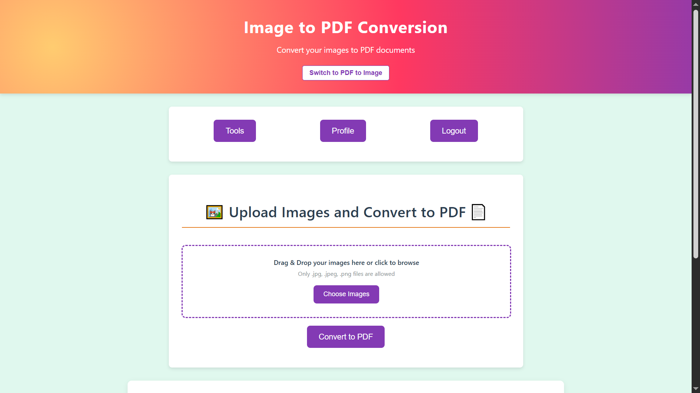
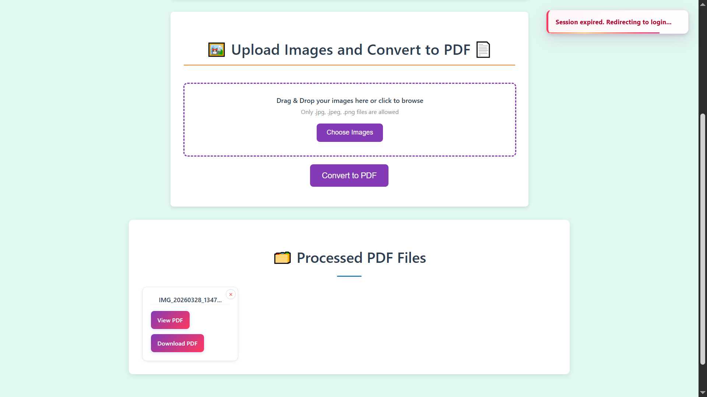

# PDF Labs — Image to PDF Service

> The image-to-PDF conversion microservice for the PDF Labs platform. Accepts JPG and PNG image uploads, stitches them into a single PDF document using `pdf-lib` (entirely server-side, no external API), and serves the result as both an inline viewer and a direct download — with per-user file history and individual file deletion.

---

## Table of Contents

- [Overview](#overview)
- [Architecture](#architecture)
- [Screenshots](#screenshots)
- [Tech Stack](#tech-stack)
- [Project Structure](#project-structure)
- [API Endpoints](#api-endpoints)
- [Environment Variables](#environment-variables)
- [Getting Started](#getting-started)
  - [Prerequisites](#prerequisites)
  - [Run Locally (without Docker)](#run-locally-without-docker)
  - [Run with Docker](#run-with-docker)
- [Conversion Pipeline](#conversion-pipeline)
- [Session & Authentication Flow](#session--authentication-flow)
- [Security Highlights](#security-highlights)
- [Related Services](#related-services)
- [Contributing](#contributing)
- [License](#license)

---

## Overview

The **Image to PDF Service** is a Node.js/Express microservice that converts one or more JPG or PNG images into a single PDF document for the [PDF Labs](https://github.com/Godfrey22152/MICROSERVICE-PDF-LABS) platform. Unlike several other services in the platform, this service performs **all PDF generation locally** using the `pdf-lib` library — no external API calls are made.

This service is responsible for:

- Rendering the Image to PDF conversion page (EJS) with the user's conversion history
- Accepting multi-image uploads (JPG and PNG) via drag-and-drop or file picker, enforcing type validation on both client and server
- Embedding each uploaded image into its own PDF page at native resolution using `pdf-lib`
- Persisting a `ProcessedFile` record to MongoDB linked to the authenticated user
- Serving the generated PDF for both inline viewing and direct download
- Allowing users to delete individual conversion records and their associated output files
- AJAX-first form submission with a simulated progress bar and inline result card injection

---

## Architecture

The image-to-pdf service processes files entirely in-process using `pdf-lib`. No external PDF API is called. Output files are stored locally in an `outputs/` directory, identified by a `uuid`-based filename.

```
                  ┌─────────────────────────────────────────────────┐
                  │               PDF Labs Platform                 │
                  │               (Docker Network)                  │
                  └──────────────────┬──────────────────────────────┘
                                     │  Token-bearing request from tools-service
         ┌───────────────────────────▼─────────────────────────────────────┐
         │              image-to-pdf-service (:5200)  ◄── THIS             │
         │  • Upload images via multer (JPG, PNG)                          │
         │  • Embed each image into a PDF page using pdf-lib               │
         │  • Save output to outputs/<uuid>.pdf                            │
         │  • Persist ProcessedFile record to MongoDB                      │
         │  • Serve view and download routes                               │
         └──────┬──────────────────────────────────────────┬───────────────┘
                │                                          │
   ┌────────────▼──────────────┐              ┌────────────▼───────────────┐
   │  MongoDB (:27017)         │              │  Local filesystem          │
   │  image-to-pdf-service DB  │              │  uploads/   (temp staging) │
   │  • ProcessedFile schema   │              │  outputs/   (uuid PDFs)    │
   └───────────────────────────┘              └────────────────────────────┘
```

> **Note:** The **[docker-compose.yml file](https://github.com/Godfrey22152/MICROSERVICE-PDF-LABS/blob/main/docker-compose.yml)** that wires all services together lives in the **root/main repository**, not in this repository.

---

## Screenshots

> Image to PDF Conversion application screenshots.

### Image to PDF Conversion Page


### Processed Files Grid


---

## Tech Stack

| Layer | Technology |
|---|---|
| Runtime | Node.js ≥ 15.0.0 |
| Framework | Express 4 |
| Templating | EJS |
| Database | MongoDB (via Mongoose 8) |
| File uploads | `multer` (disk storage, `uploads/` staging dir) |
| PDF generation | `pdf-lib` 1.17.1 — fully server-side, no external API |
| Auth | JWT (`jsonwebtoken`) — Bearer header, query param, or body |
| File ID | `uuid` v11 |
| Container | Docker (multi-stage, Alpine-based, Node.js 18) |

---

## Project Structure

```
image-to-pdf-service/
├── server.js                         # Express entry point
├── Dockerfile                        # Multi-stage production Docker build
├── package.json
├── config/
│   └── db.js                         # MongoDB connection with disconnect/error listeners
├── controllers/
│   └── imageToPdfController.js       # Render, convert, view, download, delete
├── middleware/
│   └── sessionCheck.js               # JWT guard — Bearer, query, body; HTML redirect fallback
├── models/
│   └── ProcessedFile.js              # Mongoose schema (ProcessedPdfFile + imageSchema)
├── routes/
│   └── imageToPdfRoutes.js           # All /image-to-pdf routes
├── utils/
│   ├── errorHandler.js               # handleExecError + globalErrorHandler
│   └── fileUtils.js                  # sanitizeFilename
├── views/
│   └── image-to-pdf.ejs              # Conversion page template
├── public/
│   ├── css/
│   │   └── styles.css
│   └── js/
│       ├── main.js                   # Session, drag-drop, AJAX submit, progress, delete modal
│       └── eventlisteners.js         # Navigation to other PDF Labs services
├── uploads/                          # Temporary multer staging (auto-created, gitignored)
└── outputs/                          # Generated PDFs as <uuid>.pdf (auto-created, gitignored)
```

---

## API Endpoints

All routes are prefixed with `/tools`. Session-protected routes require a valid JWT via `Authorization: Bearer <token>`, `?token=` query parameter, or request body.

| Method | Path | Auth | Description |
|---|---|---|---|
| `GET` | `/tools/image-to-pdf` | JWT | Render the conversion page with user's file history |
| `POST` | `/tools/image-to-pdf` | JWT | Upload images and convert to PDF |
| `GET` | `/tools/image-to-pdf/view/:id` | None | View the generated PDF inline in the browser |
| `GET` | `/tools/image-to-pdf/download/:id` | None | Download the generated PDF |
| `DELETE` | `/tools/image-to-pdf/:id` | JWT | Delete a conversion record and its output file |

---

### `GET /tools/image-to-pdf`

```
GET http://localhost:5200/tools/image-to-pdf?token=<jwt>
```

Queries all `ProcessedFile` records for the authenticated user where `conversionType` is `image-to-pdf` (or where the field is absent, for backwards compatibility), sorted newest-first.

**Responses:**
- `200` — Renders `image-to-pdf.ejs`
- `302` — Redirect to `http://localhost:3000` (invalid/missing token, HTML client)
- `401` — Structured JSON auth error (API client)

---

### `POST /tools/image-to-pdf`

Accepts `multipart/form-data`. Called via AJAX (`X-Requested-With: XMLHttpRequest`) from the browser; returns JSON for card injection, or redirects on non-XHR fallback.

```
POST http://localhost:5200/tools/image-to-pdf?token=<jwt>
Content-Type: multipart/form-data

images: <file(s)>   (JPG or PNG, multiple allowed)
```

**Success response (XHR):**
```json
{
  "fileId": "<uuid>",
  "filename": "photo.pdf",
  "sanitizedName": "photo.pdf",
  "format": "pdf",
  "conversionType": "image-to-pdf",
  "totalPages": 3,
  "downloadUrl": "/tools/image-to-pdf/download/<uuid>",
  "viewUrl": "/tools/image-to-pdf/view/<uuid>"
}
```

**Error responses:**
- `400` — No files uploaded / unsupported image format
- `401` — Auth error (`NO_TOKEN`, `TOKEN_EXPIRED`, `INVALID_TOKEN`)
- `500` — Conversion error

---

### `GET /tools/image-to-pdf/view/:id`

No authentication required. Serves the PDF inline using `res.sendFile` so the browser renders it directly.

```
GET http://localhost:5200/tools/image-to-pdf/view/<uuid>
```

---

### `GET /tools/image-to-pdf/download/:id`

No authentication required. Triggers a file download via `res.download`.

```
GET http://localhost:5200/tools/image-to-pdf/download/<uuid>
```

---

### `DELETE /tools/image-to-pdf/:id`

Verifies the record belongs to the authenticated user before deleting. Tolerates a missing output file on disk (proceeds with DB deletion if the file is already gone).

```
DELETE http://localhost:5200/tools/image-to-pdf/<uuid>?token=<jwt>
Authorization: Bearer <jwt>
```

**Responses:**
- `200` — `"File deleted successfully."`
- `404` — `"File not found or you don't have permission to delete it."`
- `500` — `"Server error while deleting file."`

---

## Environment Variables

Create a `.env` file in the project root (or supply via Docker/Compose):

| Variable | Required | Description |
|---|---|---|
| `MONGO_URI` | Yes | MongoDB connection string, e.g. `mongodb://mongo:27017/image-to-pdf-service` |
| `JWT_SECRET` | Yes | Secret key for verifying JWTs — must match the account-service |
| `PORT` | No | Server port (defaults to `5200`) |

> **Warning:** Never commit your `.env` file or real secrets to version control.

---

## Getting Started

### Prerequisites

- [Node.js](https://nodejs.org/) ≥ 15.0.0
- [MongoDB](https://www.mongodb.com/) instance (local or Docker)
- [Docker](https://www.docker.com/) (optional, for containerised runs)
- A valid JWT issued by the **account-service**

> **No external API key required.** PDF generation is handled entirely by `pdf-lib` running in-process.

### Run Locally (without Docker)

```bash
# 1. Clone the repository
git clone https://github.com/Godfrey22152/MICROSERVICE-PDF-LABS.git
cd MICROSERVICE-PDF-LABS/image-to-pdf-service

# 2. Install dependencies
npm install

# 3. Create your environment file
cp .env.example .env
# Edit .env with your MONGO_URI and JWT_SECRET

# 4. Start the server
npm start
```

The service will be available at `http://localhost:5200/tools/image-to-pdf`.

> The `uploads/` and `outputs/` directories are created automatically at runtime and are excluded from version control.

### Run with Docker

#### Build and run this service standalone

```bash
docker build -t image-to-pdf-service .
docker run -p 5200:5200 \
  -e MONGO_URI=mongodb://<your-mongo-host>:27017/image-to-pdf-service \
  -e JWT_SECRET=your_secret_here \
  image-to-pdf-service
```

#### Run the full PDF Labs stack

From the **root/main repository** that contains `docker-compose.yml`:

```bash
docker compose up --build
```

---

## Conversion Pipeline

Unlike other services in the platform that delegate to ConvertAPI, this service generates PDFs **entirely in-process** with `pdf-lib`.

```
User selects images (JPG / PNG) via drag-drop or file picker
        │  Client validates: only image/jpeg and image/png accepted
        │
        ▼
POST /tools/image-to-pdf  (multipart/form-data, XHR)
        │
        ▼
  multer: saves each image to uploads/<originalname>
        │
        ▼
  controller: PDFDocument.create()
        │
        ├── for each uploaded file:
        │     ├── fs.readFile(file.path)
        │     ├── pdfDoc.embedJpg(bytes)  or  pdfDoc.embedPng(bytes)
        │     └── pdfDoc.addPage([image.width, image.height])
        │           └── page.drawImage(image, { x:0, y:0, width, height })
        │
        ▼
  pdfDoc.save()  →  Buffer written to outputs/<uuid>.pdf
        │
        ├── Temp upload files deleted (fs.unlink for each)
        │
        ▼
  ProcessedFile record saved to MongoDB
        │
        ├── XHR:     res.json(payload) → appendProcessedCard() injects card into DOM
        └── non-XHR: res.redirect(/tools/image-to-pdf?token=...)

User clicks "View PDF"     → GET /tools/image-to-pdf/view/:id  → res.sendFile
User clicks "Download PDF" → GET /tools/image-to-pdf/download/:id → res.download
```

### Image-to-Page Mapping

Each image becomes exactly one PDF page, sized to the image's native pixel dimensions. If multiple images are uploaded, they appear as sequential pages in the order they were selected. The output filename is derived from the first uploaded image's name.

---

## Session & Authentication Flow

```
User arrives at /tools/image-to-pdf?token=<jwt>
        │
        ▼
  sessionCheck middleware: structural check (3 parts) + jwt.verify()
        │
   ┌────┴──────────────────────────┐
   │ Invalid / expired / no token  │  → HTML: redirect to :3000
   │                               │  → XHR:  401 JSON error
   └───────────────────────────────┘
        │ Valid
        ▼
  controller.renderImageToPdfPage → ProcessedFile.find({ userId }) → render page
        │
        ▼
  Client (main.js):
    • URL token read → localStorage.setItem('token', urlToken)
    • EJS inline script: also reads token from URL on DOMContentLoaded,
      redirects to same page with ?token= if token is in storage but not URL
    • checkSession() decodes exp → setTimeout at exact expiry moment
    • Expired/tampered → handleAuthError() → clears token → redirect to :3000

  User submits form (XHR, X-Requested-With: XMLHttpRequest)
        │
        ├─ sessionCheck validates token again server-side
        │
        ├─ 401 → handle401() → typed message → handleAuthError()
        │
        └─ 200 → appendProcessedCard(payload) injects result card into DOM

  User clicks delete button
        │
        ▼
  showConfirmationModal() — dynamically built confirm/cancel modal
        │
        ├─ Cancelled → no action
        └─ Confirmed → DELETE /tools/image-to-pdf/:id?token=<jwt>
                          → card.remove() + grid cleanup if empty
```

---

## Security Highlights

- **Server-side file type enforcement** — the controller rejects any file whose `mimetype` is not `image/jpeg` or `image/png`, even if the client-side validation was bypassed.
- **Client-side type validation** — the drag-and-drop handler and `input[type=file]` change handler both check MIME types before allowing submission, with immediate toast feedback.
- **User-scoped delete** — `deleteProcessedFile` queries MongoDB with both `fileId` AND `userId`, preventing one user from deleting another user's files.
- **Graceful missing-file handling on delete** — if the output file has already been removed from disk (e.g. container restart), the `ENOENT` error is caught and the DB record is still deleted cleanly without a 500 error.
- **No external API dependency** — PDF generation uses `pdf-lib` entirely in-process, so there is no API key to leak and no external service to fail.
- **Temp file cleanup** — all `multer` staging files in `uploads/` are deleted after conversion, including on error paths (unsupported format branch).
- **Dual-layer token validation** — `sessionCheck` enforces JWT validity server-side; `main.js` independently decodes `exp` to schedule a precise client-side expiry redirect.
- **HTML/API dual response mode** — all auth error paths check `req.accepts('html')` to redirect browser clients or return structured JSON for AJAX clients.
- **Non-root Docker user** — the production container runs as `appuser` (non-root) on Alpine Linux.
- **Multi-stage Docker build** — dev tooling, source maps, test files, and docs are stripped from the final image.
- **No secrets in image** — `MONGO_URI` and `JWT_SECRET` are injected at runtime via environment variables.

---

## Related Services

All services below are part of the PDF Labs platform and are wired together via the root `docker-compose.yml`.

| Service | Port | Description |
|---|---|---|
| `account-service` | 3000 | Auth & landing page — issues JWTs |
| `home-service` | 3500 | Authenticated dashboard |
| `profile-service` | 4000 | User profile management |
| `logout-service` | 4500 | Session termination |
| `tools-service` | 5000 | Authenticated tools hub |
| `pdf-to-image-service` | 5100 | PDF → Image conversion |
| `image-to-pdf-service` | 5200 | **This service** — Image → PDF conversion |
| `pdf-compressor-service` | 5300 | PDF compression |
| `pdf-to-audio-service` | 5400 | PDF → Audio conversion |
| `pdf-to-word-service` | 5500 | PDF → Word conversion |
| `sheetlab-service` | 5600 | PDF ↔ Excel conversion |
| `word-to-pdf-service` | 5700 | Word → PDF conversion |
| `edit-pdf-service` | 5800 | Rotate, watermark, merge, split, protect, unlock |

---

## Contributing

1. Fork the repository
2. Create a feature branch: `git checkout -b feature/my-feature`
3. Commit your changes: `git commit -m "feat: add my feature"`
4. Push to the branch: `git push origin feature/my-feature`
5. Open a Pull Request

Please follow the existing code style and keep commits focused.

---

## License

This project is licensed under the **ISC License**. See the [LICENSE](LICENSE) file for details.

---

> Maintained by [Godfrey Ifeanyi](mailto:godfreyifeanyi50@gmail.com)
