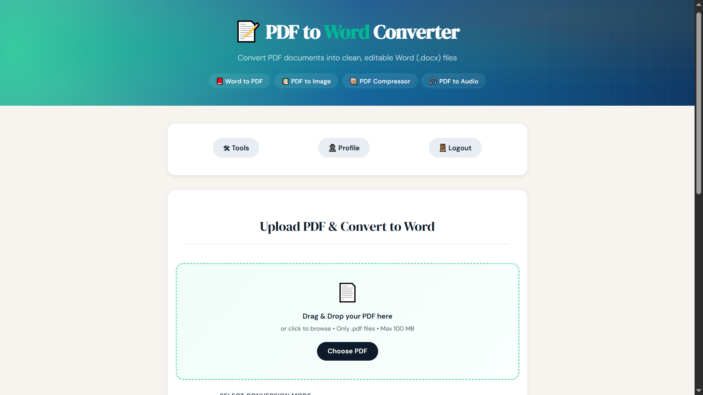
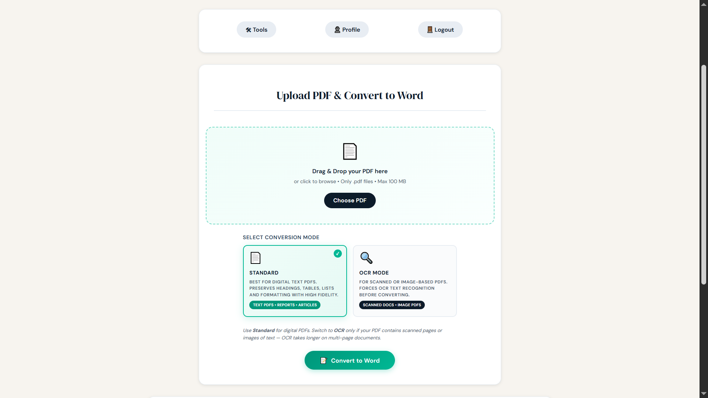
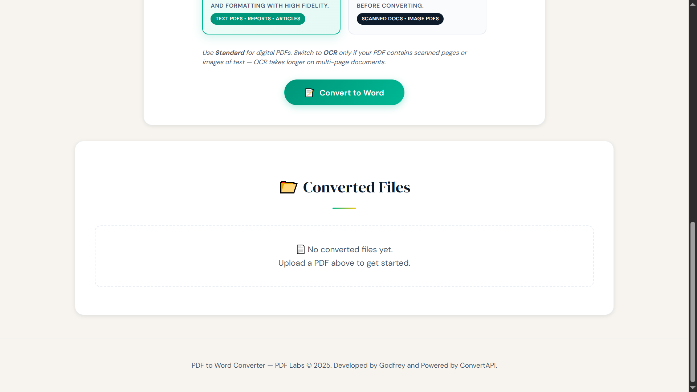

# PDF Labs — PDF to Word Service

> The PDF-to-Word conversion microservice for the PDF Labs platform. Converts PDF documents into editable `.docx` files using **ConvertAPI v2** over a raw HTTPS REST call — bypassing the Node.js SDK entirely for full control over file streaming. Supports two conversion modes: **Standard** (for digital text PDFs) and **OCR** (for scanned or image-based PDFs), with per-file original size, converted size, and page count tracking.

---

## Table of Contents

- [Overview](#overview)
- [Architecture](#architecture)
- [Screenshots](#screenshots)
- [Tech Stack](#tech-stack)
- [Project Structure](#project-structure)
- [Conversion Modes](#conversion-modes)
- [API Endpoints](#api-endpoints)
- [Environment Variables](#environment-variables)
- [Getting Started](#getting-started)
  - [Prerequisites](#prerequisites)
  - [Run Locally (without Docker)](#run-locally-without-docker)
  - [Run with Docker](#run-with-docker)
- [Conversion Pipeline](#conversion-pipeline)
- [Session & Authentication Flow](#session--authentication-flow)
- [Security Highlights](#security-highlights)
- [Related Services](#related-services)
- [Contributing](#contributing)
- [License](#license)

---

## Overview

The **PDF to Word Service** is a Node.js/Express microservice that converts PDF documents into editable Microsoft Word (`.docx`) files for the [PDF Labs](https://github.com/Godfrey22152/MICROSERVICE-PDF-LABS) platform. Unlike the compressor or image services, PDF-to-Word conversion requires the full document intelligence of an external API — this service delegates to **ConvertAPI v2** via a raw HTTPS multipart POST, bypassing the ConvertAPI Node.js SDK to gain direct control over the `Content-Type`, timeout, and file streaming.

This service is responsible for:

- Rendering the PDF to Word conversion page (EJS) with per-user conversion history including original size, Word file size, and page count
- Accepting single PDF uploads (up to 100 MB) via drag-and-drop or file picker with client and server-side type validation
- Offering two conversion modes — Standard and OCR — selectable via card UI, each mapped to a ConvertAPI `OcrMode` parameter
- Posting the PDF directly to `https://v2.convertapi.com/convert/pdf/to/docx` with a 3-minute timeout and downloading the resulting `.docx` from ConvertAPI's temporary storage URL
- Persisting a `ConvertedFile` record to MongoDB with conversion metadata
- Serving converted files as direct downloads scoped by UUID
- Allowing users to delete individual records and their output directories
- AJAX-first form submission with a progress bar that adjusts its step rate for OCR mode (slower) vs. Standard mode

---

## Architecture

The pdf-to-word service sends the PDF to ConvertAPI's REST endpoint over HTTPS, then downloads the resulting `.docx` from a temporary ConvertAPI storage URL before serving it. No local PDF processing tools are needed.

```
                  ┌─────────────────────────────────────────────────┐
                  │               PDF Labs Platform                 │
                  │               (Docker Network)                  │
                  └──────────────────┬──────────────────────────────┘
                                     │  Token-bearing request from tools-service
         ┌───────────────────────────▼──────────────────────────────────────────┐
         │              pdf-to-word-service (:5500)  ◄── THIS                   │
         │  • multer saves PDF to uploads/                                      │
         │  • Raw HTTPS POST to ConvertAPI v2 (pdf/to/docx)                     │
         │  • Download .docx from ConvertAPI temporary URL                      │
         │  • Persist ConvertedFile record to MongoDB                           │
         │  • Serve download route scoped by UUID                               │
         └──────┬─────────────────────────────────────────────┬─────────────────┘
                │                                             │
   ┌────────────▼──────────────┐              ┌───────────────▼──────────────────┐
   │  MongoDB (:27017)         │              │  ConvertAPI v2 (external HTTPS)  │
   │  pdf-to-word-service DB   │              │  POST /convert/pdf/to/docx       │
   │  • ConvertedFile schema   │              │  ← multipart/form-data           │
   └───────────────────────────┘              │  → JSON { Files[0].Url }         │
                                              │  → Download .docx from Url       │
                                              └──────────────────────────────────┘

  Local filesystem:  uploads/ (multer staging)  outputs/<uuid>/ (.docx files)
  ConvertAPI free tier: 250 conversions/month
```

> **Note:** The **[docker-compose.yml file](https://github.com/Godfrey22152/MICROSERVICE-PDF-LABS/blob/main/docker-compose.yml)** that wires all services together lives in the **root/main repository**, not in this repository.

---

## Screenshots

> PDF to Word Conversion application screenshots.

### PDF to Word Conversion Page


### Conversion Mode Selection Cards


### Converted Files History Grid


---

## Tech Stack

| Layer | Technology |
|---|---|
| Runtime | Node.js |
| Framework | Express 4 |
| Templating | EJS |
| Database | MongoDB (via Mongoose 8) |
| File uploads | `multer` (disk storage, PDF-only filter, 100 MB limit) |
| DOCX conversion | **ConvertAPI v2** — raw HTTPS REST (`form-data` multipart POST, no SDK) |
| Auth | JWT (`jsonwebtoken`) — Bearer header, query param, or body |
| File ID | `uuid` v4 |
| Container | Docker (multi-stage, Alpine 3.21 + Node.js) |

---

## Project Structure

```
pdf-to-word-service/
├── server.js                         # Express entry point
├── Dockerfile                        # Multi-stage build (no system PDF tools needed)
├── package.json
├── config/
│   └── db.js                         # MongoDB connection with disconnect/error listeners
├── controllers/
│   └── pdfController.js              # Render, callConvertApi, downloadFile, convert, delete
├── middleware/
│   └── sessionCheck.js               # JWT guard — Bearer, query, body; HTML redirect fallback
├── models/
│   └── ConvertedFile.js              # Mongoose schema with originalSize, convertedSize, conversionMode
├── routes/
│   └── pdfRoutes.js                  # GET/POST /pdf-to-word, GET /download/:id, DELETE /:id
├── utils/
│   ├── errorHandler.js               # handleExecError + globalErrorHandler
│   └── fileUtils.js                  # sanitizeFilename, formatBytes
├── views/
│   └── pdf-to-word.ejs               # Conversion page with mode cards and file history
├── public/
│   ├── css/
│   │   └── styles.css
│   └── js/
│       ├── main.js                   # Session, drag-drop, AJAX submit, OCR-aware progress, delete
│       └── eventlisteners.js         # Navigation to other PDF Labs services
├── uploads/                          # Temporary multer staging (auto-created, gitignored)
└── outputs/                          # Converted .docx files as outputs/<uuid>/ (gitignored)
```

---

## Conversion Modes

| Mode | ConvertAPI `OcrMode` | Best For |
|---|---|---|
| **Standard** *(default)* | `auto` | Digital text PDFs: reports, articles, forms, contracts. Preserves headings, tables, lists, and fonts. |
| **OCR** | `force` | Scanned or image-based PDFs, photographed pages, documents where text is embedded in images. Takes longer on multi-page documents. |

The mode is passed to ConvertAPI as the `OcrMode` form field. The `OcrLanguage` is fixed to `en` for English text recognition.

> The client-side progress bar automatically adjusts its increment rate when OCR mode is selected — advancing in smaller steps (`+2%` every 600ms) versus Standard mode (`+4%` every 400ms) — to better reflect the longer conversion time.

---

## API Endpoints

All routes are prefixed with `/tools`. Session-protected routes require a valid JWT.

| Method | Path | Auth | Description |
|---|---|---|---|
| `GET` | `/tools/pdf-to-word` | JWT | Render the conversion page with user's file history |
| `POST` | `/tools/pdf-to-word` | JWT | Upload a PDF and convert it to `.docx` |
| `GET` | `/tools/pdf-to-word/download/:id` | None | Download the converted `.docx` by UUID |
| `DELETE` | `/tools/pdf-to-word/:id` | JWT | Delete a conversion record and its output directory |

---

### `GET /tools/pdf-to-word`

```
GET http://localhost:5500/tools/pdf-to-word?token=<jwt>
```

Queries all `ConvertedFile` records for the authenticated user (sorted newest-first) and renders the page with conversion mode cards and the file history grid.

**Responses:**
- `200` — Renders `pdf-to-word.ejs`
- `302` — Redirect to `http://localhost:3000` (invalid/missing token, HTML client)
- `401` — Structured JSON auth error (API client)

---

### `POST /tools/pdf-to-word`

Accepts `multipart/form-data`. Called via XHR (`X-Requested-With: XMLHttpRequest`) from the browser; returns JSON for card injection, or redirects on non-XHR fallback.

```
POST http://localhost:5500/tools/pdf-to-word?token=<jwt>
Content-Type: multipart/form-data

pdf:            <file>              (PDF only, max 100 MB)
conversionMode: standard | ocr      (defaults to "standard")
```

**Success response (XHR):**
```json
{
  "fileId": "<uuid>",
  "originalName": "report.pdf",
  "sanitizedName": "report",
  "originalSize": 2097152,
  "convertedSize": 524288,
  "pageCount": 0,
  "conversionMode": "standard",
  "conversionLabel": "Standard Conversion",
  "downloadUrl": "/tools/pdf-to-word/download/<uuid>?file=report.docx",
  "filename": "report.docx"
}
```

> **Note:** `pageCount` is stored as `0` — ConvertAPI's `/convert/pdf/to/docx` endpoint does not return a page count in its response. The field is reserved for future enhancement.

**Error responses:**
- `400` — No file uploaded / non-PDF file / invalid conversion mode
- `401` — Auth error
- `429` — ConvertAPI monthly conversion limit reached
- `500` — Invalid API key (`401`/`403` from ConvertAPI) / unsupported file format (`415`) / network timeout / output file not found after download

---

### `GET /tools/pdf-to-word/download/:id`

No authentication required. Scoped by UUID so files are not guessable.

```
GET http://localhost:5500/tools/pdf-to-word/download/<uuid>?file=report.docx
```

**Responses:**
- `200` — File download (`res.download`)
- `400` — Missing `file` query parameter
- `404` — File not found on disk

---

### `DELETE /tools/pdf-to-word/:id`

Verifies the record belongs to the authenticated user before deleting both the MongoDB document and the `outputs/<uuid>/` directory.

```
DELETE http://localhost:5500/tools/pdf-to-word/<uuid>?token=<jwt>
Authorization: Bearer <jwt>
```

**Responses:**
- `200` — `"File deleted successfully."`
- `404` — `"File not found or you do not have permission to delete it."`
- `500` — `"Server error while deleting file."`

---

## Environment Variables

Create a `.env` file in the project root (or supply via Docker/Compose):

| Variable | Required | Description |
|---|---|---|
| `MONGO_URI` | Yes | MongoDB connection string, e.g. `mongodb://mongo:27017/pdf-to-word-service` |
| `JWT_SECRET` | Yes | Secret key for verifying JWTs — must match the account-service |
| `CONVERTAPI_SECRET` | Yes | Your ConvertAPI secret key — obtain at [convertapi.com](https://www.convertapi.com) |
| `PORT` | No | Server port (defaults to `5500`) |

> **ConvertAPI free tier:** 250 conversions/month. Each PDF-to-Word conversion counts as one conversion.

> **Warning:** Never commit your `.env` file or real secrets to version control.

---

## Getting Started

### Prerequisites

- [Node.js](https://nodejs.org/)
- [MongoDB](https://www.mongodb.com/) instance (local or Docker)
- A valid [ConvertAPI](https://www.convertapi.com) account and secret key
- [Docker](https://www.docker.com/) (optional)
- A valid JWT issued by the **account-service**

> **No system PDF tools required.** Unlike the compressor or pdf-to-image services, this service has no dependency on Ghostscript or Poppler. All conversion work is performed by ConvertAPI over HTTPS.

### Run Locally (without Docker)

```bash
# 1. Clone the repository
git clone https://github.com/Godfrey22152/MICROSERVICE-PDF-LABS.git
cd MICROSERVICE-PDF-LABS/pdf-to-word-service

# 2. Install dependencies
npm install

# 3. Create your environment file
cp .env.example .env
# Edit .env with your MONGO_URI, JWT_SECRET, and CONVERTAPI_SECRET

# 4. Start the server
npm start
```

The service will be available at `http://localhost:5500/tools/pdf-to-word`.

> The `uploads/` and `outputs/` directories are created automatically at runtime.

### Run with Docker

No system tools are installed in the runtime image — only Node.js. This makes the Docker image significantly lighter than the compressor or audio services.

#### Build and run this service standalone

```bash
docker build -t pdf-to-word-service .
docker run -p 5500:5500 \
  -e MONGO_URI=mongodb://<your-mongo-host>:27017/pdf-to-word-service \
  -e JWT_SECRET=your_secret_here \
  -e CONVERTAPI_SECRET=your_convertapi_secret \
  pdf-to-word-service
```

#### Run the full PDF Labs stack

From the **root/main repository** that contains `docker-compose.yml`:

```bash
docker compose up --build
```

---

## Conversion Pipeline

```
User uploads PDF via drag-drop or file picker
        │  Client validates: only application/pdf accepted
        │  If OCR mode selected → info toast about longer processing time
        │
        ▼
POST /tools/pdf-to-word  (multipart/form-data, XHR)
        │
        ▼
  sessionCheck validates JWT server-side
  multer: saves PDF to uploads/<temp>, enforces PDF MIME type and 100MB limit
        │
        ▼
  controller.convertPdfToWord:
    • Reads conversionMode from body → looks up CONVERSION_MODES[mode]
    • Generates uuid → creates outputs/<uuid>/ directory
    • Records originalSize = fs.statSync(inputPath).size

  callConvertApi(inputPath, originalName, ocrMode, secret):
    ├─ Builds FormData with:
    │   File: fs.createReadStream(inputPath)  ← filename validated to end with .pdf
    │   OcrMode: "auto" | "force"
    │   OcrLanguage: "en"
    │   StoreFile: "true"             ← tells ConvertAPI to host the result temporarily
    │
    ├─ Raw https.request to:
    │   POST https://v2.convertapi.com/convert/pdf/to/docx?Secret=<secret>
    │   Timeout: 180,000ms (3 minutes)
    │
    └─ Resolves with { status, body: { Files: [{ Url }] } }

  Temp file deleted immediately after ConvertAPI call completes or fails
  (fs.unlinkSync in both success and catch blocks)
        │
        ▼
  downloadFile(files[0].Url, outputPath):
    └─ Streams .docx from ConvertAPI's temporary storage → outputs/<uuid>/<n>.docx
       ConvertAPI storage URLs are valid for 3 hours after generation

  convertedSize = fs.statSync(outputPath).size
        │
        ▼
  Save ConvertedFile to MongoDB (conversionMode, originalSize, convertedSize stored)
        │
        ├─ XHR:     res.json(payload) → appendConvertedCard() injects card into DOM
        └─ non-XHR: res.redirect(/tools/pdf-to-word?token=...)

ConvertAPI Error Mapping:
  401/403 in error message → "Invalid ConvertAPI secret key" (500)
  429 in error message     → "Monthly conversion limit reached" (429)
  415 in error message     → "File format rejected by ConvertAPI" (500)
  timeout                  → "Request to ConvertAPI timed out after 3 minutes" (500)
```

### Why Raw HTTPS Instead of the SDK?

The controller calls ConvertAPI using Node.js's built-in `https.request` and the `form-data` package rather than the official ConvertAPI Node.js SDK. This gives full control over the `Content-Type` boundary (set automatically by `form-data`), the file stream, and the request timeout — avoiding SDK version mismatch issues and keeping the dependency footprint minimal.

---

## Session & Authentication Flow

```
User arrives at /tools/pdf-to-word?token=<jwt>
        │
        ▼
  sessionCheck middleware: structural check (3 parts) + jwt.verify()
        │
   ┌────┴──────────────────────────┐
   │ Invalid / expired / no token  │  → HTML: redirect to :3000
   │                               │  → XHR:  401 JSON error
   └───────────────────────────────┘
        │ Valid
        ▼
  controller.renderPdfToWordPage → ConvertedFile.find({ userId }) → render page
        │
        ▼
  Client (main.js):
    • URL token → localStorage.setItem('token', urlToken)
    • checkSession() decodes exp → setTimeout at exact expiry moment
    • Expired/tampered → handleAuthError() → clears token → redirect to :3000

  User selects conversion mode (card UI)
    → radio input toggled → .selected class applied to card
    → If OCR selected → info toast shown immediately on submit

  User submits form (XHR, X-Requested-With: XMLHttpRequest)
        │
        ├─ sessionCheck validates token again server-side
        │
        ├─ OCR mode → progress increments +2% / 600ms (slower, reflects longer conversion)
        ├─ Standard mode → progress increments +4% / 400ms
        │
        ├─ 401 → handle401() → typed message → handleAuthError()
        ├─ 429 → "Monthly conversion limit reached" toast
        │
        └─ 200 → appendConvertedCard(payload)
                   Injects card with original size, Word file size, page count, mode badge

  User clicks delete button
        │
        ▼
  showConfirmationModal() — promise-based confirm/cancel
        │
        └─ Confirmed → DELETE /tools/pdf-to-word/:id?token=<jwt>
                          → rmSync(outputs/<uuid>, recursive)
                          → ConvertedFile.deleteOne()
                          → card.remove() + grid cleanup if empty
```

---

## Security Highlights

- **Raw HTTPS POST with no SDK** — the controller uses Node.js `https.request` directly, avoiding SDK dependency drift and giving explicit control over the timeout (3 minutes), Content-Type, and file stream. The ConvertAPI secret never appears in server logs.
- **Temp file cleanup on both success and failure** — `fs.unlinkSync(inputPath)` runs in both the main success path and the `catch` block, so the uploaded PDF is always deleted from disk regardless of whether ConvertAPI succeeds or fails.
- **Multer MIME type enforcement** — the `fileFilter` rejects non-PDF MIME types before the file reaches the controller.
- **ConvertAPI error code mapping** — HTTP status codes returned by ConvertAPI (`401/403`, `429`, `415`) are mapped to specific user-facing messages rather than leaking raw API error text.
- **User-scoped delete** — `deleteConvertedFile` queries MongoDB with both `fileId` AND `userId`, preventing one user from deleting another user's files.
- **UUID-scoped download routes** — output files are not guessable without the exact UUID.
- **OCR-aware progress UX** — the client automatically uses a slower progress bar step for OCR mode, reducing the likelihood of users abandoning a conversion that appears stuck.
- **No system PDF tools in the image** — unlike the compressor (Ghostscript) or audio (Poppler) services, this service's Docker image installs only Node.js, making it significantly smaller and reducing the attack surface.
- **Dual-layer token validation** — `sessionCheck` verifies the JWT server-side; `main.js` schedules a precise client-side expiry redirect.
- **HTML/API dual response mode** — all auth error paths check `req.xhr` / `X-Requested-With` to return either a redirect or structured JSON.
- **Non-root Docker user** — the production container runs as `appuser` (non-root) on Alpine Linux.

---

## Related Services

All services below are part of the PDF Labs platform and are wired together via the root `docker-compose.yml`.

| Service | Port | Description |
|---|---|---|
| `account-service` | 3000 | Auth & landing page — issues JWTs |
| `home-service` | 3500 | Authenticated dashboard |
| `profile-service` | 4000 | User profile management |
| `logout-service` | 4500 | Session termination |
| `tools-service` | 5000 | Authenticated tools hub |
| `pdf-to-image-service` | 5100 | PDF → Image conversion |
| `image-to-pdf-service` | 5200 | Image → PDF conversion |
| `pdf-compressor-service` | 5300 | PDF compression via Ghostscript |
| `pdf-to-audio-service` | 5400 | PDF → Audio via Edge TTS |
| `pdf-to-word-service` | 5500 | **This service** — PDF → Word (.docx) via ConvertAPI |
| `sheetlab-service` | 5600 | PDF ↔ Excel conversion |
| `word-to-pdf-service` | 5700 | Word → PDF conversion |
| `edit-pdf-service` | 5800 | Rotate, watermark, merge, split, protect, unlock |

---

## Contributing

1. Fork the repository
2. Create a feature branch: `git checkout -b feature/my-feature`
3. Commit your changes: `git commit -m "feat: add my feature"`
4. Push to the branch: `git push origin feature/my-feature`
5. Open a Pull Request

Please follow the existing code style and keep commits focused.

---

## License

This project is licensed under the **ISC License**. See the [LICENSE](LICENSE) file for details.

---

> Maintained by [Godfrey Ifeanyi](mailto:godfreyifeanyi50@gmail.com) — Powered by [ConvertAPI](https://www.convertapi.com)
